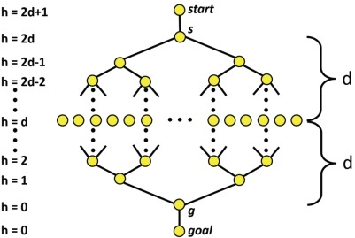

## 그래프: 너비 우선 탐색 (Breadth-First Search)

###### 너비 우선 탐색(BFS) 이란?

시작점에서 가까운 정점에서부터 가까운 정점을 순서대로 방문하는 탐색 방법

나중에 발견된 정점은 나중에 탐색 되어야 한다. -> Queue
3가지의 상태 [1.미발견,  2.미방문, 3.방문] 에 대해서 나눠서 처리 해줘야한다.

###### 코드

```python
adj: dict = {
  1: [2, 3, 4],
  2: [1],
  3: [2, 4],
}

def bfs(start: int) -> List[int]:
    discovered = defaultdict(False)
    order = []

    discorvered[start] = True
    deq = deque([start])

    while len(deq) > 0:
      here = deq.popleft() # 방문
      order.append(here)

      for there in adj[here]:
	if not discovered[there]: # 미발견
	  deq.append(there) # 미방문
	  discovered[thre] = True

    return order
```


###### 너비 우선 탐색 스패닝 트리 (BFS Spanning Tree)

BFS 과정에서 정점을 발견하는데 사용한 간선으로 구성된 Spanning Tree

###### 복잡도

기본적으로 DFS와 동일

| 구현체           | 시간복잡도       | 공간복잡도 |
| ---------------- | ---------------- | ---------- |
| Linked List      | O( \|V\|+\|E\| ) | O( \|V\| ) |
| Adjacency Matrix | O( \|V\|^2 )     | O( \|V\|   |


###### 주 활용: 최단 경로 찾기

가중치가 없는 그래프의 경우 `s -> e`


#### 문제: Sorting Game (ID: SORTGAME)

주어진 크기가 n인 배열에 임의 점 i, j 구간을 reverse하는 연산을 할 수 있을 때, Sorted 상태가 되기 위한 연산 횟수

###### 해답 1) Graph로 바꾸어 풀기

주어지는 정수 배열의 크기는 `1 <= n <= 8`
 `n! 의 모든 정점을 만들어서 BFS 문제로 전환하여 풀이

###### 코드

```python
from collections import defaultdict, deque

def find_min_op(arr: List[int], n: int) -> int:
    distance = defaultdict(int)
    destination = sorted(arr)
    deq = deque([ arr ])

    while len(deq) > 0:
	now = deq.popleft()
	if now == destination:
	    break

	for i in range(n):
	    for j in range(i+1, n):
		nex = now[:i] + list(reversed(now[i:j+1])) + now[j+1:]
		if distance[tuple(nex)] > 0:
		    continue
		distance[tuple(nex)] = distance[tuple(now)] + 1
		deq.append( nex )

    return distance[tuple(destination)]
```


###### 해답 2) 미리 다 계산해두기

1. 미리 다 계산 하는데 필요한 연산 `1! + ... + 8! = 1 + ... + 40320 = 46233`
2. 시작점 A에 대해서 `A -> sorted` 에 필요한 연산과 `sorted -> A` 동일

###### 코드

```python
from typing import List

from sys import stdin
from collections import deque

def pre_calc(n: int) -> int:
    distance = dict()
    start = [i for i in range(0,n)]
    deq = deque([start])
    distance[tuple(start)] = 0

    while len(deq) > 0:
	now = deq.popleft()

	for i in range(n):
	    for j in range(i+1, n):
		nex = now[:i] + list(reversed(now[i:j+1])) + now[j+1:]
		if tuple(nex) in distance:
		    continue
		distance[tuple(nex)] = distance[tuple(now)] + 1
		deq.append( nex )

    return distance

def solve(arr: List[int], n):
    seq = []
    for i in range(n):
	cnt = 0
	for j in range(n):
	    if arr[j] < arr[i]:
		cnt += 1
	seq.append(cnt)
    return tuple(seq)


if __name__ == "__main__":
    distances = {}
    for i in range(1, 9):
	distances[i] = pre_calc(i)

    tc = int(input().strip())

    for t in range(tc):
	n = int(input().strip())
	lis = list(map(int, stdin.readline().split()))

	per = solve(lis, n)
	print(distances[n][per])


```


#### 문제: 어린이날 (ID: CHILDRENDAY)

n명의 어린이가 있을 때, n명에게 동일한 수의 사탕을 나눠 주어야 한다, 이 중 m명의 학생에게는 사탕을 한 개 더 줘야한다.
d안에 포함된 숫자로 구성된 최소 필요 사탕 갯수 구하기

###### 접근

1. 최소 사탕 수는 `n+m` 이상
2. `n`으로 나눈 나머지가 `m`, `m + an (a>=1)`
3. `d`에 포함된 숫자만을 활용 `d = 167 => 1, 6, 7`

`((c % n) * 10 + x) % n = (c * 10 + x) % n` <- MOD의 성질  [Modulo Operation](https://en.wikipedia.org/wiki/Modulo_operation#Properties_(identities))

###### 코드

```python
from typing import List
from collections import deque, defaultdict


def find_next(here: int, edge: int, mod: int) -> int:
    there = here * 10 + edge
    if there >= mod:
	return mod + there % mod

    return there % mod

def gifts(digits: List[int], n: int, m: int) -> str:
    parent, choice = defaultdict(lambda: -1), dict()
    deq = deque([0])
    parent[0] = 0

    while len(deq) > 0:
	here = deq.popleft()

	for digit in digits:
	    there = find_next(here, digit, n)
	    if parent[there] != -1:
		continue

	    parent[there] = here
	    choice[there] = digit
	    deq.append(there)

    if parent[n+m] == -1:
	return 'IMPOSSIBLE'

    here, ret = n+m, []
    while parent[here] != here:
	ret.append(str(choice[here]))
	here = parent[here]

    return ''.join(list(reversed(ret)))


if __name__ == '__main__':
    tc = int(input())

    for t in range(tc):
	d, n, m = input().split()
	digits = sorted(map(int, list(str(d))))

	n, m = int(n), int(m)
	ans = gifts(digits, n, m)

	print(ans)
```


----

## 최단 경로 전략

BFS대신 사용 할 수 있는 최단 경로 찾는 접근 방법에 대한 설명

#### 예제: 15-퍼즐


4 x 4 숫자퍼즐을 해결하기 위한 최소 횟수

###### 접근

* 상태공간(state space)  -> 각 16개의 타일 배치를 하나의 상태로 -> `16!` 상태 (Vertex)

* 빈칸에 상하좌우의 하나의 타일이 올 수 있음 -> 한 상태에서 다른 상태로 가는 경우의 수 4개 (Edge)

* 현재 상태공간에서 완성된 상태공간으로 가는 최단 경로를 푸는 문제로 변환

###### 코드

```python
class State:
    def __init__(self, state, y, x):
	self.state = state
	self.current_loc = (y, x)

    def get_adjacent(self):
	y, x = self.current_loc
	adjacents = []

	for ny, nx in [(y - 1, x), (y + 1, x), (y, x - 1), (y, x + 1)]:
	    if ny < 0 or ny < 0 or ny >= 4 or nx >= 4:
		continue
	    next_state = deepcopy(self.state)
	    next_state[ny][nx], next_state[y][x] = next_state[y][x], next_state[ny][nx]
	    adjacents.append(
		State(next_state, ny, nx)
	    )

	return adjacents

    def __eq__(self, other):
	return self.state == other.state


def bfs(start: State, end: State):
    if start == end:
	return 0

    deq = deque([start])
    discovered = {}
    discovered[start] = 0

    while len(deq) > 0:
	here = deq.popleft()
	cost = discovered[here]

	for adjacent in here.get_adjacent():
	    if adjacent not in discovered:
		if adjacent == end:
		    return cost + 1
		discovered[adjacent] = cost + 1
		deq.append(adjacent)

    return -1

```


###### 효율성 분석

`O( |V| + |E| ) = O( b^d )`  -> 매우 비효율적이다.

최단경로가 24인 경우, 2600만개의 State 발생, ~2GB


#### 개선1: 양방향 탐색 (Bidirectional Search)



시작지점과 목표지점에서 동시에 Search를 진행해서 중간에서 만나도록 한다.

###### 코드

```python
# ...

def sgn(x):
  if x == 0:
    return 0
  return 1 if x > 0 else -1

def incr(x):
  if x < 0:
    return x-1
  return x+1

def bidirectional_search(start: State, end: State):
    if start == end:
	return 0

    deq = deque([start, end])
    discovered = {}
    discovered[start] = 1
    discovered[end] = -1

    while len(deq) > 0:
	here = deq.popleft()
	cost = discovered[here]

	for adjacent in here.get_adjacent():
	    if adjacent not in discovered:
		if adjacent == end:
		    return cost + 1
		discovered[adjacent] = incr(cost)
		deq.append(adjacent)

	    elif sgn(discovered[adjacent]) != sgn(discovered[here]):
	      return abs(discovered[adjacent]) + abs(discovered[here]) - 1

    return -1

```

###### 효율성 분석

시작지점, 목표지점에서 시작한 각 탐색은 최대 `d/2` 지점까지만 도달한다.  => `O( b^(d/2))` 훨씬 효율적!

2배 가량 더 깊게 탐색해도 이전 알고리즘과 동일한 성능을 보여준다.

###### 유의사항

아래와 같은 경우 활용하기가 어렵다.

* 역방향 간선이 정방향 간선보다 훨씬 많은 경우
* 정방향 간선은 찾기가 쉽지만, 역방향 간선은 어려운 경우


#### 개선2: 점점 깊어지는 탐색 (Iteratively deepening search, IDS)

지금까지 소개한 방식들은 깊어질 수록 메모리 사용량이 계속 늘어난다.

메모리는 한정된 자원이기 때문에, 시간을 희생하고 메모리를 아끼는 방법 -> 깊이 우선 탐색을 활용

###### 깊이 우선 탐색의 한계

* 최소경로를 보장하지 않는다.
* 사이클에 빠져서 무한루프에 빠질 수 있다.

###### 해결 방안: 검점 깊어지는 탐색

* 임의 깊이 한계 `l` 을 정의 하여 `l` 깊이 이내에서 탐색 수행
* 답을 못찾으면 `l`을 늘린다.
* 지금까지의 최소경로 `best`를 찾고 다음에 찾은 최소경로가 `best`보다 크면 Exit

###### 코드

```python
best = 0
def dfs(here, finish, steps):
  if steps >= best:
    return
  if here == finish:
    best = steps
    return

  for adjacent in here.get_adjacent():
    dfs(adjacent, finish, steps+1)

def ids(start, finish, growth_step):
  limit = 4
  while True:
    best = limit + 1
    dfs(start, finish, 0)
    if best <= limit:
      return best
    limit += growth_step

```


#### 개선3: 가지치기(Pruning)

> 맨해튼 거리(Manhattan distance), `|x1-x2| + |y1-y2|`

dfs 가정에서 맨해튼 거리로 가지치기(Pruning)를 할 수 있다.

모든 타일에서 완성된 퍼즐이 되기까지의 맨해튼 거리를 구해서, 더하면
현재 상태에서 완성된 퍼즐이 되는데 필요한 하한이 된다.

만약에 이 값이 지금까지 찾은 best보다 작으면 탐색 할 필요가 없다

###### 코드

> ```python
> def dfs(here, finish, steps):
>   #if steps >= best:
>   if steps + here.estimate() >= best:
>     return
>   if here == finish:
>     best = steps
>     return
>
>   for adjacent in here.get_adjacent():
>     dfs(adjacent, finish, steps+1)
> ```
>
>

###### 효율성 평가

`(d+1) * b^0 + d * b^1 + (d-1) * b^2  + ... + 2 * b^(d-1) + 1 * b^d

처음 알고리즘과 똑같이 `O(b^d)` 하지만 가지치기 덕분에 실제로는 더 빠르다.


#### 개선4: 효율적인 상태 객체의 구현

###### 문제점

2차원 배열 4x4 배열은 연산하는데 16번이 필요하다.
메모리도 4byte * 16 = 64byte를 차지하니, 위 문제처럼 많은 상태 표현이 필요하면 부담이 된다.

###### 해결법

상태가 16개 -> Integer bit수 32개 -> bit masking!

연산도 빠르고, 저장 측면에서도 비교가 안되게 효율적이다.


#### 부록1. 탐색 방법 선택하기

###### 선택 가이드

1. 너비가 너무 넓지 않다면 기본 방법 -> 가장 직관적, 쉬움
2. 메모리나 시간이 부족하면 양방향 -> 단 역방향 이동이 쉬워야
3. 위 두 방식 모두 메모리가 부족하면 점점 깊어지는 탐색이 필
