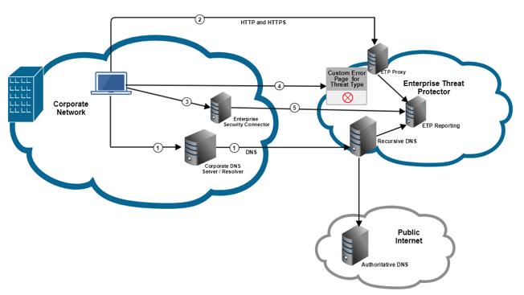
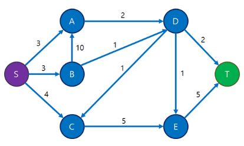
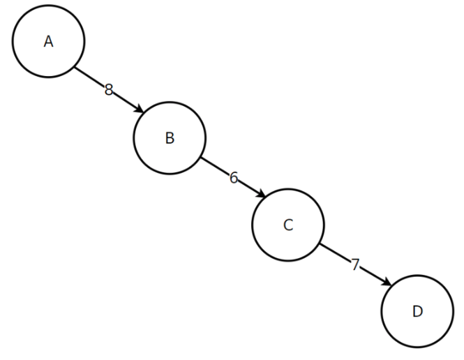
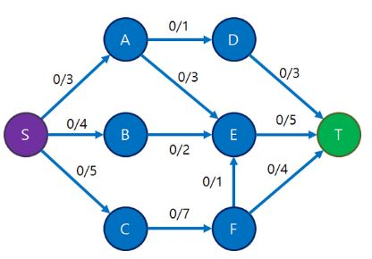
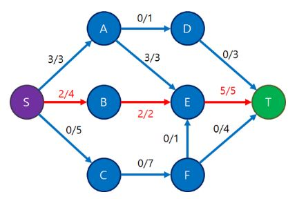

# 32장 네트워크 유량(Network Flow)

## 1) 배경

네트워크 유량은 특정한 지점에서 다른 지점으로 데이터가 얼마나 많이 흐르고 있는가를 측정하는 알고리즘입니다. 이러한 알고리즘은 교통 체증, 네트워크 데이터 전송 등의 다야안 분야에 활용되고 있습니다.



네트워크를 이용해 수백 GB에 달하는 아주 큰 파일을 다운로드 하는 중이라고 합시다. 이렇게 전송받을 자료의 양이 많을때 우리가 관심을 갖는 부분은 서버가 보낸 패킷이 내 컴퓨터에 몇미리초 만에 도착하는 것이 아니라, 1초에 몇 MB의 자료를 전송 받을 수 있느냐입니다. 네트워크 유량(Network Flow)는 이렇게 각 간선이 용량을 갖는 그래프에서 두 정점 사이에 얼마나 많은 흐름, 유량을 보낼 수 있는지를 계산하는 문제에서 시작되었습니다.

결론)
Network Flow란?

그래프에 서로 다른 두 정점인 **소스 S**(source), **싱크 T**(sink) 정점이 정해지고,
소스 정점에서 유량을 발생시켜서 간선들을 통해 싱크 정점에 많은 유량을 흘려 보내는것이 목표



## 2) 용어 설명

용량(Capacity): 간선에 흘릴수 있는 최대 데이터 양
유량(Flow): 간선에 흐르는 데이터 양
소스(Source) : 시작 정점, S로 주로 표시됨
싱크(Sink): 도착 정점, T로 주로 표시됨

### 예시 1)

각 도시를 지날때 1초가 걸리고 각 길의 폭은 8(서울->대전), 3(대전->부산)이라고 하자.
사람 1명당 1개의 폭을 차지 한다고 할때 서울에서 부산으로 1초당 몇명을 보내야 막힘이 없이 안정적으로 갈 수 있을까? 

- Source: 서울, Sink: 부산


- 서울 -> 대전 용량(Capacity) : 8,  대전 -> 부산  용량(Capacity) : 3


- 서울에서 부산으로 8명을 한번에 보냈을 경우


- 1초에 3명씩 서울에서 부산으로 보내야 막힘 없이 안정적으로 보낼 수 있다. (표현 방식: 유량/용량)

### 예시 2)

A에서 D로 최대한 많은 유량을 보내려고 할 때 가장 합리적인 양은 얼마일까?



- 6이상을 보내면 정체 현상이 발생할 수 있다. 여기서 6을 최대유량(Max Flow)라고 한다.


## 3) 포드-풀커슨 알고리즘

이제 한 번 여러개의 정점과 간선이 있는 경우를 확인해 봅시다.

참고) 네트워크 유량을 해결하는 가장 기초적인 방법으로 포드-풀커슨 알고리즘이 있습니다. 포드-풀커슨 알고리즘은 알고리즘 방법론으로 구현 방식은 다양하나 jongman book에서는 너비우선탐색으로 포드-풀커슨 알고리즘을 이용하여 구현한 에드몬드-카프 알고리즘에 대해 설명하고 있습니다.

- **유량 그래프의 성질**

  1. 각 간선에 흐르는 유량은 그 간선의 용량을 넘어서는 안 됩니다. flow(u, v) ≤ capacity(u, v)

  2. S와 T를 제외한 정점에서는 **들어오는 유량 총합과 나가는 유량 총합이 같아야 합니다.**
     ex) 2번 정점에 들어오는 유량의 총합과 나가는 총합은 같아야 합니다.

  3. 간선 (u, v) 방향으로 유량이 흐르고 있다면, **역방향으로는 음의 유량이 그만큼 흐르고 있는 것으로 취급합니다.**

     즉, f(u, v) = -f(v, u)입니다.

     위의 두 성질보다는 좀 덜 당연한데, 이 성질은 추후 최대 유량을 구해내는 알고리즘에서 유용하게 써먹습니다.


- **핵심 Idea:**
  유량 그래프의 성질의 기반으로 정해진 용량(Capacity) 안에서 가능한 용량의 양을 반복적으로 더해준다.
  남아있는 용령이 1이 넘으면 계속해서 흘려 내보내주면 최적화가 이루어 진다.
  유량을 흘려보내는 것을 도중에 멈춰서는 안 되고, 반드시 Sink인 6까지 도달해야만 유효합니다.


### 포드-풀커슨 알고리즘 설명

출처: http://blog.naver.com/PostView.nhn?blogId=kks227&logNo=220804885235&parentCategoryNo=&categoryNo=299&viewDate=&isShowPopularPosts=false&from=postList

- 가능한 모든 경우의 수를 탐색하기 위해 유량(Flow)를 0으로 초기화, 유량(f)/용량(c)으로 표시



선택: [S, A, E, T]


선택: [S, B, E, T]



선택: [S, C, F, T]


증가 경로를 더 찾을 수 없어 보임.. 여기서 **최대 유량은 9**

여기서 유량 그래프의 3번째 성질을 사용함 f(u, v) = -f(v, u)


선택: [S, C, F, E, A, D, T]


**원래 정점 A에서 E로 흘려보내던 유량 3 중에서 1을 철수해서 다른 정점인 D로 흘려보내게 되었다**고 생각할 수가 있습니다.

최대 유량: 10

### 포드-풀커슨 알고리즘의 구현: 에드몬드 카프 알고리즘, 시간복잡도 O(V * E^2)

```c++
#include<cstdio>
#include<queue>
#include<memory.h>
#include<algorithm>

using namespace std;
const int MAX_V = 111;
const int INF = 1 << 30;

//capacity 배열
int c[MAX_V][MAX_V];
//flow 배열
int f[MAX_V][MAX_V];
//각 node의 parent를 저장할 배열
int parent[MAX_V];

//방문하지 않은 노드 중에 용량이 남아있는지 확인
int residual(int here, int there) {
  return c[here][there] - f[here][there];
}

int edmonds_karp(int source, int sink) {
  int total = 0;
    
  while (true) {
     memset(parent, -1, sizeof(parent));
     queue<int> Q;
     Q.push(source);
     parent[source] = source;

     while (!Q.empty() && parent[sink] == -1) {
       int here = Q.front(); Q.pop();
       for (int there = 0; there < MAX_V; there++) {
         if (residual(here, there) > 0 && parent[there] == -1) { 
           parent[there] = here;
           Q.push(there);
         }
       }
     }

     //모든 경로를 다 찾았는데도 sink에 도달하지 못햇다면 나갑니다.
     if (parent[sink] == -1) break;

     int mn = INF;
     //최소 유량을 찾습니다.
     for (int p = sink; p != source; p = parent[p]) {
       mn = min(c[parent[p]][p] - f[parent[p]][p], mn);
     }
     //최소 유량만큼 추가합니다.
     for (int p = sink; p != source; p = parent[p]) {
       f[parent[p]][p] += mn;
       f[p][parent[p]] -= mn;
     }
     total += mn;
  }
  return total;
}
```


## 네트워크 모델링

https://book.algospot.com/problems.html

### 예제: 마일리지로 여행하기 (문제 ID:MILEAGE, 난이도:중)

풀이)


항공권, 렌트카를 구입하는 최대 마일리지 유량을 구하여 사용해야하는 현금의 양을 최소화 한다.


### 예제: 도난당한 조각상 (문제 ID:SAINTTAIL, 난이도:중)

풀이) SKIP..


#### 32.4 문제: 승부조작(문제 ID: MATCHFIX, 난이도: 중)

문제)

```
한때 세계대회 준우승까지 하며 최강의 프로그래머로 칭송 받았던 J씨는 성적이 떨어진 이후 유혹을 이기지 못하고 승부 조작의 세계에 손을 댔습니다. 프로그래밍 대회의 마당발로 알려졌던 J씨인만큼 승부 조작의 규모는 상당해서, 알고스팟 컵 결승 리그에 진출한 N명의 선수 모두를 승부 조작에 참여시켰습니다.

결승 리그는 여러 번의 1:1 경기로 이루어집니다. 경기를 하면 무승부 없이 항상 승부가 나며, 모든 경기가 끝난 후 승수가 가장 많은 선수가 우승합니다. 만약 가장 승수가 많은 선수가 둘 이상 있을 경우 공동 우승을 하게 됩니다. J씨는 대부분이 우승하지 못할 것으로 점쳤던 선수 X를 단독 우승하도록 해서 도박 사이트에서 부당 이득을 챙기려 합니다. 물론 너무 노골적으로 승부를 조작하면 의심을 피하기 어렵기 때문에, 가능한 X가 적은 승수로 우승하도록 하고 싶습니다.

현재 각 선수의 승수와 남아 있는 경기의 목록이 주어질 때, 승부를 적절히 조작해 X가 우승하도록 할 수 있는지 여부를 계산하고, 우승할 수 있다면 필요한 X의 최소 승수는 얼마인지 계산하는 프로그램을 작성하세요.
```

입력)

```
입력의 첫 줄에는 테스트 케이스의 수 C (C <= 50) 가 주어집니다. 각 테스트 케이스의 첫 줄에는 결승 리그에 참가하는 선수의 수 N (2 <= N <= 12) 과 남아 있는 경기의 수 M (0 <= M <= 100) 이 주어집니다. 이 때 각 선수에게는 0부터 N-1 까지의 번호가 주어집니다. 그 다음 줄에는 N 개의 정수로 0번부터 N-1 번까지 순서대로 각 선수의 현재 승수가 주어집니다. 그 후 M 줄에는 각 경기를 치르는 두 선수의 번호가 주어집니다. 모든 선수의 현재 승수는 1000 이하입니다.

선수 X의 번호는 0번입니다. 결승 리그에서 모든 선수가 같은 수의 경기를 치르도록 되어 있다는 보장은 없습니다.
```

출력)

```
각 테스트 케이스마다 한 줄에 X가 리그를 단독 우승하기 위해 필요한 최소 승수를 출력합니다. 만약 이것이 불가능하다면 -1 을 출력합니다.
```

예제 입력)

```
3   -> TC 수 (C)

2 2 -> N, M
3 3 -> 각 번호 선수의 승수 (0, 1)
0 1 -> 경기 1
0 1 -> 경기 2

3 3 -> N, M
4 2 2 -> 각 번호 선수의 승수 (0, 1 ,2)
1 2 -> 경기 1
1 2 -> 경기 2
1 2 -> 경기 3

4 4 -> N, M
5 3 3 2 -> 각 번호 선수의 승수 (0, 1, 2, 3)
0 1 -> 경기 1
1 2 -> 경기 2
2 3 -> 경기 3
1 3 -> 경기 4
```


### 풀이)

네트워크 모델링)


Code)

```java
import javafx.util.Pair;
import java.io.BufferedReader;
import java.io.InputStreamReader;
import java.io.OutputStreamWriter;
import java.io.PrintWriter;
import java.util.*;

public class MATCHFIX {
    public static void main(String[] args) throws Exception {
        BufferedReader br = new BufferedReader(new InputStreamReader(System.in));
        PrintWriter out = new PrintWriter(new OutputStreamWriter(System.out));

        int tc = Integer.parseInt(br.readLine());
        while (tc-- > 0) {
            String[] NM = br.readLine().split(" ");
            int N = Integer.parseInt(NM[0]);    // 선수의 수
            int M = Integer.parseInt(NM[1]);    // 남은 경기의 수

            // 현재까지 승리
            int[] players = new int[N];
            String[] V = br.readLine().split(" ");
            for (int i = 0; i < N; i++) 
              players[i] = Integer.parseInt(V[i]);
            // 현재까지 승수 중 가장 큰 승수 =: 누가 가장 많은 승수로 이기고 있나 
            // => 남은 경기로 0번이 현재 일등을 이길 수 있나?
            // startInclusive, endExclusive
            int curMaxWins = Arrays.stream(players, 1, N).max().getAsInt();

            // 경기를 할 두 선수 쌍
            int canWin = 0;
            Pair<Integer, Integer>[] matches = new Pair[M];
            for (int i = 0; i < M; i++) {       
                // 경기를 할 두 선수 쌍
                String[] M01 = br.readLine().split(" ");
                int a = Integer.parseInt(M01[0]);
                int b = Integer.parseInt(M01[1]);
                // match vertexes
                matches[i] = new Pair<>(a, b); 

              // 0 player 0선수가 경기를 하는 한다면 최대 이길 수 있는 경기수는 canWin 인데 최소로 하고자 한다
                if (a == 0 || b == 0) 
                    canWin++;  // 남은 경기에서 0번이 이길 수 있는 최대 승수         
            }

            if (curMaxWins >= players[0] + canWin) {          
              // 0번선수의 현재승수와 남은 경기수가, 다른 선수의 최고 승수보다 작다면 승리할 수 없다
                System.out.println(-1);
                continue;
            }

            // N : players, M: remained matches, 1 : source, 1 : sink
            // source : N+M번째 vertex, sink : N+M+1번째 vertex
            // params : v, source, sink
            FordFulkerson ff = new FordFulkerson(N + M + 1 + 1, N + M, N + M + 1); 
            ff.initCapa(matches);

            int minWins = -1;
            // 현재 0번 선수의 승수
            int curWins = players[0];
            // 현재 승수에서 +1을 하면서 모두 매치되는 최소 승수를 구함
            for (int totalWin = curWins; totalWin <= curWins + canWin; totalWin++) {
                if (totalWin > curMaxWins && ff.canWinWith(totalWin, players, M)) {
                    // 현재까지 totalWin
                    minWins = totalWin;                                             
                    break;
                }
            }
						// 불가능하면 -1, 가능한 경우 최소 승수
            System.out.println(minWins);                                            
        }
        br.close();
        out.close();
    }

    // network flow
    static class FordFulkerson { // int or double?
        int V;          // Vertex Cnt
        int[][] capa;   // capa[u][v] : u -> v 로 보낼 수 있는 용량
        int[][] flow;   // flow[u][v] : u -> v 로 흘러가는 유량 (반대는 음수)
        int source;
        int sink;

        // 네트워크 유량 문제의 해결 방법을 제시한 것은 포드 풀커슨이지만, 이를 어떤 방법(DFS or BFS)으로 구현하는지 제시한 것은 Edmonds-Karp이다.
        FordFulkerson(int V, int source, int sink) {
            this.V = V;
            this.source = source;
            this.sink = sink;
          
						// init to 0
            capa = new int[V][V];
            flow = new int[V][V];   
        }

        // 소스에서 각 경기로, 경기에서 선수로 capa를 1로 준다. 즉 간선을 연결한다
        void initCapa(Pair<Integer, Integer>[] matches) {
            int m = matches.length;
            for (int i = 0; i < m; i++) {
                // source -> match vertexes
                capa[source][i] = 1;          
                // 각 경기에서 -> 선수1
                capa[i][m + matches[i].getKey()] = 1;
                // 각 경기에서 -> 선수2
                capa[i][m + matches[i].getValue()] = 1;                     
            }
        }

        // 선수들에서 sink로 가는 간선을 추가하고 이 capa를 재조정해가며, 
        // 0번 선수가 현재 totalWins로 우승할 수 있는지를 반환
        // m 남은 경기 수
        boolean canWinWith(int totalWins, int[] players, int m) {           
            for (int i = 0, n = players.length; i < n; i++) {
                // 각 선수에서 싱크로 가능한 최대 승수를 용량으로 하는 간선을 추가
                int maxWin = (i == 0 ? totalWins : totalWins - 1);
                // 각 선수에서 sink로 가는 간선의 capa 지정
                capa[i + m][sink] = maxWin - players[i];                    
            }
						// 이때 모든 경기에서 승자를 지정할 수 있나?
            return networkFlow(source, sink) == m;                          
        }

        // 미리 정해진 capa에 따라 flow[u][v]를 계산하고 총 유량 totalFlow을 반환한다
        int networkFlow(int source, int sink) {
            // *** flow 초기화
            for (int i = 0; i < flow.length; i++) 
              Arrays.fill(flow[i], 0);

            int totalFlow = 0;

            while (true) { // BFS
                int[] parent = new int[V];
               // should init to -1
                Arrays.fill(parent, -1);                            

                Queue<Integer> queue = new LinkedList<>();
                // root
                parent[source] = source;                            
                queue.add(source);
								// 아직 sink까지 연결안되었다면
                while (!queue.isEmpty() && parent[sink] == -1) {
                  	// retrieve and remove
                    int here = queue.poll();                        
										 // 잔여 용량이 있는 간선을 따라 탐색한다
                    for (int there = 0; there < V; there++) {   
                        // capa(u,v) - flow(u,v) 는 잔여용량
                        if (capa[here][there] - flow[here][there] > 0 && parent[there] == -1) { 
                            queue.add(there);
                            parent[there] = here;
                        }
                    }
                }
								// 증가 경로가 없으면 종료
                if (parent[sink] == -1) break;                      

                // 증가 경로를 통해 유량을 얼마나 보낼지 결정
                int amount = 987654321;
                for (int p = sink; p != source; p = parent[p]) {
                    amount = Math.min(capa[parent[p]][p] - flow[parent[p]][p], amount);
                }

                // 증가 경로를 통해 유량을 보냄
                for (int p = sink; p != source; p = parent[p]) {
                    flow[parent[p]][p] += amount;
                    flow[p][parent[p]] -= amount;
                }
								// totalFlow에 보낸 유량을 계속 더함
                totalFlow += amount;                                
            }
            return totalFlow;
        }
    }
}

```


### 32.6 문제: 국책사업(문제 ID: , 난이도: 상)

풀이) SKIP..


To-Do:
여러 응용이 존재하며 네트워크 유량 문제인 지 숨기는 경우가 많아
다양한 유형의 문제와 유량 그래프를 그리는 연습이 필요하다고 함..

> 6086번: [최대 유량](https://www.acmicpc.net/problem/6086)
> 15892번: [사탕 줍는 로봇](https://www.acmicpc.net/problem/15892)
> 2316번: [도시 왕복하기](https://www.acmicpc.net/problem/2316)
