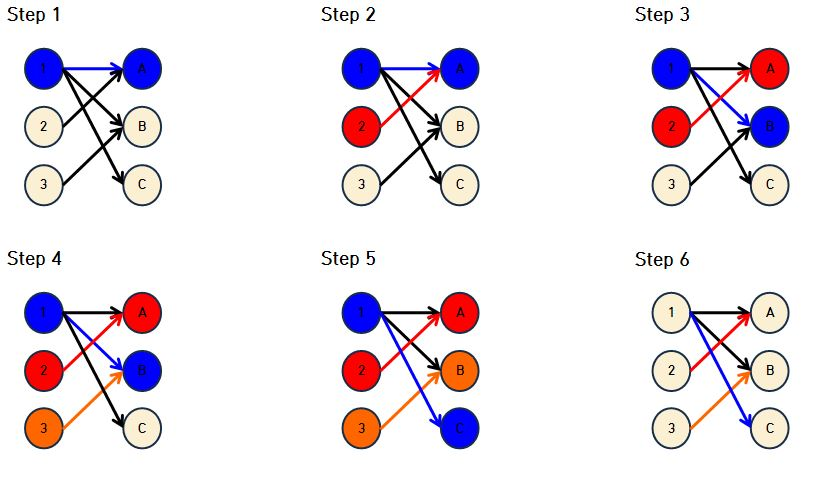
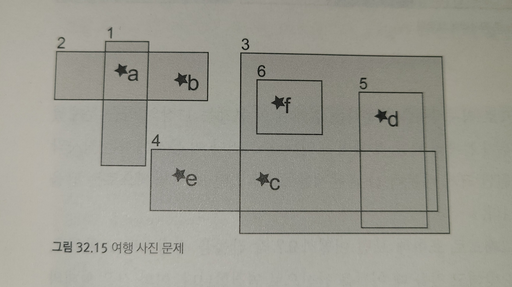

# 32장 이분 매칭(Bipartite Matching)


## 매칭 (Matching)

#### 정의

최대 매칭 문제 [Maximum Matching](https://en.wikipedia.org/wiki/Blossom_algorithm)

그래프에서 끝점을 공유하지 않는 최대 간선 집합을 구하는 문제

#### 문제

> N명의 유치원생이 소풍을 가는데 사이 좋은 학생끼리만 짝을 지어 주고 싶을 때, 짝을 지어 줄 수 있는 최대 가능한 수

각 학생을 그래프 노드로 하고, 사이 좋은 학생들만 간선으로 이어준다. 끝점을 공유하지 않는 간선의 집합을 최대로 만들면 정답이다.


매칭 문제는 구현하기 까다롭기 때문에 매칭의 단순한 형태인 이분 매칭(이분그래프에서의 매칭) 이 많이 출제된다.


## 이분 그래프 (Bipartite Graph)

정점이 두 개의 그룹으로 나눠지고, 다른 그룹내의 정점으로만 이어진 형태의 그래프

> EX) N명의 사람이 각각 할 수 있는 일이 다를 때 N개의 일을 할달하는 방법

위와 같이 할당하는 문제가 이분 그래프로 쉽게 표현된다.


## 이분 매칭 (Bipartite Matching)

이분 그래프에서 최대 매칭을 찾는 문제이다.

일반 네트워크 플로우 문제보다 자주 등장하는 문제이다.




### 네트워크 유량으로 구현

이분 그래프의 두 그룹을 각각 A, B라고 할 때, 각각 그룹에 `source`, `sink` 노드를 새로 만든 뒤, `capacity`가 1인 `edge`를 각각 연결한다. 포드-풀커슨 알고리즘을 네트워크 플로우 문제를 풀면된다.

최대유량이  `|V|` 이므로 `BFS`를 최대 `|V|`번만 하면된다. 이 경우 포드-풀커슨의 시간 복잡도는 `O(|V||E|)` 


### 이분 매칭 구현

이분 그래프의 다음과 같은 단순한 성질을 사용하기 때문에 알고리즘이 네트워크 플로우보다 훨씬 간단해진다.

* 유량 그래프의 최대 유량은 O(|V|)
* dfs를 사용하여 함수 스택에 Path 정보가 보존
* 모든 증가 경로의 용량이 1
* 매칭된 노드의 경우, 증가 경로가 유일하다.

#### 구현
```c++
int n,m;
bool adj]MAN_N][MAX_M];

vector<int> aMatch, bMatch;
vector<bool> visited;

bool dfs(int a) {
  if (visited[a]) return false;
  visited[a] = true;

  for (int b = 0; b < m; b++) {
    if (adj[a][b]) {
      if (bMatch[b] == -1 || dfs(bMatch[b])) {
        aMatch[a] = b;
        bMatch[b] = a;
        return true;
      }
    }
  }
  return false
}

int bipartiteMatch() {
  aMatch = vector<int>(n, -1);
  bMatch = vector<int>(m, -1);

  int size = 0;
  for (int start = 0; start < n; start++) {
    visited = vector<bool>(n, false);
    if(dfs(start)) {
      size++;
    }
  }

  return size;
}

```

---

## 예제: 축사배정 & 열혈강호1 (백준)

#### 축사배정

농부 존은 소 축사를 완성하였다. 축사 환경을 쾌적하게 유지하기 위해서, 존은 축사를 M개의 칸으로 구분하고, 한 칸에는 최대 한 마리의 소만 들어가게 계획했다.

첫 주에는 소를 임의 배정해서 축사를 운영했으나, 곧 문제가 발생하게 되었다. 바로 소가 자신이 희망하는 몇 개의 축사 외에는 들어가기를 거부하는 것이다.

농부 존을 도와 최대한 많은 수의 소가 축사에 들어갈 수 있도록 하는 프로그램을 작성하시오. 축사의 번호는 1부터 M까지 매겨져 있다.

(1 ≤ N, M ≤ 200)

#### 열혈강호

강호네 회사에는 직원이 N명이 있고, 해야할 일이 M개가 있다. 직원은 1번부터 N번까지 번호가 매겨져 있고, 일은 1번부터 M번까지 번호가 매겨져 있다.

각 직원은 한 개의 일만 할 수 있고, 각각의 일을 담당하는 사람은 1명이어야 한다.

각각의 직원이 할 수 있는 일의 목록이 주어졌을 때, M개의 일 중에서 최대 몇 개를 할 수 있는지 구하는 프로그램을 작성하시오.

(1 ≤ N, M ≤ 1000)


```sh
예제 입력 1 
5 5
2 2 5
3 2 3 4
2 1 5
3 1 2 5
1 2

예제 출력 1 
4
```


```python
from collections import defaultdict

matchedBarn = {}
G = defaultdict(list)

def mark_match(i, visited):
    for barn in G[i]:
        if barn in visited:
            continue
        visited[barn] = True

        if barn not in matchedBarn or mark_match(matchedBarn[barn], visited):
            matchedBarn[barn] = i
            return True
    return False
    

if __name__ == '__main__':
    (N, M) = map(int, input().split())

    for i in range(N):
        nums = list(map(int, input().split()))
        _, barns = nums[0], nums[1:]
        G[i] = barns
    
    ans = 0
    for i in range(N):
        visited = {}
        if mark_match(i, visited):
            ans += 1

    print(ans)

```

---

## 예제: 열혈강호2 (백준)

강호네 회사에는 직원이 N명이 있고, 해야할 일이 M개가 있다. 직원은 1번부터 N번까지 번호가 매겨져 있고, 일은 1번부터 M번까지 번호가 매겨져 있다.

각 직원은 최대 두 개의 일을 할 수 있고, 각각의 일을 담당하는 사람은 1명이어야 한다.

각각의 직원이 할 수 있는 일의 목록이 주어졌을 때, M개의 일 중에서 최대 몇 개를 할 수 있는지 구하는 프로그램을 작성하시오.

```
예제 입력 1 
5 5
2 1 2
2 1 2
2 1 2
2 4 5
0

예제 출력 1 
4
```

```python
from collections import defaultdict

matchedBarn = {}
G = defaultdict(list)

def mark_match(i, visited):
    for barn in G[i]:
        if barn in visited:
            continue
        visited[barn] = True

        if barn not in matchedBarn or mark_match(matchedBarn[barn], visited):
            matchedBarn[barn] = i
            return True
    return False
    

if __name__ == '__main__':
    (N, M) = map(int, input().split())

    for i in range(N):
        nums = list(map(int, input().split()))
        _, barns = nums[0], nums[1:]
        G[i] = barns
    
    ans = 0
    for i in range(N):
        visited = {}
        if mark_match(i, visited):
            ans += 1
        if mark_match(i, visited):
            ans += 1

    print(ans)
```

---

## 예제: 여행사진 (TRAVELPICTURES, 중)

> 하나의 사진이 하나의 유적지와만 매칭될 때, 모든 사진과 유적지를 매칭



좌표 - 사진 정보 (x1, y1) ... (xn, yn)

영역 - 유적지 정보 (x1,y1,u1,v1) .. (xn,yn,un,vn)


#### SOL) 

각각 두개의 집합 `사진`과 `유적지`가 있다. 이 문제를 그래프로 표현하면 된다.

각 사진을 각각의 영역에 포함되는지 여부로 그래프를 만들고 이분 매칭으로 풀면 된다.


---

## 예제: 도미노로 직사각형 채우기 (DOMINOS, 중)

> M x N 격자판에 1x2 크기의 도미노로 가득 채울 수 있는지를 판단


#### sol)


격자에 특징이 있다. 위에 체스판을 보면 알 수 있듯이 각 격자칸은 이분 그래프로 표현될 수 있다. 검은 격자는 절대 하얀 격자를 이웃하지 않는다.

이 특징을 이용하여 모든 정점이 매칭될 수 있는지를 확인 -> `bipartiteMatch * 2 == M*N`

```c++
const int dy[4] = { 1, -1, 0, 0 };
const int dx[4] = { 0, 0, 1, -1 };

bool inRange(int y, int x);

int H,W;
vector<string> board;

bool fillDomino() {
  vector<vector<int>> id(H, vector<int>(W, -1));
  n = m = 0;

  for (int y = 0; y < H; y++) {
    for (int x = 0; x < W; x++) {
      if (board[y][x] != '#') {
        if ((y+x) % 2 == 0) {
          id[y][x] = n++;
        } else {
          id[y][x] = m++;
        }
      }
    }
  }

  memset(adj, 0, sizeof(adj));

  for (int y1 = 0; y1 < H; y1++) {
    for (int x1 = 0; x1 < W; x1++) {
      if ((y1 + x1) % 2 == 0 && board[y1][x1] != '#') {
        for (int k = 0; k < 4; k++) {
          int y2 = y1 + dy[k], x2 = x1 + dx[k];

          if (inRange(y2, x2) && board[y2][x2] != '#') {
            adj[id[y1][x1]][id[y2][x2]] = 1;
          }
        }
      }
    }

    return bipartiteMatch() * 2 == (n+m);
  }
}
```

---

## 예제: 비숍 (BISHOPS, 중)

주어진 체스판 안에서 비숍이 서로 공격 할 수 없게 배치할 수 있는 최대 비숍 수


#### sol)

체스판에서 하나의 셀은 두 개의 대각선에만 포함되어 있다. 이 두 개의 대각선 집합(왼쪽->오른쪽, 오른쪽->왼쪽)의 최대 매칭이 정답이다.

```c++
const int dx[2] = { -1, 1 };
const int dy[2] = {  1, 1 };

vector<string> board;

int id[2][8][8];
int n, m;

int adj[64][64];

int bipartiteMatch();
int placeBishops() {
  memset(id, 01, sizeof(id));
  int count[2] = { 0, 0 };
  for (int dir = 0; dir < 2; dir++) {
    for (int y = 0; y < board.size(); y++) {
      for (int x = 0; x < board.size(); x++) {
        if (board[y][x] == '.' && id[dir][y][x] == -1) {
          int cy = y, cx = x;

          while (0 <= cy && cy < board.size() &&
                 0 <= cx && cs < board.size() &&
                 board[cy][cx] == '.' ) {
                   id[dir][cy][cx] = count[dir];
                   cy += dy[dir];
                   cx += dx[dir];
          }
          count[dir]++;
        }
      }
    }
  }

  n = count[0];
  m = count[1];
  memset(adj, 0, sizeof(adj));
  for (int y = 0; y < board.size(); y++) {
    for (int x = 0; x < board.size(); x++) {
      if (board[y][x] == '.') {
        adj[id[0][y][x]][id[1][y][x]] = 1;
      }
    }
  }
  return bipartiteMatch();
}
```
---

## 더 공부할 거리

#### 더 빠른 네트워크 플로우 알고리즘
Dinic O(|V|^2|E|) < Edmonds-Karp O(|V||E|^2)

#### MCMF (Min-cost, Max-flow) 
정해진 비용으로 최대의 유량을 흘려보내는 문제 (successive shortest path)

#### 배정문제 (assignment problem)

이분 매칭의 변형, 두 정점을 서로 연결하는 데 일정한 비용이 들 때 모든 정점을 서로 연결하기 위한 최소 비용을 찾는 문제

->MCMF, Hungarian Algorithm, Vertex Cover, 

이분 그래프에서 `최소 정점 덮개 크기 == 최대 매칭 크기` -> 쾨닉의 정리
