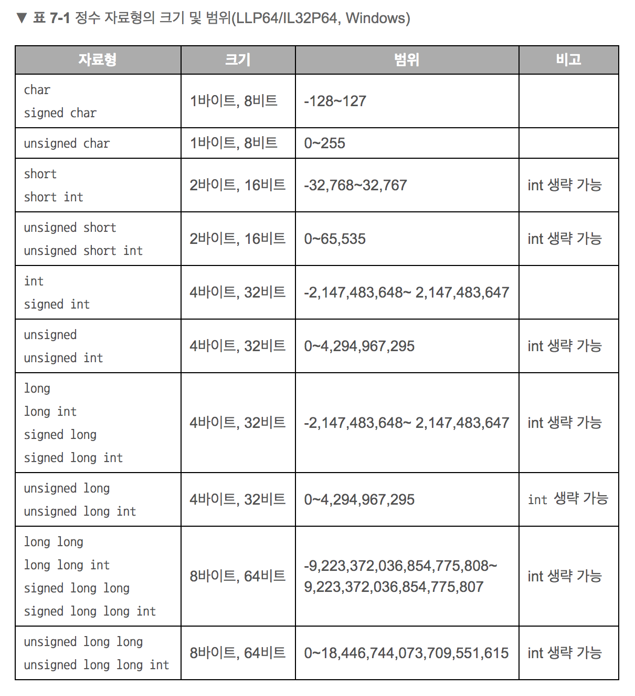

# 16. 비트마스크

##16.1 도입

### 1) 장점

- 더 빠른 수행 시간

  - 비트마스크 연산은 대부분 $O(1)$
  - 대신, 원소의 수는 많지 않아야 함.
  - 연산을 반복적으로 수행해야하는 경우 속도향상 기대

- 더 간결한 코드 - 반복문 없이 한줄 사용 가능

- 더 작은 메모리 사용량 

  - `boolean` 배열을 정수로 대체 : `bool[]` &#8594; int

  - **연관 배열을 배열로 대체 ** : `<vector<bool>, int>` &#8594; `int[]`

       


### 2) 용어 정리

- 비트(bit) : 이진수의 한 자리 ($0$ 또는 $1$)

- 부호 없는 $N$ 비트 정수형 변수 &#8594; $N$ 자리 이진수

  &#8594; 각 비트가 표현하는 값은 $2^0$ ~ $2^{N-1}$ 까지

- 비트 $0$ (꺼져 있다) / $1$ (켜져있다)

     


### 3) 비트 연산자

- 정수 변수를 비트 별로 조작 가능하다.

     


#### AND / OR / XOR 연산

| bit1 | bit2 | AND(`&`) | OR(`|`) | XOR(`^`) |
| :--: | :--: | :------: | :-----: | :------: |
|  0   |  0   |    0     |    0    |    0     |
|  1   |  0   |    0     |    1    |    1     |
|  0   |  1   |    0     |    1    |    1     |
|  1   |  1   |    1     |    1    |    0     |


#### NOT 연산


  

#### Shift 연산


| 연산                                   | 코드     |
| -------------------------------------- | -------- |
| 두 정수 $a,\ b$ 를 비트 별로 AND 연산  | `a & b`  |
| 두 정수 $a,\ b$ 를 비트 별로 OR 연산   | `a | b`  |
| 두 정수 $a,\ b$ 를 비트 별로 XOR 연산  | `a ^ b`  |
| 정수 $a$ 비트 별 NOT 연산              | `~a`     |
| 정수 $a$ 를 왼쪽으로 $b$ 비트 시프트   | `a << b` |
| 정수 $a$ 를 오른쪽으로 $b$ 비트 시프트 | `a >> b` |


### 유의할 점

#### 유의 1.   우선순위

- 비트 연산자의 우선순위가 비교 연산자보다 낮다 

  1. 비교 연산자 (ex. `==` , `!=` )
  2. 비트 연산자 (ex. `&`, `|`, `^`)

- `&` vs. `==`  &#8594; `==` win

  ```c++
  int c = (6 & 4 == 4);
  ```

  1. `4 == 4` &#8594; $TRUE = 1$ 
  2. `6 & 1` &#8594; $110_2\ \&\ 1_2 = 0_2$

  ```c++
  // 수정 
  int c = ((6 & 4) == 4);
  ```


#### 유의 2. 시프트 연산 오버플로우

- 예시1. 64비트 비트마스크 $a$ 의 $b$ 번 비트가 켜져있는지 확인하는 코드

  - 1은 부호 있는 32비트 상수로 취급 &#8594; $b$ 가 32보다 크면 오버플로우
  - 32보다 큰 $b$ 를 사용하면 1 뒤에  `ull` 붙이기
    - `ull` : unsigned long long  (부호 없는 64비트 정수)

  ```c++
  bool isBitSet(unsigned long long a, int b) {
      return (a & (1 << b)) > 0;
      // 수정 return (a & (1ULL << b)) > 0;
  }
  ```


- $N$ 비트 정수를 $N$ 비트 이상 왼쪽으로 시프트

  ```c++
  unsigned int a = 1; // 부호 없는 32 비트 정수
  cout << (a << 32);  // error
  cout << (a << 31);  // ok
  ```


#### 유의 3. 부호 없는 정수형을 사용하자 (부호 있는 정수형 사용 X)

- 부호 있는 정수형에서 최상위 비트가 켜진 숫자는 음수를 표현

   &#8594; 모든 비트를 사용하고 싶다면 부호 없는 정수형을 사용하자!

- 부호있는 정수형의 모든 비트를 사용하여 시프트하면 버그 발생 가능

  &#8594; 음수를 오른쪽으로 시프트하면 왼쪽 비트가 0이 아니라 1로 채워짐 


#### 정수 자료형의 크기와 범위 (알아두면 좋을 것 같음!)

- `signed ` : 부호 있음
- `unsigned` : 부호 없음




##  16.2 비트마스크를 이용한 집합의 구현

- ==$N$ 비트== 정수 &#8594; ==$0$ ~ $N-1$== 범위 정수 원소들의 집합을 표현 가능하다.

- 원소 $i$가 집합에 속해있는지 여부 = $2^i$ 비트가 켜져있는지 여부($1$ or $0$)

  &#8594; $2^i$ 비트가 켜져있으면 (==$1$==이면) : 원소 $i$가 ==집합에 속해있다.==

  &#8594; $2^i$ 비트가 꺼져있으면 (==$0$==이면) : 원소 $i$가 ==집합에 속해있지 않다.==

- 원소가 중복되지 않는 집합에 적용 가능하다.


### 기본 예제 

- $ N=10$ &#8594; $0$ ~ $9$ 범위 정수 원소들의 집합 표현 가능

- $\{1, 4, 5, 6, 7, 9\}$ 집합을 $10$ 비트 정수로 표현해보면?

  &#8594; $2^1 + 2^4 + 2^5 + 2^6 + 2^7 + 2^9$

  &#8594; bit $|9|8|7|6|5|4|3|2|1|0|$

  ​           $|1|0|1|1|1|1|0|0|1|0|$

  &#8594; $10\ 1111\ 0010_2 = 754_{10}$

  &#8594; $10$ 비트 정수인 $754$ 로 $\{1, 4, 5, 6, 7, 9\}$ 집합 표현!


### 피자집 예제

- 원하는 토핑을 골라 피자를 주문하자
- **토핑 $20$가지 ($0$~$19$번)** &#8594; $N=20$  

- 주문 시 토핑을 **넣기($1$) / 넣지 않기($0$)** 로 선택가능


### 1) 공집합과 꽉 찬 집합

- 토핑 없는 피자 &#8594; **공집합** 

  &#8594; $0000\ 0000\ 0000\ 0000\ 0000_2 = 0_{10}$

  ```c++
  int emptyPizza = 0;
  ```

- 모든 토핑을 다 올린 피자 &#8594; **꽉 찬 집합**

  &#8594; $1111\ 1111\ 1111\ 1111\ 1111_2 = 1048575_{10}$ 

  ​     $= 1\ 0000\ 0000\ 0000\ 0000\ 0000_2 -1$ 

  ```c++
  int fullPizza = (1 << 20) - 1; //1048575
  ```

- 16진수 0xff... 쓸 수 있다고함!


### 2) 원소 추가

- 원소 추가 &#8594; 해당 비트를 ==켜기(1)== &#8594; **OR 연산**

- 번호가 $p$ 인 토핑 페퍼로니를 추가하려면?

  ```c++
  toppings |= (1 << p);
  ```

    


### 3) 원소의 포함 여부 확인

- 집합 `toppings` 에 토핑 `p` 가 추가되었는지 확인하려면? &#8594; **AND 연산**

  ```c++
  if (toppings & (1 << p)) 
      cout << "topping p is in" << endl;
  ```

- **유의!**  `&` 연산의 결과 값은 0 또는 `1<<p`  $1000_2$

  &#8594; 논리 연산처럼 1 또는 `true` 가 반환된다고 착각하면 아래 같은 실수 발생

  ```c++
  // 제대로 동작 안함
  if ((toppings & (1 << p)) == 1) 
      cout << "topping p is in" << endl;
  ```

    


### 4) 원소 삭제

- 토핑 목록에서 페퍼로니를 삭제하고 싶으면?

1. `toppings` 에서 `1<<p` 를 빼기

   ```c++
   toppings -= (1 << p);
   ```

   - 페퍼로니가 토핑 목록에 있을 때만 사용 가능
   - 페퍼로니가 없는데 사용하면 큰일 남

2. 토핑이 없을때도 정상 동작하도록 &#8594; **NOT 연산 + AND 연산**

   ```c++
   toppings &= ~(1 << p);
   ```

   - `~(1<<p)` NOT 연산 &#8594; 해당 비트만 꺼지고(0) 나머지는 켜짐(1)

   - `&` AND 연산 &#8594; `toppings` 의 나머지 비트는 유지, `p` 번 비트만 항상 꺼짐(0)

       


### 5) 원소의 토글(toggle)

- 해당 비트가 켜져 있으면 끄고, 꺼져 있으면 크기 &#8594; **XOR 연산**

- `p` 번 토핑이 들어가 있는 경우 빼고, 빠져 있는 경우 넣으려면?

  ```c++
  toppings ^= (1 << p);
  ```


### 6) 두 집합에 대해 연산하기

- 두 집합 a와 b의 집합 연산
- 수행 시간 &#8594; 원소 하나에 대한 수행시간과 같음!

``` c++
// a 와 b 의 합집합
int added = (a | b);          
// a 와 b 의 교집합
int intersection = (a & b);   
// a 에서 b 를 뺀 차집합
int removed = (a & ~b);    
// a 와 b 중 하나에만 포함된 원소들의 집합
int toggled = (a ^ b);         
```

  

### 7) 집합 크기 구하기

- 비트를 순회하면서 **켜져 있는 비트의 수**를 직접 세야함 &#8594; 재귀로 구현

  ```c++
  int bitCount (int x) {
    if (x == 0) return 0;
    return x % 2 + bitCount(x / 2);
  }
  ```

- 위 코드를 직접 최적화하기보다는, 최적화되어있는 **내장 명령어** 사용하자

  - 32비트 부호 없는 정수 `toppings`의 켜진 비트 수를 구하는 코드

  | 컴파일러 혹은 언어 |       집합의 크기 구하기       |
  | :----------------: | :----------------------------: |
  |      gcc/g++       | `__builtin_popcount(toppings)` |
  |     Visual C++     |      `__popcnt(toppings)`      |
  |        Java        |  `Integer.bitCount(toppings)`  |

    

### 8) 최소 원소 찾기

- 컴파일러 명령어로 집합에 포함된 가장 작은 원소 찾을 수 있다.  00101010 -> 2

  &#8594; 최하위 비트의 위치 구하기 : 몇 번 위치인지 알 수 있음

  - 32비트 부호 없는 정수 `toppings`의 최하위 비트 위치 구하는 코드

  | 컴파일러 혹은 언어 |              최소 원소 찾기               |
  | :----------------: | :---------------------------------------: |
  |      gcc/g++       |         `__builtin_ctz(toppings)`         |
  |     Visual C++     |    `_BitScanForward(&index, toppings)`    |
  |        Java        | `Integer.numberOfTrailingZeros(toppings)` |

- 위치가 아니라 **값**을 알고싶으면?

  - ex. 40 ($10\ 1000_2$) 에서 3이 아니라 $2^3$ 을 구하고 싶으면?

  ```c++
  int firstTopping = (toppings & -toppings);
  ```

  - 컴퓨터가 음수를 표현하는 2의 보수를 사용한다. 
    - 2의 보수를 사용하는 시스템에서는 음수 -toppings 를 표현하기 위해 toppings 에 비트별 NOT 연산을 적용하고 그 결과에 1을 더한다. 
    - 예를 들어 toppings 의 값이 160 이라고 하자. 그러면 아래와 같은 계산 과정을 가진다.

  ```c++
         toppings      = 1010 0000 0101 1111  0110 0000
        -toppings      = 0110 0000
  toppings & -toppings = 0010 0000
  ```

     


### 9) 최소 원소 지우기

```c++
toppings &= (toppings - 1);
```

```c++
       toppings           = 1010 0000
       toppings - 1       = 1001 1111
toppings & (toppings - 1) = 1000 0000
```

- 최소 원소를 얻은 뒤, 그 원소를 지우는 것보다 간결함
- 어떤 정수가 2의 거듭제곱 값인지 확인할 때 유용
  - 2의 거듭제곱 값들은 이진수 표현에서 켜진 비트가 하나밖에 없음

  - 최하위 비트를 지웠을 때 0이 되면 주어진 수는 2의 거듭 제곱임.

       


### 10) 모든 부분 집합 순회하기

- 비트마스크를 사용하면 `for` 문 하나로 간단히 모든 부분 집합을 순회할 수 있다.

- pizza 가 {a, b, c} 라면 {a}, {b}, {c}, {a, b}, {a, c}, {b, c}, {a, b, c} 를 열거 {1, 3, 5}

  &#8594; 공집합은 방문하지 않음.

```c++
for (int subset = pizza; subset; subset = ((subset - 1) & pizza)) {
  //subset 은 pizza 의 부분집합
}
```

```c++
       pizza              = 1010 1100 //{7,5,3,2}
           
       pizza - 1          = 1010 1011
   pizza & (pizza - 1)    = 1010 1000 //{7,5,3}
           
       subset-1           = 1010 0111
   pizza & (subset - 1)   = 1010 0000 //{7,5}
           
       subset-1           = 1001 1111
   pizza & (subset - 1)   = 1000 0000 //{7}
           
       subset-1           = 0111 1111
   pizza & (subset - 1)   = 0010 1100 //{5,3,2}  
 
       subset-1           = 0010 1011
   pizza & (subset - 1)   = 0010 1000 //{5,3}
           
       subset-1           = 0010 0111
   pizza & (subset - 1)   = 0010 0000 //{5}
           
       subset-1           = 0001 1111
   pizza & (subset - 1)   = 0000 1100 //{3, 2}
           
       subset-1           = 0000 1011
   pizza & (subset - 1)   = 0000 1000 //{3}
        
       subset-1           = 0000 0111
   pizza & (subset - 1)   = 0000 0100 //{2}
```

```c++
for (int subset = pizza; subset; subset = ((subset - 1) & pizza)) {
  //subset 은 pizza 의 부분집합
}
```

  

## 16.3 비트마스크 응용 예제

### 지수 시간 동적 계획법

- 비트마스크를 이용하면 Boolean 배열을 정수 인덱스로 변환 가능
- 메모이제이션 구현 간단해짐


### 에라토스테네스의 체

- 14.2 절의 에라토스테네스의 체 알고리즘 

- 에라토스테네스의 체는 굉장히 빠르게 동작하기 때문에, 수행범위를 늘릴 때 부담이 되는 것은 수행시간보다 **메모리**

- 체를 구현할 때 **범위 내의 각 정수가 지워졌는지 여부** 를 Boolean 배열이 아닌 **정수**로 표현

    


### 15 퍼즐 상태 표현하기

- Boolean 배열 뿐만 아니라 , 표현해야 하는 값의 범위가 작을 때는 2비트씩, 3비트씩 묶어서 배열로 사용 가능

- 15퍼즐 : 0~15까지 숫자가 들어있는 $4\times4$  크기 배열

  &#8594; 각 숫자는 4비트로 표현 

  &#8594; $4 \times 16 $개의 숫자 $= 64$ 비트 정수로  표현 가능

  $0001\ 0010\ 0011\ 0100\ 0101\ 0110\ 0111\ 1000\ 1001\ 1010\ 1011\ 1100\ 1101\ 1111\ 1110_2$


```c++
typedef unsinged long long uint64;

// mask의 index 위치에 쓰인 값을 반환
int get(uint64 mask, int index) {
    return (mask >> (index << 2)) & 15;
} 
// mask 0001 1000 1110 1101 

// index = 3(11) -> 3<<2 = 1100 (4 곱하는거랑 같음)
// mask >> (3X4) 하면 해당 4비트가 맨 끝자리로 오게됨
// 15(1111)와 &연산하면 4비트 중 1인 값 반환

// mask의 index 위치를 value로 바꾼 결과를 반환
uint64 set(uint64 mask, int index, uint64 value) {
    return mask & ~(15LL << (index << 2)) | (value << (index << 2));
}
// 해당 index 비트를 0000으로 초기화하고 value 값으로 세팅
```


### O(1) 우선순위 큐

- 포함된 원소 중에서 우선순위가 가장 높은 원소를 빠르게 찾아내는 자료구조

- 자료 N개 연산 속도

  - 우선순위 큐 : $O(lgN)$
  - 비트마스크 : $O(1)$

-  ex. 큐에 넣는 원소의 우선순위가 1~140

  &#8594; 140개의 큐

  &#8594; 각 큐에 원소가 있는지 여부를 비트마스크로 표현

  &#8594; 140개의 불린 값을 64비트 정수 3개로 저장

  &#8594; 첫 번째 비트를 찾는 연산으로 우선순위 높은 원소가 어딨는지 구하기

   

### 예제. 극대 안정 집합

- $N$ 개의 화학 물질을 운반해야 함.

- 안정적인 집합 : 한 상자에 넣어도 폭발하지 않는 물질의 집합

- 극대 안정 집합 : 물질을 하나라도 추가하면 폭발이 일어나는 집합

- 화학물질의 폭발정보가 주어질 때 극대 안정 집합의 수를 세기

  &#8594; $2^n$ 개의 모든 집합을 만들어 보면서 각 집합이 안정적인지 확인

```c++
int n;

// explodes[i]와 같이 두었을 때 폭발하는 물질 집합의 미트마스크 표현
int explodes [MAXN];

// 주어진 집합이 안정적인지 확인 (3. 원소 포함 여부 확인)
bool isStable(int set) {
    [1, 3, 5]
    for(int i=0; i<n; ++i) 
        // 집합에 포함된 i번째 원소와 같이 두었을 때 폭발하는 물질이 set에 있다면	
        // 1. set에 i번째 원소 있는지 확인
        // 2. set와 explodes[i] 간의 겹치는 원소가 있는지 확인
        if((set & (1<<i)) && (set & explodes[i]))
            return false;
    return true;
}

// 모든 극대 안정 집합의 수를 세기
int countStableSet() {
    int ret = 0;
    // 모든 집합을 만들어 보자
    for(int set = 1; set < (1<<n); ++set){
        // 안정적이지 않으면 셀 필요 없음
        if(!isStable(set)) continue;
        
        // 극대 안정집합인지 확인하기 위해, 넣을 수 있는 다른 물질이 있나 확인한다.
        bool canExtend = false;
        for(int add= 0; add < n; ++add) {
            // 1. add가 집합에 포함되어 있지 않고
            // 2. set에 add를 넣어도 안정적이라면 (이미 set는 안정 집합이므로 isStable()할 필요없이 추가하는 add에 대해서만 겹치는 원소가 있는지 확인하자)
            if((set & (1<<add)) == 0 && (explodes[add] & set)==0) {
                canExtend = true;
                break;
            }
        }
        
        // 더 이상 원소를 추가할 수 없는(넣으면 폭발하는) 집합이 극대 원소 집합
        if(!canExtend)
            ++ret;
    }
    return ret;
}
```


## 16.4 & 16.5 문제 : 졸업 학기

- 졸업 학점을 채우려면 전공과목 $N(1\le N\le12)$개중 $K(0\le K \le N)$개 이상을 수강해야 함.
- 각 과목은 해당 과목의 선수과목$R_i(0 \le R_i \le {N-1}) $을 미리 수강했어야만 수강 가능
- 각 학기마다 모든 과목이 개설되는 것이 아니고, 한 학기에 최대 $L(1 \le L \le 10)$ 까지 수강 가능 
- 각 과목의 정보와 앞으로 $M(1\le M \le 10)$ 학기 동안 개설될 과목의 목록이 주어질 때 최소 몇 학기만에 졸업 가능?

```c++
int graduate(int semester, int taken) {
	//기저사례 : k개 이상의 과목을 이미 들은 경우
	if (bitCount(taken) >= k) return 0;
	//기저사례 : m학기가 전부 지난 경우
	if (semester == m) return IMF;

	//메모제이션
	int& ret = cache[semester][taken];
	if (ret != -1) return ret;
	ret = IMF;
	//이번 학기에 들을 수 있는 과목 중 아직 듣지 않은 과목들을 찾는다.
	int canTake = (classes[semester] & ~taken);
	//선수 과목을 다 듣지 않은 과목들을 걸러낸다.
	for (int i = 0; i < n; ++i)
		if ((canTake&(1 << i)) && (taken&prerequisite[i]) != prerequisite[i])
			canTake &= ~(1 << i);
	//이 집합의 모든 부분집합을 순회한다.
	for (int take = canTake; take > 0; take = ((take - 1)&canTake)) {
		//한 학기에 1과목까지만 들을 수 있다.
		if (bitCount(take) > l)continue;
		ret = min(ret, graduate(semester + 1, taken | take) + 1);
	}
	//이번 학기에 아무 것도 듣지 않을 경우
	ret = min(ret, graduate(semester + 1, taken));
	return ret;
}
```


