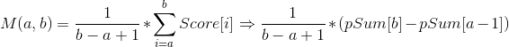

# 17장. 부분 합
## 17.1 도입
### Why?: 최적화, memoization?

#### Idea:
  > 연속된 구간합을 구해서 그때그때마다 구간합을 구하면 O(N)의 시간 복잡도를 갖는다.
    score[a]부터 score[b]까지를 순회하며 각수를 더해야 하기 때문이다.
    하지만, 누적합(partialSum)을 이용하면 연속된 구간합(partialSum[b] - partialSum[a-1])을 O(1)만에 구할 수 있다.

  - Example 1: 배열 score[]의 각 원소와 해당 배열의 부분합

    i | 0 | 1 | 2 | 3 | 4 | 5 | 6 | 7 | 8 
    ---- | ---- | ---- | ---- | ---- | ---- | ---- | ---- | ---- | ----
    score | 100 | 97 | 86 | 79 | 66 | 52 | 49 | 42 | 31
    partialSum | 100 | 197 | 283 | 362 | 428 | 480 | 529 | 571 | 602
  
    - partialSum을 미리 계산해 두면 score[]의 특정 구간의 합을 O(1)에 구할 수 있음.
    - partialSum[b] - partialSum[a-1] (단, partialSum[-1] = 0)

    
    ```c++
    /* 
     * Code 17.1 부분합을 계산해주는 함수(partialSum)와 이를 이용해 구간합을 계산하는 함수
     */
    //주어진 벡터 a의 부분합을 계산
    vector<int> partialSum(const vector<int>& a) {
      //1. partialSum vector 생성
      vector<int> ret(a.size());
      //2. 첫번째 Index 값 복사
      ret[0] = a[0];
      //3. 두번째 Index 부터 순회하여 Partial Sum 계산 
      for(int i = 1; i < a.size(); i++)
        ret[i] = ret[i-1] + a[i];
   
      //4. 계산한 Partial Sum Vector return
      return ret;
    }

    //어떤 벡터의 부분합 pSum[]이 주어질 때, 원래 벡터의 a부터 b까지의 합을 구한다.
    int rangeSum(const vector<int>& pSum, int a, int b) {
      if(a == 0)  return psum[b];
      return pSum[b] - pSun[a-1];
    }
    ```

#### 응용 1: 임의의 a, b 연속된 구간 평균 구하기


```c++
/*
 * Code 17.2 부분합을 계산해주는 함수(ㅔartialSum)를 이용해 특정 구간의 평균을 계산하는 함수(mean)
 */
//A[]의 부분 합 벡터 psum이 주어질때 A[a,b]의 평균을 반환한다(psum은 partialSum을 통해 구한다.)
double mean(const vector<int>& psum, int a, int b) {
  //1. 구간합을 사용하여 평균을 계산
  return rangeSum(psum, a , b) / double(b - a + 1);
}
```

#### 응용 2: 임의의 a, b 연속된 구간 분산 구하기


```c++
/*
 * Code 17.3 제곱의 부분합을 계산해주는 함수(squarePartialSum)와 이를 이용해 특정 구간의 분산을 계산하는 함수(variance)
 */
//주어진 벡터 a의 부분 제곱 합을 계산
vector<int> squarePartialSum(const vector<int>& a) {
  //1. partialSum vector 생성
  vector<int> ret(a.size());
  //2. 첫번째 Index 값 복사
  ret[0] = a[0] * a[0];
  //3. 두번째 Index 부터 순회하여 Sqaure Partial Sum 계산 
  for(int i = 1; i < a.size(); i++)
    ret[i] = ret[i-1] + a[i] * a[i];
   
  //4. 계산한 Partial Sum Vector return
  return ret;
}

//A[]의 제곱의 부분 합 벡터 sqpsum, A[]의 부분 합 벡터 psum이 주어질때
//A[a,b]의 분산을 반환한다 (sqpSum은 squarePartialSum()을 통해, psum은 partialSum을 통해 사전 계산한다.)
double variance(const vector<int>& sqpsum,
                const vector<int>& psum, int a, int b) {
  //1. 구간의 평균을 계산
  double mean = mean(psum, a , b);
  double ret = rangeSum(sqpsum, a, b) - 2 * mean + rangeSum(psum, a, b) + (b - a + 1) * mean * mean;
  return ret / (b - a + 1);
}
```

#### 2차원으로 확장
##### A[y1, x1]에서 A[y2, x2]까지의 직사각형 구간합 구하기

> psum[y,x]는 (0,0)을 왼쪽 위칸, (y,x)를 오른쪽 아래 칸으로 갖는 직사각형 구간에 포함된 모든 


```c++
/*
 * Code 17.4 부분 합을 이용해 2차원 배열의 구간 합을 구하는 함수의 구현
 */
//어떤 2차원 배열 A[][]의 부분합 psum[][]이 주어질 때
//A[y1,x1]과 A[y2,x2]를 양 끝으로 갖는 부분 배열의 합을 반환한다.
int gridSum(const vector<vector<int>>& psum, int y1, int x1, int y2, int x2) {
    int ret = psum[y2][x2];
    if(y1 > 0) ret -= psum[y1-1][x2];
    if(x1 > 0) ret -= psum[y2][x1-1];
    if(y1 >0 && x1 > 0) ret += psum[y1-1][x1-1];
    return ret;
}
```
## 17.2 문제
#### 예제 1: 합이 0에 가장 가까운 구간의 합을 구하라

i | 0 | 1 | 2 | 3 | 4 | 5 | 6 | 7 | 8 | 9
---- | ---- | ---- | ---- | ---- | ---- | ---- | ---- | ---- | ---- | ----
A[i] | -14 | 7 | 2 | 3 | -8 | 4 | -6 | 8 | 9 | 11


#### 예제 1 풀이:


Hint) 구간의 합이 0에 가장 가깝다? -> 구간합의 차이가 가장 적다

i | 0 | 6 | 4 | 1 | 5 | 2 | 7 | 3 | 8 | 9
---- | ---- | ---- | ---- | ---- | ---- | ---- | ---- | ---- | ---- | ----
psum[i] | -14 | -12 | -10 | -7 | -6 | -5 | -4 | -2 | 5 | 16

```c++
//
//  parialSum.cpp
//
//  Created by 김지훈 on 2019/11/15.
//  Copyright © 2019 JuneKim. All rights reserved.
//

#include <iostream>
#include <vector>
#include <algorithm>
#include <limits.h>

using namespace std;

bool compare(int a, int b) {
    return a < b;
}

int main() {
    int myarr[] = {-14,7,2,3,-8,4,-6,8,9,11};
    int psum[10];
    
    //1. 누적합 계산
    psum[0] = myarr[0];
    for(int i = 1; i < 10; ++i) {
        psum[i] = psum[i-1] + myarr[i];
    }
    
    //2. 누적 합 정렬
    sort(psum, psum+10, compare);
    
    int result = INT_MAX;
    for(int i = 1; i < 10; i++) {
        int partialSumDiff = psum[i] - psum[i-1];
        if(result > partialSumDiff) {
            result = partialSumDiff;
        }
    }
    
    //3. Print
    cout << "Sum:" << result << endl;
    return 0;
}

```
#### 예제 2: 크리스마스 인형(문제ID: CHRISMAS)
https://algospot.com/judge/problem/read/CHRISTMAS

#### 예제 2 풀이
Hint)"H에서 T까지 구입했을때 남기지 않고 어린이들에게 나눠줄 수 있는가?"
(psum[T] - psum[H-1]) mod K = 0
=> 인형의 합을 어린아이들 수로 나눈 나머지의 수가 중요 하다!
현 문제에서의 psum의 재정의:
0부터 i-1번쨰 상자에(상자의 수 i기 때문에) 들어있는 인형의 합을 아이들 수로 니눈 나머지 

```c++
//
//  main.cpp
//  Chrismas
//
//  Created by 김지훈 on 2019/11/15.
//  Copyright © 2019 JuneKim. All rights reserved.
//

#include <iostream>
#include <vector>
using namespace std;

int test_case; // Test Case 수
int N; // 상자의 수
int K; //아이들 수
//D[]의 부분 합 배열 psum[]과 k가 주어질 때, 몇 가지 방법으로 살 수 있는지 반환
//psum[]의 첫 번째 원소 전에 0을 삽입했다고 가정

int waysToBuy(const vector<int> &psum, int K)
{
    const int MOD = 20091101;
    int result = 0;

    //psum[]의 각 값을 몇 번이나 본 적 있는지 기록
    vector<long long> count(K, 0);
    for (int i = 0; i < psum.size(); i++)
        count[psum[i]]++;

    //두 번 이상 본 적 있다면 이 값 중 두 개를 선택하는 방법의 수를 더한다
    //count[i]개 중 2개를 고를 경우의 수
    //nC2를 더한다 (n=count[i])

    for (int i = 0; i < K; i++)
        if (count[i] >= 2)
            result = (result + ((count[i] * (count[i] - 1)) / 2)) % MOD;

    return result;
}

//D[]의 부분 합 배열 psum[]과 K가 주어질 때, 겹치지 않게 몇번이나 살 수 있는지 반환
//psum[]의 첫 번째 원소 전에 0을 삽입했다고 가정
int maxBuys(const vector<int> &psum, int K)
{
    /*
        result[i] = i - 1번 상자까지 구매 가능한 최대 횟수
        i - 1번째 인형을 구매하지 않거나? 구매할 경우 둘중의 최댓값을 저장
            result[i] = max(result[i -1], result[최근에 psum값이 같았던 인덱스] + 1);
     */

    vector<int> result(psum.size(), 0);
    //previous[s]=psum[]이 s였던 마지막 위치
    vector<int> previous(K, -1);
    for (int i = 0; i < psum.size(); i++)
    {
        //i번째 상자를 아예 고려하지 않는 경우
        if (i > 0)
            result[i] = result[i - 1];
        else
            result[i] = 0;

        //psum[i]를 전에도 본 적이 있다면, prev[psum[i]]+1부터 현재까지 구매
        int loc = previous[psum[i]];
        if (loc != -1)
            result[i] = max(result[i], result[loc] + 1);

        //previous[]에 현재 위치 기록
        previous[psum[i]] = i;
    }
    return result.back();
}

int main(void)
{
    cin >> test_case;

    for (int i = 0; i < test_case; i++)
    {
        cin >> N >> K;

        vector<int> v(N);

        for (int i = 0; i < N; i++)
            cin >> v[i];

        vector<int> psum(N + 1);
        psum[0] = 0;

        //psum = 상자에 들어있는 인형들의 합을 아이들 수로 나눈 나머지
        for (int i = 1; i <= N; i++)
            psum[i] = (psum[i - 1] + v[i-1]) % K;

        cout << waysToBuy(psum, K) << " " << maxBuys(psum, K) << endl;

    }
    return 0;
}
```

