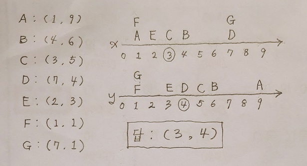
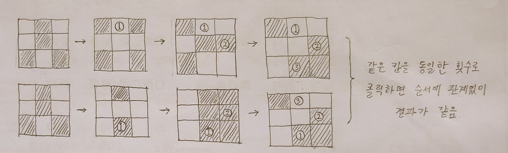
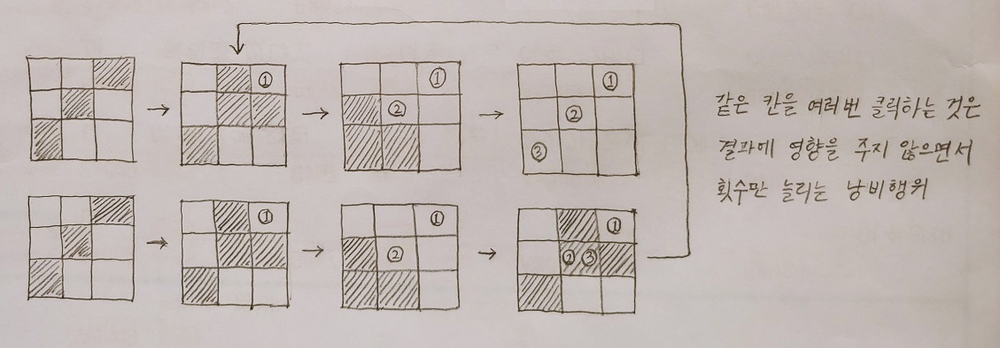
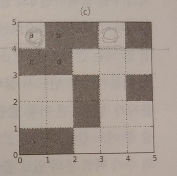
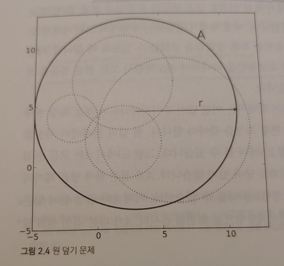

# 개관

- 학교에서는 이론을 위주로 배웁니다.
- 소프트웨어 개발자로 일하지만 코딩에는 서투른 사람이 많습니다.
- 저자가 프로그래밍 대회를 통해 느꼈던 즐거움을 공유하려 합니다.
- 이를 통해 이론을 더 깊이 이해할 수 있습니다.

# 1장. 문제해결과 프로그래밍 대회

## 1.1 도입

- 프로그래머라는 직업의 틀 안에는 많은 종류가 있지만 어떤 분야를 막론하고 문제해결능력은 필수적입니다.
- 그러나 실무에서는 문제해결 자체보다 전체 시스템의 구조에 영향을 받는 경우가 많으므로 문제해결 능력을 기르는 것은 어렵습니다.
- 알고리즘에 대한 이론과 지식이 퍼즐조각이라면 이것을 맞춰서 큰 그림을 만드는게 문제해결 능력입니다.
- 이러한 문제해결 능력은 추상적인 기술이므로 훈련하기가 어려운데 가장 좋은 방법은 (온라인, 오프라인) 프로그래밍 대회에 자주 참가하는 것입니다.

## 1.2 프로그래밍 대회 

프로그래밍 대회의 문제 형태: **"어떤 값을 읽어서 어떤 값을 계산하는 프로그램을 작성하시오."**

#### 예제 : 록 페스티벌 (난이도:하, 문제 ID:FESTIVAL)

- 상황
  - 공연장을 빌려서 록 페스티발을 개최하려 함
  - 하루에 한 팀의 밴드가 콘서트를 함
  - 몇 개의 밴드를 섭외할지는 결정하지 않았지만 L개의 팀은 이미 섭외함  
    (따라서 페스티벌은 최소 L일 이상 지속됨)
  - N일 간의 공연장 대여비용을 알고 있다고 있다고 할 때,  
    **L일 이상 연속해서 대여하는 평균비용을 최소화하려면** 어떻게 빌려야 하나?
- 예
  - 6(N)일간의 대여 비용: { 3, 1, 2, 3, 1, 2 }
  - 3(L)개 팀을 이미 섭외했음
  - 평균비용을 구해보면 4일 동안 빌렸을 때가 더 저렴
    - 3일 빌리면 ==> (1+2+3) / 3 = 2 
    - 4일 빌리면 ==> (1+2+3+1) / 4 = 1.75
- 시간 및 메모리 제한
  
  - 2초 안에 실행되어야 하며, 64MB 이하의 메모리
- 입력
  - 첫번째 줄 : 테스트 케이스의 수 C (C <= 100)
  - 각 테스트케이스
    - 첫번째 줄 : N L (1<=N<=1000, 1<=L<=1000, L<=N)
    - 두번째 줄 : N일간의 공연장 대여비용
  ```bash
  2
  6 3
  1 2 3 1 2 3
  6 2
  1 2 3 1 2 3
  ```

- 출력

  ```bash
  1.7500000000
  1.5000000000
  ```

#### 프로그래밍 대회에서 배울 수 있는 것들

위와 같이 프로그래밍 대회의 문제는 현업에서 접하는 문제들과는 다릅니다. 이를 통해 배울 수 있는 것들은 아래와 같습니다.

- 그래픽 인터페이스가 없으므로 문제해결에만 집중할 수 있음
- 알고리즘과 자료구조를 직접 사용해 볼 수 있는 계산집중적 문제임
- 정답과 오답의 구분이 명확하기 때문에 객관적인 평가와 피드백을 받을 수 있음
- 자신이 코딩한 프로그램의 퍼포먼스를 직접 경험하게 되므로 더 효율적으로 구현하려고 노력하게 됨
- 실무의 대형 프로젝트에서 간과했던 진짜 프로그램의 핵심점인 부분에만 집중할 수 있음
- 대회라는 것은 곧 경쟁이지만 실패하더라도 고수의 코드를 보고 배울 수 있음

## 1.3 이 책을 읽는 방법

#### 이 책의 구성

- 전체 7부로 구성 1,2부(1장~5장)는 기본지식 함양이며 3부 이후부터는 알고리즘 기법과 자료구조

- 책에 있는 모든 연습문제는 [algospot](http://algospot.com)에서 실제로 풀어볼 수 있으며 채점받을 수 있음

  

#### 필요한 배경지식

- C++ 과 STL;;
- 고등학교 수학;;

## 1.4 국내에서 참가할 수 있는 프로그래밍 대회

- 교재 참조

## 1.5 대회 준비를 위한 조언 

- 가능한 한 많은 문제 풀기
- 온라인 채점 사이트 이용하기

## 1.6 더 읽을거리

- Introduction to Algorithms : 전 세계 전산학과 알고리즘, 자료구조의 교과서
- Programming Challenges : 바야돌리드 대학교의 문제와 문제풀이 일부, 좋은 입문서
- The Art of Computer Programming : 알고리즘 부야의 가장 권위 있는 책, MMIX 어셈블리를 사용하기 때문에 진입장벽 있음
- 프로그래밍 콘테스트 챌린징 : 일본의 프로그래밍 고수들이 쓴 책으로 실용적이고 다양한 테크닉

# 2장. 문제 해결 개관

## 2.1 도입

- 단순히 알고리즘을 외워서 문제를 풀면 실력이 늘지 않음
- 문제 해결과정을 잘 나눠서 접근하는 것이 필요함
- 이 장에서는 문제 해결과정을 여러 단계로 나눠보고 각 단계별로 설명

## 2.2 문제 해결 과정

#### 파인만 알고리즘

- 양자 물리학자인 리차드 파인만이 사용한 방법
- 가장 일반적인 문제해결 방법
- 순서
  1. 칠판에 문제를 적는다.
  2. 골똘히 생각한다.
  3. 칠판에 답안을 적는다.
- 반쯤 농담이지만, 중요한 점은 문제해결 방법을 단계별로 나눴다는 점입니다.

#### 어떻게 문제를 풀 것인가(How to Solve It)라는 유명한 책에 나온 문제 해결 과정

1. 문제를 이해한다.
2. 어떻게 풀지 계획을 세운다.
3. 계획을 수행해서 문제를 해결한다.
4. 어떻게 풀었는지 돌아보고, 개선할 방법이 있는지 찾아본다.

#### 위의 2가지 방법을 합쳐서 탄생한 프로그래밍 대회를 위한 6단계 문제 해결 방법

1. 문제를 읽고 이해한다.
   - 문제를 대충 이해하면 나머지 5단계를 아무리 잘해도 의미가 없음
   - 초보자부터 챔피언까지 공통적으로 하는 실수
2. 문제를익숙한 용어로 재정의한다. (재정의와 추상화)
   - 문제는 대부분 현실세계의 개념을 인간의 언어로 작성한 것이기 때문에 복잡함
   - 축약하고 알기 쉽게 수학적/전산한적으로 옮겨서 표현하는 것 (프로그래밍과 연결)
3. 어떻게 해결할지 계획을 세운다. (전략 수립)
   - 문제해결을 위한 알고리즘과 자료구조를 선택
   - 이미 알고있는 알고리즘과 자료구조를 통해 해결할 수 있다면 베스트이지만, 그렇지 않은 경우 여기서 가장 많은 시간을 소비함
4. 계획을 검증한다.
   - 전략을 세웠다고 해서 바로 키보드를 잡으면 안됨
   - 선택한 알고리즘과 자료구조를 통해 문제를 주어진 시간과 메모리 용량을 통해 해결할 수 있는지 검증필요
   - 성공하지 못할것 같으면 3단계로 돌아가서 새로운 계획을 세워야 함
   - 4,5장에서는 이러한 알고리즘의 효율성과 정당성을 증명하는 전략을 다룸
5. 프로그램을 구현한다.
   - 실제로 프로그래밍을 시작
   - 아무리 좋은 알고리즘과 자료구조를 찾았다고 해도 실제로 구현할 수 없으면 아무 의미가 없음
6. 어떻게 풀었는지 돌아보고, 개선할 방법이 있는지 찾아본다. (회고하기)
   - 문제해결에 직접적인 연관은 없지만, 장기적으로 중요함
   - 내가 해결한 과정을 돌아봐야만 유사한 문제에 대해 더 효율적인 알고리즘을 선택할 수 있음
   - 가장 좋은 방법은 어떤 문제에 대해서 해결한 코드와 접근방식을 기록으로 남겨두는 것
   - 맞추지 못한 경우, 오답원인도 꼭 기록해야 함
   - 문제를 해결한 다른사람의 코드도 봐야 함, 자신이 생각하지 못했던 통찰을 얻을 수 있음
   - 스터디나 인터넷을 통해 함께 공부하는 것이 중요함

#### 문제를 풀지 못 할 때

- 위의 6단계를 통해서 문제를 풀지 못하는 경우가 있을 것입니다.
- 물론 최대한 직접 고민하여 해결방법을 찾는 것이 중요합니다.
- 그러나 너무 많은 시간을 허비하는 것도 비추합니다.
  - 직접 풀어보는 시간의 범위, 즉 기준을 정하고 그 시간이 지나면 다른 사람의 소스코드나 풀이를 참고합시다.
- 자신이 왜 그러한 풀이를 떠올리지 못했는지 돌아보면서 해당 알고리즘, 자료구조, 풀이기법을 꼭 기록합시다.
  - 그래야만 유사한 문제를 봤을 때, 해당 기법이 떠오를 것입니다.

#### 주의

- 위 6단계를 하나하나 의식하면서 문제를 풀라는 의미는 아님
- 많은 문제를 풀다보면 이 과정이 자연스럽게 익숙해짐

## 2.3 문제 해결 전략

#### 직관과 체계적인 접근

- 문제해결과정 3단계 : "전략 수립"은 실제로 막막한 경우가 많습니다.
- 이럴 때는 문제해결을 위한 직관력을 키우는게 중요한데, 직관력도 문제를 많이 풀어봐야 향상됩니다.
- 아래 10가지는 전략 수립를 위한 좋은 방법들이며 순서가 빠른게 더 강력한 방법입니다.

#### 문제 해결 과정 3단계인 "전략수립" 을 위한 체계적인 접근방법 10가지

1. 비슷한 문제를 풀어본 적이 있던가?
   - 어떤 문제의 유형에는 어떤 알고리즘을 사용한다라는 것이 연상되는 경우입니다.
   - 이를 위해서는 문제가 어떤 유형이고 이를 위한 해결법이 무엇인지를 체계적으로 공부해야 합니다
   - 해결법 연상의 예 
     - 문제유형 : 사건의 발생확률이나 경우의 수를 구해야 함 >>> 해결법 : 동적계획법
     - 문제유형 : 두 도시를 잇는 가장빠른 기차 >>> 해결법 : 최단경로 알고리즘
2. 단순한 방법에서 시작할 수 있을까? (점진적인 개선)
   - 해결방법이 잘 떠오르지 않는다면 "무식하게 풀 수 있을까?"로 시작해 봅니다.
     - 즉, 공간 혹은 시간적 제약사항을 고려하지 않고 어떻게든 해결하는 방법을 찾아보는 것입니다.
     - 예를 들어 모든 경우의 수를 다 훑어보는 것 등
     - 주어진 시간내에 문제를 해결할 수 없더라도 실마리를 얻을 수 있습니다.
     - 점진적으로 개선하면 주어진 시간내에 동작하도록 구현하는데 성공할 수도 있습니다.
   - 점진적인 개선의 예제
     - 3명의 어린이에게 사탕을 가장 공평하게 나눠주는 방법은?
       - 사탕의 개수 : N(N <= 30)개
       - 사탕의 무게 : 최대 20 (정수)
       - 공평함의 의미 : 사탕의 총 무게의 차이가 가장 작음 (가장 많이 받은 아이 vs 가장 적게 받은 아이)
     - 제일 단순한 방법 (6장의 주제 : 완전탐색)
       - 모든 경우의 수 : 3^30 = ‭205,891,132,094,649‬ 개 (약 205조개)
       - 주어진 시간 내에 실패할 확률이 큽니다.
     - 1차 개선
       - idea : 1명이 받은 사탕의 무게가 같다면 같은 경우로 볼 수 있음 (29장의 주제 : 너비우선탐색)
       - 3명에게 배분한 사탕을 무게로 표현하면 아래와 같음
         - (0g, 0g, 0g) ~ (600g, 600g, 600g)  
           ※ 600g = 20 x 30
         - 따라서 경우의 수는 :  600 ^ 3 = ‭216,000,000‬ 개 (약 2억개)
     - 2차 개선
       - idea : 사탕의 총 무게(많은 아이 - 적은 아이)의 차는 20g을 넘을 수 없음     
         ※ 왜냐하면 차이가 20g 이상일떄는 제일 많은 아이가 제일 적은 아이한테 하나 주면 되니깐  
       - 공평하게 주는게 목적이므로)가장 많이 받는 아이의 사탕은 (20 x N) / 3 + 20 = 220g 을 넘을 수 없음
         - (0g, 0g, 0g) ~ (220g, 220g, 220g)
         - 따라서 경우의 수는 : 220 ^ 3 = ‭10,648,000‬ (약 1000만개)
     - 3차 개선
       - idea : (180, 190, 200) 과 (200, 190, 180) 은 같은 답임  
         ※ 문제에서 누가 많은 받든지 순서는 중요하지 않으므로 중복임
       - 따라서 경우의 수는 : 10,648,000 / 6 = 1,774,666 (약 200만개)  
         ※ 3가지 수를 나열하는 방법 6을 (3 x 2 x 1) 나눠서
     - 회고
       - 단순하게 풀면 2조개의 경우의 수를 모두 체크해봐야 했음 - 실패할 확률이 매우 높았음
       - 3차 개선결과, 205조 / 200만 = 1억배 개선 되었음
       - 8장 동적계획법에 이러한 방법을 많이 다룸
3. 손으로 풀어보기 (교재의 제목 오타인 것 같음)
   - 바로 위에서처럼 점진적으로 할 수 있다면 얼마나 좋을까요?
   - 그러한 해결방법이 떠오르지 않을 때는 완전히 새로운 방향을 고민해보는 것도 좋습니다.
   - 손으로 풀어보는 습관은 그러한 방법 중 하나입니다.
4. 문제를 단순화할 수 없을까?
   - 복잡한 문제를 좀 더 쉽게 변형해서 풀어보면 어떨까요?
     - 문제의 제약 조건 없애보기
     - 계산에 필요한 변수 줄여보기
     - 다차원 문제를 1차원으로 바꿔보기
   - 예제
     - 2차원 격자에 N개의 점이 있을 때, 모든 점과의 거리가 최소가 되는 좌표를 찾으시오.
       - 두 점의 거리 : x좌표의 차이 + y 좌표의 차이  
         ※ 예 : 두 점 (7, 1), (2, 3) 간의 거리는 5 + 2 = 7
       - 선을 따라서 가로, 세로 방향으로만 이동가능
       - 주어진 좌표  
         
     - 해결방법
       - idea #1 : 1차원으로 바꿔보기  
         ※ 두 점의 "x좌표의 차이" vs "y좌표의 차이"는 서로 독립변수임
       - idea #2 : (1차원에서) N이 홀수이면 가운데 있는 점이 최저거리이고, 짝수이면 가운데 있는 두 점 사이가 최저거리임  
         
5. 그림으로 그려볼 수 있을까?
   - 숫자보다 도형이 이해하기 쉽습니다.
   - 예를 들어 바로 위 예제문제에서
     - 그림대신 (x, y)같은 형태들만 주어졌다면? 거꾸로 2차원 좌표에 그려보는 것이 가능했음
   - 항상 성공할 수는 없지만 결정적인 방법을 찾아낼 수도 있습니다.
   - 7번 전략에 예제가 있습니다.
6. 수식으로 표현할 수 있을까?
   - 6번은 특이하게 평문을 수식으로 표현해보는 것입니다.
     (다른 전략들은 대부분 알기 쉽게 바꾸는 것과는 반대로)
   - 7번 전략에 예제가 있습니다.
7. 문제를 분해할 수 있을까?
   - 주어진 제약조건이 복잡하면 다루기 쉽게 분해해 봅시다.
   - 복잡한 조건 1개를 다루기 쉽게 단순한 여러개의 조건으로 바꾸는 것입니다.
   - 예제
     - 400m 달리기 경주에 N명의 육상 선수들이 참가합니다.
     - 과거기록을 통해 각 선수의 최고기록(best)과 최저기록(worst)를 알고 있습니다.
     - 이 때, 아래와 같은 신문기사가 여러개 나왔는데 기사에 오류가 있는지 확인하려면?
       1. 선수 i는 선수 j에게 반드시 패배함
       2. 선수 i와 선수 j가 서로 상대에게 이길 가능성이 있음
   - 해결방법
     - idea
       - 5번 전략(그림으로 그려볼 수 있을까?)를 이용해 각 선수의 기록 범위를 시각화합니다.  
           
         - 신문기사 1번에 해당하는 관계 (선수 i는 선수 j에게 반드시 패배함)
           - 0번 선수 & 2번 선수
           - 1번 선수 & 2번 선수
         - 신문기사 2번에 해당하는 관계 (선수 i와 선수 j가 서로 상대에게 이길 가능성이 있음)
           - 0번 선수 & 1번 선수  
             (두 선수간의 교집합이 있는 경우)
     - idea
       - 6번 전략(수식으로 표현할 수 있을까?)를 이용해 수식을 도출합니다.
         - 이 때, 신문기사 1번 수식과 신문기사 2번 수식을 최대한 같은 형태로 도출합니다.
         - 그 이유는 동일한 형태의 수식이 만들어지면 위상정렬(28장)을 이용해서 풀 수 있기 때문입니다.
       - 신문기사 1번에 대한 수식 (선수 i는 선수 j에게 반드시 패배함)
         - worst[j] < best[i]
       - 신문기사 2번에 대한 수식 (선수 i와 선수 j가 서로 상대에게 이길 가능성이 있음)
         - 두 선수의 worst ~ best 에 교집합이 있으면 성립하는 조건입니다.
         - (best[j] < worst[i]) && (best[i] < worst[j])
   - 회고
     - 3가지의 전략이 사용되었으며 게다가 위상정렬까지 염두에 두어야 해결이 가능한 문제입니다.
     - 그 과정에서 2번째 수식을 1번째 수식으로 분할하게 되었습니다.
8. 뒤에서부터 생각해서 문제를 풀 수 있을까?
   - 문제를 풀다보면 어떤 순서를 내포하는 것들이 있습니다.
   - 해결방법이 떠오르지 않을 때는 그 순서를 뒤집어 보면 어떨까요?
   - 예를 들어, 사다리타기에서 원하는 목적지를 찾아내는 가장 빠른 방법은 거꾸로 올라가는 것입니다.
9. 순서를 강제화 할 수 있을까?
   - 8번의 연장선에 있습니다. 이번에는 순서를 강제로 만들어 봅시다.
   - 예제
     - 5 x 5 격자의 모든 칸에 불을 켜는 최소클릭수 찾기
       - 켜진상태 : 하얀색, 꺼진상태 : 검은색
       - 어떤 칸을 클릭하면 상태가 반대로 바뀌는데, 이 때 상하좌우 4개 칸도 같이 반대로 바뀜
       - 즉, 아래 그림에서 2.3(a)의 가운데 칸을 클릭하면 2.3(b)처럼 변함  
         
     - 해결방법
       - 처음방법
         - idea
           - 어떤 순서로 칸들을 클릭하든 상관이 없습니다.  
             
           - 한 칸을 두 번 이상 클릭할 필요가 없습니다.  
             
         - 위와 같은 이유로 각 칸을 클릭할지 말지만 고민하면 됩니다.
         - 경우의 수는 : 2 ^ 25 = ‭33,554,432‬개 (5 x 5 격자이므로)
       - 개선
         - idea : 순서를 일부러 강제화 해보기  
           ※ 순서는 결과에 영향을 주지 않음을 알고 있으므로  
         - 항상 왼쪽 위에서부터 순서대로 클릭한다고 강제화 하면 어떻게 될까요?  
             
           - c는 클릭하면 안됩니다. 그려면 a가 꺼지게 되고 다시는 켤 수 없기 때문입니다.
           - d는 클릭해야 합니다. 안 그러면 b는 영영 켜지지 않기 때문입니다.
         - 규칙이 만들어 졌습니다. 
           - 맨 위에 있는 줄만 정하면 그 다음 줄들은 고정된 답을 가진다는 것입니다.
           - 결국 경우의 수가 : 2 ^ 5 = 32개로 줄어들었습니다.
       - 회고
         - 순서를 강제화함으로써 처음방법 대비 경우의 수를 100만배 감소시킬 수 있었습니다.  
           ※ 33,554,432 / 32 = 1,048,576 (약 100만)  
         - 모두 불을 켜는데 실패할 수도 있음을 주지해야 합니다.
10. 특정 형태의 답만 고려할 수 있을까? (정규화)
    - 이 전략은 순서를 강제화하는 전략의 연장선에 있습니다.
    - 예제
      - 아래 그림에서 실선으로 표시된 원 A를 통해서 점선으로 표시된 원을 모두 덮을 수 있는지 확인하기  
        
      - 사람이 눈으로 풀면 쉽게 풀 수 있는 문제이지만, 프로그램으로 하려면 막막해집니다.
        - 원 A의 중심이 가능한 좌표는 거의 무한하다고 봐야합니다. 따라서 답도 1차적으로는 무한합니다.
        - 답이 될 수 있는 후보군을 유한하게 축소해보면 어떨까요?
      - idea  
        
        - 그림 (a)의 원A를 점선원에 닿을 때까지 이동시킨 것이 그림 (b)
        - 그림 (b)의 원A를 반시계방향으로 돌려서 다른 점선원에 닿을 때까지 이동시킨 것이 그림 (c)
        - 그림 (c)에서 답을 찾았습니다.
      - 만약 이 문제의 답이 있다면
        - (점선에 접하지 않는 것이라고 할지라도) 조금만 이동시키면 위의 그림 (c)처럼 만들 수 있습니다.
        - 즉, 답이 있다면 두 점선 원에 접하는 답도 존재합니다.
        - 따라서 원A가 임의의 두 점선 원에 접하는 모든 경우의 수만 조사하면 답의 유무를 확인할 수 있습니다.  
          ※ 원A가 두 점선 원에 접하는 경우의 수는 2개입니다.
      - 회고
        - 정답이 될 수 있는 무한한 후보군을 유한한 후보군으로 정규화할 수 있었습니다.
        - 정규화 기법은 매우 유용하지만 문제마다 적용해야할 기법이 다르기 때문에 많은 경험이 필요합니다.

# 3장. 코딩과 디버깅에 관하여

## 3.1 도입: 코딩의 중요성을 간과하지 말라

- 문제해결 과정 5단계: 전략수행(코딩)은 역시 가장 중요합니다.
- 프로그래밍 대회라고 해서 동작만 잘 된다고 능사는 아닙니다.
- 왜냐하면 코드가 간결하고 이해하기 쉬워야만 디버깅이 쉽고 실수를 줄일 수 있기 때문입니다.

## 3.2 좋은 코드를 짜기 위한 원칙

프로그래밍 대회를 위한 좋은 코딩습관 7가지

1. 간결한 코드를 작성하기
   - 프로그래밍 대회에서는 전역변수와 매크로가 유용합니다.
   - 왜냐하면 코드의 길이가 비교적 짧고, 실수를 줄이는 것이 더 중요하기 때문입니다.
   - 예를 들어 아래와 같이 for 문에 매크로를 사용하면 실수를 피할 수 있습니다. (C++ 11 부터는 굳이 필요 없음)
     ```c++
     #define FOR(i,n) for(int i = 0; i < (n); ++i)
     bool hasDuplicate(const vector<int>& array) {
     	FOR(i,array.size())
     		FOR(j,i)
             	if(array[i] == array[j])
                     return true;
         return false;
     }
     ```
   - 실수가 있는 코드
     ```c++
     for(int i = 0; i < array.size(); ++i)
     	for(int j = 0; j < i; ++i)	// ++j 여야 함
     ```

2. 적극적으로 코드 재사용하기
   - 3번 이상 사용되면 함수나 클래스로 분리하는 습관을 가집시다.
   - 코드가 간결해지고 디버깅하기 쉬워집니다.
   - 단, 프로그래밍 대회에서는 하나의 클래스나 함수가 여러가지 일을 해도 됩니다.
     실무에서처럼 SRP(Single Responsibility Principle)는 지키지 않아도 됩니다.

3. **표준 라이브러리 공부하기**
   - 표준 라이브러리에서 제공하는 알고리즘, 자료구조는 직접 구현하지 안 됩니다.
   - 문자열, 동적배열, 스택, 큐, 리스트, 사전 등의 자료구조와 정렬 등의 표준알고리즘을 적극 사용합시다.

4. **항상 같은 형태로 프로그램을 작성하기**
   - 자주 작성하는 코드나 알고리즘은 일관성 있게 구현해야 합니다.
   - 예를 들어
     - while / do-while 중 어떤것을 사용할지
     - 2차원 배열을 크기를 가로/세로 or 세로/가로 중 어떤 순서로 전달할지

5. 일관적이고 명료한 명명법 사용하기
   - 이 부분은 실무에서 적용되는 규칙이 그대로 적용됩니다.
   - 예를 들어
     - 변수명을 모호하게 만들면 안 됩니다.
       ```c++
       int a[30][30], i, j, p[100], k=0, l=-1;
       ```
     - 함수명도 모호하게 만들지 말고, 무엇을 하는 함수인지 명료하게 작성해야 합니다.
       ```c++
       bool judge(int y, int x, int cy, int cx, int cr);
       ```
       ```c++
       bool isInsideCircle(int y, int x, int cy, int cx, int cr)
       ```

6. 모든 자료를 정규화해서 저장하기
   - 정규화는 어떤 자료를 입력받자마자 바로 수행해야 합니다.
   - 예를 들어
     - 유리수 :  9/6 = 3/2는 같으므로 기약분수로 표현
     - 2차원 평면에서 각도 : -30도, 330도, 690도는 같은 값이므로 1가지로 통일
     - 문자 : UTF-8, UTF-16인지 입력받자마자 바로 변환
     - 시간 : UTC로 통일

7. 코드와 데이터를 분리하기
   - 예를 들어
     - 아래 코드에서 각 달의 문자열 데이터는 분리해야 합니다.
       ```c++
       string getMonthName(int month) {
        if(month == 1) return "January";
        if(month == 2) return "Feburary";
        ...
        return "December";
       }
       ```
       ```c++
       const string monthName[] = {"January", "Feburary", ..., "December"};
       ```
     - 체스판 같은 게임보드에서 상대좌표
       ```c++
       const int knightDx[8] = { 2,  2, -2, -2, 1, 1, -1, -1 };
       const int knightDy[8] = { 1, -1,  1, -1, 2, 2,  2, -2 };
       ```

## 3.3 자주하는 실수

자주하는 실수 12가지

1. 산술 오버플로우
   - 중요해서 3.5에서 따로 다룸
   
2. 배열 범위 밖 원소에 접근
   - 배열의 size와 index를 꼭 구별해서 사용합시다.
   - 아래와 같이 선언해서 array[10] 에 접근하면 컴파일 에러도 안나기 때문에 디버깅하기 어려운 문제가 런타임에 발생합니다.
     ```c++
     int array[10], t;
     ```

3. 일관되지 않은 범위 표현 방식 사용하기
   - 열린구간
     - (2, 10) : 3~9
   - 닫힌구간
     - [2, 10] : 2~10
   - C++을 포함하는 대부분의 프로그래밍 언어는 half-open interval 을 사용함을 기억합시다.
     - [2, 10) : 2~9
   - C++ STL의 iterator에서 이와 같은 방법을 사용함을 기억합시다.
     - list.begin() : 시작원소
     - list.end() : null 이다, list.end()-1 을 사용해야 null에 접근하지 않습니다.
   - 이러한 법칙에 일관성이 없으면 어떤 함수를 호출할때 전달하는 값의 범위와 함수내부에서 사용하는 범위가 달라질 수 있기 때문에 일관성을 가져야 합니다.

4. Off-by-one 오류
   - 어떤 연산에서 1개 차이로 오류가 발생하는 경우를 뜻합니다.
   - 예를 들어 100미터 거리에 10미터마다 기둥을 세운다고 할 때 기둥의 개수는 11개입니다.
   - 즉, A[0] ~ A[10] 까지의 평균을 구할때는 아래와 같습니다.
   - A[0] + A[10] / 11 (end - begin + 1)
   - 또한, A[1] ~ A[1] 까지의 평균은 아래와 같습니다.
   - A[1] / 1 (end - begin + 1)

5. 컴파일러가 잡아주지 못하는 상수 오타
   - 정말 단순한 실수가 오답으로 판정되는 경우가 많습니다.
   - 실수를 줄이는 것이 중요합니다.
   - 예1) weird 를 wierd 로 쓴 경우
   - 예2) 1000000000 <- 0의 개수를 틀리는 경우
   - 예3) C++에서 64비트는 상수 뒤에 LL을 붙여야 하는데 붙이지 않은 경우

6. 스택 오버플로우
   - 프로그래밍 대회에서는 재귀함수도 자주 사용하기 때문에 유의할 필요가 있습니다.
   - C++의 경우, 배열이나 클래스를 지역변수로 선언하면 스택을 사용합니다.
   - 따라서 기본적으로 힙을 사용하게 되는 STL컨테이너를 사용하는 것이 더 좋은 방법입니다.

7. 다차원 배열 인덱스 순서 바꿔쓰기
   - 실무에서는 2차원 배열보다 차수가 큰 배열을 사용하는 경우가 드물지만 프로그래밍 대회에서는 이런 상황이 종종 발생합니다.
   - 이것을 헷갈리지 말아야 하며 8장의 메모이제이션 부분을 설명할때 상세히 배웁니다.

8. **잘못된 비교 함수 작성**
   - C++ < 연산자의 성질
     - a<a는 항상 거짓입니다, 이 성질을 비반사성이라고 합니다.
     - a<b가 참이면 b<a는 거짓입니다, 이 성질을 비대칭성이라고 합니다.
     - a<b가 참이고 b<c가 참이면 a<c 입니다, 이 성질을 전이성이라고 합니다.
     - a<b와 b<a가 모두 거짓이면 a와b는 같은 값으로 간주합니다, a와b가 같고, b와c가 같다면 a와c도 같아야 합니다.
       이 성질을 상등관계의 전이성이라고 합니다.
     - 위의 정보를 참고하여 아래와 같이 집합 비교함수를 overloading 해서 C++ 표준 정렬함수(sort)에 전달하면 결과를 예측할 수 없습니다.
       ```c++
       // 진부분집합을 판정하는 함수
       bool isProperSubset(const IntegerSet& a, const IntegerSet& b);
       
       bool operater<(const IntegerSet& a, const IntegerSet& b)
       {
         if(isProperSubset(a,b))
           return true;
         if(isProperSubset(b,a))
           return false;
           
         return false;
       }
       ```
   - 이 때, 아래와 같은 3가지 집합을 정렬함수에 전달하면 위의 규칙에 혼란이 발생합니다.
     - {1} < {2} < {2,3} 
     - 먼저, isProperSubset 함수는 {2} < {2,3} 에 대해 true 를 반환하는데 이와 다른 결과도 아래처럼 생성됩니다.
     - C++ < 연산자 "규칙4"에 의해 아래 2가지가 성립됩니다.
       - {1}<{2} : 거짓 / {2}<{1} : 거짓이므로 {1} == {2}
       - {1}<{2,3} : 거짓 / {2,3}<{1} : 거짓이므로 {1} == {2,3}
     - 이로 인해 {1} == {2} == {2,3} 가 되고 {2} < {2,3} 과 충돌이 발생하게 됩니다.
     - 그러므로 아래와 같이 구현해야 합니다.
       ```c++
       bool operator<(const IntegerSet& a, const IntegerSet& b)
       {
         if(a.size() != b.size()) 
           return a.size() < b.size();
         
         return lexicographical_compare(a.begin(), a.end(), b.begin(), b.end());
       }
       ```

9. 최소, 최대 예외 잘못 다루기
   - 최대,최소값(즉, 경계값)에 대한 오류만 확인해도 많은 문제를 사전에 예방할 수 있습니다.
   - 예를 들어, 아래코드는 소수를 구별하는 코드인데 최소값 문제가 있습니다.
      ```c++
      bool isPrime(int n)
      {
        if(n % 2 == 0)
          return false;
        
        for(int i =2; i<n; ++i)
          if(n % i == 0)
            return false;
            
        return true;
      }
      ```
   - 문제점
     - 2는 짝수이지만 소수이며
     - 1은 소수가 아님에도 true를 리턴

10. 연산자 우선순위 잘못 쓰기
    - if (b & 1 == 0) 은 항상 거짓임
    - if ((b & 1) == 0) 과 같이 우선순위가 확실하지 않을때는 항상 괄호를 써줘야 함

11. **너무 느린 입출력 방식 선택**
    - 프로그래밍 대회에서는 입력자료가 10000개~ 도 넘어가는 경우가 더러 있음
    - 이럴 때에 시간초과로 오답처리 되는 경우도 있음
    - C++ 에서 지원하는 입력함수 gets() , cin 중 gets() 가 성능면에서 훨씬 좋음
    - cin을 사용하기 전에 동기화를 끄는 방법도 있음 : cin.sync_with_stdio(false);

12. 변수 초기화 문제
    - 많은 프로그래밍 대회에서는 여러벌의 데이터를 주고 반복해서 답을 처리하는 경우가 많음
    - 1벌의 데이터를 처리하고 나서는 꼭 초기화를 해줘야 함
    - 초기화를 항상 하는 것이 가장 좋은 방법이며, 아래와 같은 방법으로 테스트하는 것도 도움이 됨
    - 입력데이터를 복사해서 2배로 늘림 (작은 데이터처리 후에 큰 데이터 처리할 때 문제가 생기는 경우 및 반대의 경우를 걸러줌)
      ```c++
      2
      1234
      321
      ```
      ```c++
      4
      1234
      321
      1234
      321
      ```

## 3.4 디버깅과 테스팅

### 디버깅에 관하여

- 직접 눈으로 디버깅하는 연습을 합시다.
  - 소스코드가 길지 않아서 눈이 더 빠름
  - 재귀호출이나 중복반복문은 디버깅 도구를 사용하면 오히려 어려울 수 있음
  - ACM-ICPC 같은 대회는 3명이 1개의 PC를 쓰기 때문에 애초에 불가능함
- 디버깅 도구 대신에 아래와 같은 방법을 사용해 봅시다.
  - 입력이 크면 디버깅이 어려우므로 오동작을 일으키는 간단한 입력을 찾기
  - assert문 사용하기
  - 계산과정의 중간결과를 출력하기
- 물론, 런타임 에러 등으로 프로그램이 죽을때는 스택정보를 보기 위해 디버거를 사용하는 것이 더 좋습니다.

#### 테스트에 관하여

- 시간이 된다면 테스트 케이스는 최대한 많이 돌려보는게 좋습니다.
- 테스트코드를 자동화하는 것도 하나의 방법입니다. (스캐폴딩이라고도 함)
- (이런 상황이 많지 않지만) 만약 정렬알고리즘을 구현한다면, STL표준 함수인 sort()와 비교해 보는 것도 방법입니다.

## 3.5 변수 범위의 이해

### 산술 오버플로우

- 자료형의 크기는 한계가 있기 때문에 이를 벗어나는 경우를 오버플로우라고 함
- 값이 너무 큰 경우, 값이 너무 작은 경우 모두 포함함
- 프로그래밍 과정에서 범하는 가장 흔한 실수임

### 너무 큰 결과

- 결과값이 32비트를 넘어갈 것으로 예상하면 64비트 변수를 사용하는데, 최종값은 64비트를 사용하면서 중간값은 32비트를 사용하는 실수

### 너무 큰 중간 값

- 최소공배수를 구하는 아래 코드는 문제를 일으킵니다.
  ```c++
  // 최대공약수를 구하는 함수
  int gcd(int a, int b);
  
  // 최소공배수를 구하는 함수
  int lcm(int a, int b)
  {
    return (a*b) / gcd(a,b);
  }
  ```
- 만약 lcm(50000, 100000) 을 해보면 최소공배수는 100,000 이 나와야 한다 그러나 실제로는 14,100 이 반환됩니다.
- 그 이유는 a*b = 50,000 x 100,000 = 5 *10^9 = 5,000,000,000가 되어 (signed) int 의 최대값인 2,147,483,647을 넘어가기 때문입니다.
- C++ 컴파일러는 이러한 경우에 경고를 하지 않기 때문에 프로그래머는 이런 부분에 항상 유의해야 합니다.

### 너무 큰 무한대 값

- 알고리즘을 구현하다 보면 아직 알지 못하는 값을 무한대로 지정하곤 합니다.
- 이 때는 무한대 값을 가지고 곱셈 등의 연산을 하는지 확인한 후, 적절한 값을 선택합니다.
- 예를 들어, 필자의 경우 signed int 에 대해서는 아래와 같이 무한대값을 설정하곤 합니다.
  - 987,654,321
  - 이것은 2^30 에 가까울 정도로 크며, 2개가 더해지더라도 오버플로우가 나지 않습니다.

### 오버플로우 피해하기

- 가장 간단한 방법은 더 큰 자료형을 쓰는 것입니다.
- 예를 들어, 앞에 lcm 함수는 64비트 정수형을 쓰면 쉽게 고칠 수 있습니다.
  ```c++
  int lcm(int a, int b)
  {
    return (a * (long long) b) / gcd(a,b);
  }
  ```
- 두번째 방법은 연산의 순서를 바꾸는 것입니다.
  ```c++
  int lcm(int a, int b)
  {
    return a * (b / gcd(a,b));
  }
  ```
- 연산방법을 다르게 하는 경우도 있는데(동적계획법) 이러한 방법은 8장에서 심화하여 다룹니다.

### 자료형의 프로모션

- C++ 에서 연산에 의한 자료형 프로모션 규칙은 아래와 같습니다.
  - 규칙1: 한쪽은 정수형이고 한쪽은 실수형 - 정수형이 실수형으로 변환
  - 규칙2: 양쪽이 정수형이거나 양쪽이 실수형 - 보다 넓은 범위를 갖는 자료형으로 변환
  - 규칙3: 양쪽이 int형보다 작은 정수형인 경우 - 둘 다 int형으로 변환됨
  - 규칙4: 부호 없는 정수형과 부호 있는 정수형이 섞여 있는 경우 - 부호 없는 정수형으로 변환됨
- 예를 들어 아래와 같은 수식의 결과는 어떻게 될까요?
  ```c++
  unsigned char a = 17;
  short b = -18;
  int c = 2;
  unsinged int d = 0;
  
  cout << (a + b) * c + d << endl;
  ```
- (17 - 18) x 2 + 0 = -2 가 되어야 하지만 실제로는 그렇지 않습니다.  
  - 왜냐하면 규칙4에 의해서 최종결과값은 unsigned int 가 되는데 -2 라는 값은 저장할 수 없기 때문에 오버플로우가 발생하기 때문입니다.
- 결과값은 4,294,967,294 가 출력됩니다.
  - C#, JAVA 등에서는 발생하지 않는 문제이지만 C++을 사용하는 이상 항상 고려해야 합니다.

## 3.6 실수 자료형의 이해

- 결론부터 말하면 최대한 사용하지 않는 것이 좋습니다
- 실수가 부정확할 수 밖에 없는 이유는 아래와 같습니다.
  - 이진수 0.11111 이 있다면 각각의 1은 아래를 의미합니다.
  - 0.5, 0.25, 0.125, 0.0625, 0.03125... 
  - 즉, 10진수의 소수를 표현하려면 2씩 나눠간 값을 더하는 구조이므로 제한된 비트수에서는 정확한 값을 표현할 수 없습니다.
  - 또한, 파이와 같은 무한소수 등은 원래부터 표현이 불가능합니다.
- 예제
  - 아래 코드의 출력결과? [online_compiler](https://www.onlinegdb.com/online_c++_compiler)
    ```c++
    float a = 0.775;
    printf("Result = %.2f",a);
    ```
- 실수형을 사용하려면 오차범위를 명확하게 예상하거나 되도록이면 64비트 실수형(double)을 사용하는 것이 좋습니다.
- 실수연산을 정수연산으로 변환하는 것도 고려해봅시다.
  - 자리수를 정수배 늘려서 계산 : 0.5 < 0.7 이라는 수식을 5 < 7 로 계산
  - 3개의 정수 a,b,c가 있을 때, a/bxc 의 결과가 항상 정수라면, (axc)/b 와 같은 형태로 계산하면 중간에 실수 연산을 없앨 수 있음  
    (극단적인 예)
