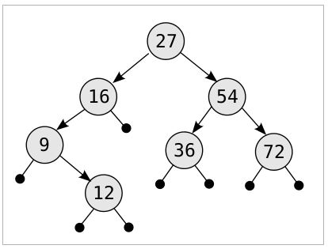

# 21장. 트리

## 21.1 문제: 트리 순회 순서 변경
문제 Link:
https://algospot.com/judge/problem/read/TRAVERSAL

## 21 문제 풀이:
* Hint 1) 트리 순회 Pseudo Code
> 
        //전위 순회 Pseudo Code
		if(currentNode)
		{
			Visit(currentNode);
			Preorder(currentNode->leftChild);
			Preorder(currentNode->rightChild);
		}
		//중위 순회 Pseudo Code
		if(currentNode)
		{
			Inorder(currentNode->leftChild);
			Visit(currentNode);
			Inorder(currentNode->rightChild);
		}
		//후위 순회
		if(currentNode)
		{
			Postorder(currentNode->leftChild);
			Postorder(currentNode->rightChild);
			Visit(currentNode);
		}

* Hint 2) 전위 순회의 첫번째 Index가 root이다.

* Hint 3) 그림
>
		//Preorder Data
		27 16 9 12 54 36 72
		//Inorder Data
		9 12 16 27 36 54 72

	
```c++
#include <iostream>
#include <string>
#include <algorithm>
#include <vector>
using namespace std;

vector<int> slice(const vector<int> &v, int a, int b)
{
    return vector<int>(v.begin() + a, v.begin() + b);
}

//트리의 전위탐색 결과와 중위탐색 결과가 주어질 때 후위 탐색 결과를 출력한다
void printPostOrder(const vector<int> &preorder, const vector<int> &inorder)
{
    //트리에 포함된 노드의 수
    const int N = preorder.size();

    //기저 사례: 텅 빈 트리면 곧장 종료
    if (preorder.empty())
        return;

    //이 트리의 루트는 전위 탐색 결과로부터 곧장 알 수 있다
    const int root = preorder[0];

    //이 트리의 왼쪽 서브트리의 크기는 중위 탐색 결과에서 루트의 위치를 찾아서 알 수 있다
    const int L = find(inorder.begin(), inorder.end(), root) - inorder.begin();

    //오른쪽 서브트리의 크기는 N에서 왼쪽 서브트리와 루트를 빼면 알 수 있다
    const int R = N - L - 1;

    //왼쪽 서브트리의 순회 결과를 출력
    printPostOrder(slice(preorder, 1, L + 1), slice(inorder, 0, L));

    //오른쪽 서브트리의 순회 결과를 출력
    printPostOrder(slice(preorder, L + 1, N), slice(inorder, L + 1, N));

    //후위 순회이므로 루트를 가장 마지막에 출력
    cout << root << " ";
}

int main(void)
{
    int test_case;
    cin >> test_case;

    for (int i = 0; i < test_case; i++)
    {
        int N;
        cin >> N;
        vector<int> preorder, inorder;
        for (int i = 0; i < N; i++)
        {
            int node;
            cin >> node;
            preorder.push_back(node);
        }

        for (int i = 0; i < N; i++)
        {
            int node;
            cin >> node;
            inorder.push_back(node);
        }
        printPostOrder(preorder, inorder);
        cout << endl;
    }
    return 0;
}
```

## 21.2 문제: 요세
문제 Link:
https://algospot.com/judge/problem/read/FORTRESS

## 21.2 문제 풀이:
```c++
#include <iostream>
#include <vector>
#include <algorithm>
using namespace std;
struct Wall{
    int y;
    int x;
    int r;
};

struct TreeNode{
    vector<TreeNode*> children;
};

Wall wall[101];
int longest;
int N, T;
 
int sq(int x){
    return x * x;
}
bool enclose(int a, int b){
    if(wall[a].r <= wall[b].r) return false;
 
    int y1 = wall[a].y;
    int x1 = wall[a].x;
    int r1 = wall[a].r;
    int y2 = wall[b].y;
    int x2 = wall[b].x;
    int r2 = wall[b].r;
    if(sq(r1 - r2) <= sq(x1 - x2) + sq(y1 - y2)){
        return false;
    }
    return true;
}
 
bool isChild(int parent, int child){
    if(parent == child) return false;
    if(!enclose(parent, child)) return false;
    for(int i = 0 ; i < N; i++){
        if(i == parent || i == child) continue;
        if(enclose(parent, i) && enclose(i, child)) return false;
 
    }
    return true;
}
TreeNode* getTree(int root){
    TreeNode* node = new TreeNode();
    for(int i = 0 ; i < N; i++){
        if(isChild(root, i)){
            node->children.push_back(getTree(i));
        }
    }
    return node;
}
 
int height(TreeNode* root){
    int s = root->children.size();
    vector<int> heights;
    for(int i = 0 ; i < s; i++){
        heights.push_back(height(root->children[i]));
    }
    if(heights.empty()) return 0;
    int h_s = heights.size();
    if(h_s >= 2){
        sort(heights.begin(), heights.end());
        longest = max(longest, heights[h_s - 1] + heights[h_s - 2] + 2);
    }
    return heights.back() + 1;
}

bool cmp(Wall a, Wall b){
    return a.r > b.r ? true : false; 
}

int main(void){
    scanf("%d", &T);
    while(T--){
        longest = 0;
        scanf("%d", &N);
        for(int i = 0 ; i < N; i++){
            int x, y, r;
            scanf("%d %d %d", &x, &y, &r);
            wall[i] = {y, x, r};
        }
 
        sort(wall, wall + N, cmp);
 
        TreeNode* root = getTree(0);
        printf("%d\n", max(longest, height(root)));
    }
}
```