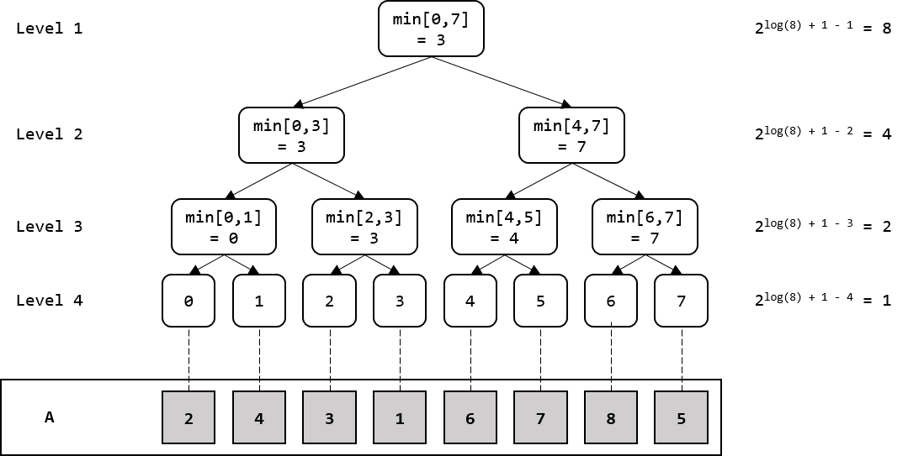

# 23장. 우선순위 큐와 힙 (PriorityQueue and Heap)

## 도입

### 우선순위 순으로 뽑는 큐

* Linked List 구현 - 삽입 O(1),  삭제 O(n)
* Balanced Binary Search Tree 구현 - 삽입 O(log n),  삭제  O(log n)   <- 구현이 매우 복잡
* <b>Heap 구현 - 삽입 O(log n)  , 삭제 O(log n) </b>   <- 구현 간결

## 힙의 정의 및 구현

### 정의

1. 부모 노드가 항상 자식 노드보다 크다. (대소관계 규칙)
2. 마지막 레벨을 제외한 모든 노드가 전부 차 있어야한다. (완전이진트리)    <- 밸런스를 잡아줌


### 구현

> <b>배열을 이용한 구현</b>
>
> 1차원 배열에 순서대로 이진트리표현
>
> * `A[i]`의 왼쪽 자식 노드 `A[2*i+1]`
> * `A[i]`의 오른쪽 자식 노드 `A[2*i+2]`
> * `A[i]`의 부모 노드 `A[(i-1)/2]`
>
> ```c++
> vector<int> heap;
> ```
>
> 


> <b>새 원소 삽입</b>
>
> 마지막 Index에 원소를 삽입하고, Heap 조건을 만족할 때까지 부모를 타고 올라간다
>
> 시간복잡도: Olog(n)
>
> ```c++
> void push_heap(vector<int> &heap, int newValue) {
>   heap.push_back(newValue);
>   
>   int idx = heap.size() - 1;
>   
>   // 타고 올라간다.
>   while(idx > 0 && heap[(idx-1)/2] < heap[idx]) {
>     swap(heap[idx], heap[(idx-1)/2]);
>     idx = (idx-1) / 2;
>   }
> }
> ```


> <b>최대 원소 추출 꺼내기</b>
>
> 최대 원소 조회 자체는 `A[0]` 확인하면 된다. 대신 삭제하는 과정이 까다롭다.
>
> 시간복잡도: Olog(n)
>
> ```c++
> void pop_heap(vector<int>& heap) {
>   heap[0] = heap.back();
>   heap.pop_back();
>   int here = 0;
>   
>   while(true) {
>     int left = here*2 + 1, right = here*2 + 2;
>     
>     if(left >= heap.size()) break;
>     int next = here;
>     if(heap[next] < heap[left]) next = left;
>     if(right < heap.size() && heap[next] < heap[right]) next = right;
>     
>     if(next == here) break;
>     swap(heap[here], heap[next]);
>     here = next;
>   }
> }
> ```


## 23.3 문제: 변화하는 중간 값 (RUNNINGMEDIAN)

> 새로운 원소가 들어올 때마다 중간 값을 찾아 합산해서 출력

Sol 1) Balanced Binary Tree (ie. TREAP) 구현 <- 구현이 까다로움

<b>Sol 2) 두 개의 Heap을 구현, 왼쪽 MaxHeap, 오른쪽 MinHeap</b>

```c++
#include <iostream>
#include <queue>

#define MOD 20090711
using namespace std;

int main() {
    int C;
    cin >> C;

    for (int c = 0; c < C; c++) {
        int N, a, b;
        cin >> N >> a >> b;

        
        priority_queue<int, vector<int>, greater<int>> rq;
        priority_queue<int, vector<int>, less<int>> lq;
        long long value = 1983, sum = 0;
        
        for (int i = 0; i < N; i++) {
            if (i % 2 == 1) {
                rq.push(value);
            } else {
                lq.push(value);
            }

            while(!rq.empty() && lq.top() > rq.top()) {
                int leftValue = lq.top();
                int rightValue = rq.top();
                lq.pop(); rq.pop();
                rq.push(leftValue);
                lq.push(rightValue);
            }

            sum = (lq.top() + sum) % MOD;
            value = (value*a+b) % MOD;
        }

        cout << sum << endl;
    }
}
```

```
/* Input */
3
10 1 0
10 1 1
10000 1273 4936 

/* Output */
19830
19850
2448920
```


### 난수 생성기

> 입력이 너무 많아 알고리즘 수행시간에 영향을 미칠 때, 난수 생성기로 입력을 내부에서 생성할 때 사용

```c++
struct RNG {
  int seed, a, b;
  RNG(int _a, int _b) : a(_a), b(_b), seed(1983) {}
  int next() {
    int ret = seed;
    seed = ((seed * (long long)a) + b) % 20090711;
    return ret;
  }
}
```


# 24장. 구간 트리 (Segment Tree)

## 도입

* 자료를 저장하는 용도로 쓰인 이전 트리들과 다르게 <b>질의를 빠르게</b> 처리 하기 위한 트리
* 빠른 질의 응답을 위해 구간 별로 미리 연산 후 인덱싱
* 최소값(최대값, 합, XOR, ...) 을 찾는데 `O(n)`이 아닌 `O(log n)`





## 구현


* 꽉 찬 이진트리 (Perfect Binary Tree) -> 배열을 사용하여 메모리 절약 가능
* 배열 크기는 `2^n * 2` 이지만 구현 편의를 위해 `4*n` 공간 활용


> <b>구간 트리의 초기화</b>
>
> 각 노드마다 최소값 연산을 수행하고 끝나기 때문에
>
> Time Complexity: `O(n)`
>
> ```c++
> struct RMQ {
>   int n;
>   vector<int> rangeMin;
>   
>   RMQ(const vector<int>& array) {
>     n = array.size();
>     rangeMin.resize(n * 4);
>     init(array, 0, n-1, 1);
>   }
>   
>   int init(const vector<int>& array, int left, int right, int node) {
>     if (left == right) {
>       return rangeMin[node] = array[left];
>     }
>     
>     int mid = (left + right) / 2;
>     int leftMin = init(array, left, mid, node*2);
>     int rightMin = init(array, mid+1, right, node*2+1);
>     return rangeMin[node] = min(leftMin, rightMin);
>   }
> };
> ```
>
> 


> <b>구간 트리의 질의 처리</b>
>
> 트리를 순회를 응용하여 간단히 구현 가능, 아래 세가지 경우만 처리하면 된다.
>
> * 교집합이 공집한인 경우 -> 무한대 반환
> * 교집합이 [nodeLeft, nodeRight]인 경우 -> 미리 계산해둔 값을 즉시 반환
> * 이외의 모든 경우 -> 두 개의 자손 노드에 대해 query()를 재귀 호출한 뒤, 이 두 값 중 더 작은 값을 반환
>
> Time Complexity: `O(log n)` 
>
> ```c++
> const int INT_MAX = numeric_limits<int>::max();
> struct RMS {
>   /* 생략 */
>   
>   int query(int left, int right, int node, int nodeLeft, int nodeRight) {
>     if(right < nodeLeft || nodeRight < left) {
>       return INT_MAX;
>     }
>     
>     if (left <= nodeLeft && nodeRight <= right) {
>       return rangeMin[node];
>     }
>     
>     int mid = (nodeLeft + nodeRight) / 2;
>     return min(
>       query(left, right, node*2, nodeLeft, mid),
>       query(left, right, node*2+1, mid+1, nodeRight)
>       );
>   }
>   
>   int query(int left, int right) {
>     return query(left, right, 0, 0, n-1);
>   }
> };
> ```
>
> 


> <b>구간 트리의 갱신</b>
>
> 전처리 후에 값이 바뀌었을 때 갱신하는 방법
>
> * index위치가 바뀌었다고 할 때, 해당 index가 영향을 미치고 있는 노드들만 업데이트
> * 앞의 `init()`과 `query()`를 합친 것처럼 구현
>
> Time Complexity: `O(log n)`
>
> ```c++
> struct RMQ {
>   /* 생략 */
>   
>   int update(int index, int newValue, int node, int nodeLeft, int nodeRight) {
>     if (index < nodeLeft || nodeRight < index) {
>       return rangeMin[node];
>     }
>     
>     if(nodeLeft == nodeRight) {
>       return rangeMin[node] = newValue;
>     }
>     
>     int mid = (nodeLeft + nodeRight) / 2;
>     return rangeMin[node] = min(
>       update(index, newValue, node*2, nodeLeft, mid),
>       update(index, newValue, node*2+1, mid+1, nodeRight)
>     );
>   }
>   
>   int update(int index, int newValue) {
>     return update(index, newValue, 1, 0, n-1);
>   }
> };
> ```
>
> 


## 예제

> 특정 구간에서 최소치 두 개 찾기
>
> * `query()`에서 최소값 두 개를 반환 하도록 구현
>
> ```c++
> vector<int> query(int left, int right, int node, int nodeLeft, int nodeRight) {
>     if(right < nodeLeft || nodeRight < left) {
>       return INT_MAX;
>     }
> 
>     if (left <= nodeLeft && nodeRight <= right) {
>       int mid = (nodeLeft + nodeRight) / 2;
> 
>       if (nodeLeft == nodeRight) {
>         return vector<int>({ rangeMin[node*2], INT_MAX });
>       }
>       return vector<int>({ rangeMin[node*2], rangeMin[node*2+1] });
>     }
> 
>     int mid = (nodeLeft + nodeRight) / 2;
>     vector<int> leftMin = query(left, right, node*2, nodeLeft, mid);
>     vector<int> rightMin = query(left, right, node*2+1, mid+1, nodeRight);
>    
>     leftMin.insert(leftMin.end(), rightMin.begin(), rightMin.end());
>     sort(leftMin.begin(), leftMin.end());
>   
>   	return vector<int>({ leftMin[0], leftMin[1] });
>   }
>   
>   vector<int> query(int left, int right) {
>     return query(left, right, 0, 0, n-1);
>   }
> ```
>
> 

> 정렬된 수열의 특정 구간에서 최대 출현 빈도 계산
>
> * 부분구간 두개가 연결되는 경우도 있음, `[1, 2, 2],  [2, 2, 4]` 이 경우를 처리
> * 처리하기 위해 추가 정보를 반환 필요. `RangeResult` 정의
>
> ```c++
> struct RangeResult {
>   int size;
>   int mostFrequent;
>   int leftNumber, leftFreq;
>   int rightNumber, rightFreq;
> };
> 
> RangeResult merge(const RangeResult &a, const RangeResult& b) {
>   RangeResult ret;
>   ret.size = a.size + b.size;
>   
>   ret.leftNumber = a.leftNumber;
>   ret.leftFreq = a.leftFreq;
>   if (a.size == a.leftFreq && a.leftNumber == b.leftNumber) {
>     ret.leftFreq += b.leftFreq;
>   }
>   
>   ret.rightNumber = b.rightNumber;
>   ret.rightFreq = b.rightFreq;
>   if (b.size == b.rightFreq && a.rightFreq == b.rightFreq) {
>     ret.rightFreq += a.rightFreq;
>   }
>   
>   ret.mostFrequent = max(a.mostFrequent, b.mostFrequent);
>   if(a.rightNumber == b.leftNumber) {
>     ret.mostFrequent = max(ret.mostFrequent, a.rightFreq + b.leftFreq);
>   }
>   
>   return ret;
> }
> ```
>
> 


## 24.2 문제: 등산로 (MORDOR)

* 등산로 100m마다 고도를 나타내는 표지판 존재, 특정 구간의 난이도는 특정 구간의 고도의 최대값 - 최소값
* 기본적인 풀이: Max Segment Tree와 Min Segment Tree를 구현
* <b>개선된 풀이: Min Segment Tree만 구현한 후, Max는 Input에 negation한 값으로 Min Segment Tree 생성</b>

```c++
#include <cstdio>
#include <algorithm>
#include <vector>
using namespace std;

const int INT_MAX = numeric_limits<int>::max();

struct RMQ {
    int n;
    vector<int> rangeMin;

    RMQ(const vector<int>& arr) {
        n = arr.size();
        rangeMin.resize(n*4);
        init(arr, 0, n-1, 1);
    }

    int init(const vector<int>& arr, int left, int right, int node) {
        if (left == right) {
            return rangeMin[node] = arr[left];
        }

        int mid = (left + right) / 2;
        int leftMin = init(arr, left, mid, node*2);
        int rightMin = init(arr, mid+1, right, node*2+1);
        return rangeMin[node] = min(leftMin, rightMin);
    }

    int query(int left, int right, int node, int nodeLeft, int nodeRight) {
        if (right < nodeLeft || nodeRight < left) {
            return INT_MAX;
        }

        if (left <= nodeLeft && nodeRight <= right) {
            return rangeMin[node];
        }

        int mid = (nodeLeft + nodeRight) / 2;
        return min(
            query(left, right, node*2, nodeLeft, mid),
            query(left, right, node*2+1, mid+1, nodeRight)
        );
    }

    int query(int left, int right) {
        return query(left, right, 1, 0, n-1);
    }
};

int main() {
    int T;
    scanf("%d", &T);

    while(T--) {
        int N, Q, a, b;

        scanf("%d %d", &N, &Q);
        vector<int> heights(N), invHeights(N);
        for (int i = 0; i < N; i++) scanf("%d", &heights[i]), invHeights[i] = -heights[i];
        struct RMQ tree(heights);
        struct RMQ invTree(invHeights);

        for (int i = 0; i < Q; i++) {
            scanf("%d%d", &a, &b);
            printf("%d\n", -invTree.query(a, b) - tree.query(a, b));            
        }
    }
    return 0;
}
```

```
/* Input */
2
3 1
1 2 3
0 2
10 4
3 9 5 6 10 8 7 1 2 4 
1 6
4 7
9 9
5 8

/* Output */
2
5
9
0
7
```


## 24.4 문제: 족보 탐험 (FAMILY TREE)

* 각 사람의 부모 정보가 주어져 있을 때, 촌수를 계산하는 문제 

* 순회(Traversal) 정보를 직렬화하는 것이 핵심

  

```c++
/* RMQ 생략 */

const int MAX_N = 100000;
const int INT_MAX = numeric_limits<int>::max();
vector<int> child[MAX_N], trip;

int no2serial[MAX_N], serial2no[MAX_N];
int locInTrip[MAX_N], depth[MAX_N];
int nextSerial;

void traverse(int here, int d, vector<int>& trip) {
    no2serial[here] = nextSerial;
    serial2no[nextSerial] = here;
    ++nextSerial;

    depth[here] = d;
    locInTrip[here]  = trip.size();
    trip.push_back(no2serial[here]);

    for(int i = 0; i < child[here].size(); ++i) {
        traverse(child[here][i], d+1, trip);
        trip.push_back(no2serial[here]);
    }
}

RMQ* prepareRMQ() {
    nextSerial = 0;
    trip.clear();
    traverse(0, 0, trip);
    return new RMQ(trip);
}

int distance(RMQ* rmq, int u, int v) {
    int lu = locInTrip[u], lv = locInTrip[v];
    if (lu > lv) swap(lu, lv);

    int lca = serial2no[rmq->query(lu, lv)];
    return depth[u] + depth[v] - 2*depth[lca];
}

int main() {
    int T;
    scanf("%d", &T);

    while(T--) {
        int N, Q, j, a, b;

        scanf("%d %d", &N, &Q);
        for (int i = 0; i < N; i++) {
            child[i].clear();
        }
        for (int i = 1; i < N; i++) {
            scanf("%d", &j);
            child[j].push_back(i);
        }
        struct RMQ *tree = prepareRMQ();

        for (int i = 0; i < Q; i++) {
            scanf("%d%d", &a, &b);

            int ans = distance(tree, a, b);
            printf("%d\n", ans);            
        }
    }
    return 0;
}
```

```
/* Input */
1
13 5
0 1 1 3 3 0 6 0 8 9 9 8
2 7
10 11
4 11
7 7
10 0

/* Output */
4
2
6
0
3
```

