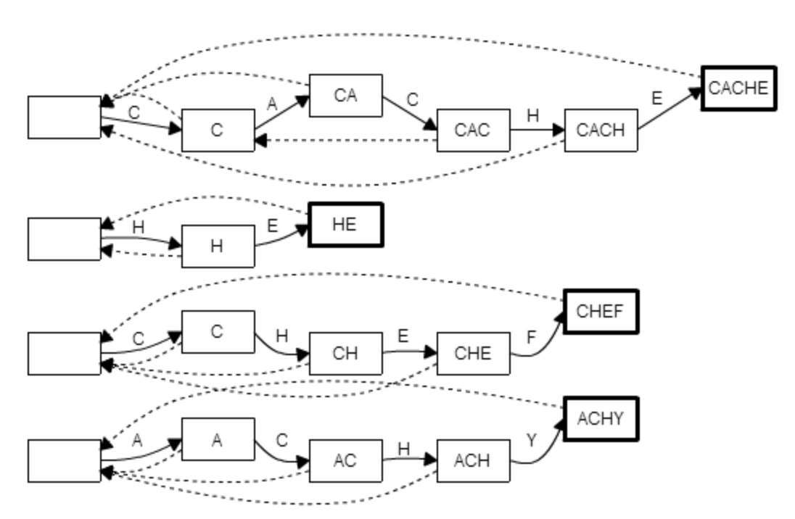
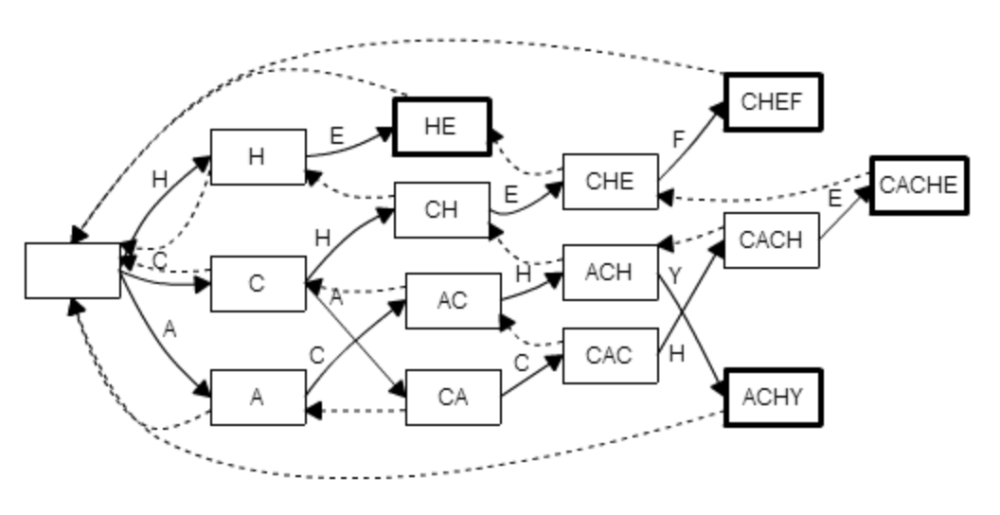

## 트라이(Trie)의 탄생 배경

트리는 정수나 실수의 검색 효율이 좋지만 문자열 검색 시 효율이 좋지 않다.
트라이는 검색 효율을 더 개선하기 위해 고안된 자료 구조이다.

- 일반적인 문자열 검색: *O(NM)*
- 정수/실수의 이진 검색 트리: *O(logN)*
- 문자열 이진 검색 트리: *O(MlogN)*

## 트라이

일반 트리 자료구조 중 하나로, Digital Tree, Prefix Tree라고 불린다.
텍스트 자동 완성 기능과 같이 문자열을 저장하고 탐색하는데 유용한 자료 구조로 문자열 자동 완성에 주로 활용된다.

- 장점: *O(m)*의 시간복잡도
- 단점: 공간 효율

### 트라이의 구현

```java
package me.seongwoon.trie;

public class Trie {
    public static class TrieNode {
        private static final int ALPHABETS = 26;
        private static int charToIndex(char c) {
            return c - 'A';
        }

        TrieNode[] children = new TrieNode[ALPHABETS];
        boolean terminal;
    }

    private final TrieNode root = new TrieNode();

    public void insert(String key) {
        TrieNode currentNode = root;
        for (char c : key.toCharArray()) {
            final int i = TrieNode.charToIndex(c);
            if (currentNode.children[i] == null) {
                currentNode.children[i] = new TrieNode();
            }
            currentNode = currentNode.children[i];
        }
        currentNode.terminal = true;
    }

    public TrieNode find(String key) {
        TrieNode currentNode = root;
        for (char c : key.toCharArray()) {
            final int i = TrieNode.charToIndex(c);
            if (currentNode.children[i] == null) {
                return null;
            }
            currentNode = currentNode.children[i];
        }
        return currentNode;
    }
}
```

```java
package me.seongwoon.trie;

import static org.junit.Assert.assertFalse;
import static org.junit.Assert.assertTrue;

import org.junit.Test;

import me.seongwoon.trie.Trie.TrieNode;

public class TrieTest {

    @Test
    public void test() {
        final Trie trie = new Trie();
        trie.insert("EXIT");
        trie.insert("EXIST");
        trie.insert("EXPERIENCE");
        trie.insert("EXPERT");
        trie.insert("EXO");

        assertTrue(getTerminal(trie.find("EXPERT")));
        assertTrue(getTerminal(trie.find("EXPERIENCE")));
        assertFalse(getTerminal(trie.find("EX")));
        assertFalse(getTerminal(trie.find("EXISTENCE")));
        assertFalse(getTerminal(trie.find("EXPO")));
        assertFalse(getTerminal(trie.find("")));
    }

    private static boolean getTerminal(TrieNode trieNode) {
        return trieNode != null ? trieNode.terminal : false;
    }
}
```

### 추가 내용

- 사전(Dictionary) 자료 구조로 활용 가능
- 접미사 트리로 활용 가능


## 문제: 안녕히, 그리고 물고기는 고마웠어요! (SOLONG)

### 문제 요약

지느러미로 문자를 입력해야하는 돌고래를 위해 자동 완성이 지원되는 툴을 개발하였다. 
돌고래가 특정 문장을 입력하는데 총 몇 번의 타이핑이 필요한가?

- 자동 완성 알고리즘은 미리 저장된 N개의 단어만을 사용
- 타이핑을 했을때 저장된 단어만을 추천
- 추천 우선순위는 단어의 출현 빈도 > 알파벳 순으로 결정
- 탭(tab)을 누르면 추천된 단어가 자동으로 입력됨

### 제한

- 메모리: 64MB 이하
- 시간: 3초 이내

```java
package me.seongwoon.trie.problem;

public class SoLong {
    public static class TrieNode {
        private static final int ALPHABETS = 26;
        private static int charToIndex(char c) {
            return c - 'A';
        }

        TrieNode[] children = new TrieNode[ALPHABETS];
        int terminal = -1;
        int recommend = -1;
    }

    private static final TrieNode ROOT = new TrieNode();

    public void insert(String key, int id) {
        TrieNode currentNode = ROOT;
        for (char c : key.toCharArray()) {
            final int i = TrieNode.charToIndex(c);
            if (currentNode.children[i] == null) {
                currentNode.children[i] = new TrieNode();
            }
            currentNode = currentNode.children[i];
            if (currentNode.recommend == -1) {
                currentNode.recommend = id;
            }
        }
        currentNode.terminal = id;
    }

    public TrieNode find(String key) {
        TrieNode currentNode = ROOT;
        for(char c : key.toCharArray()) {
            final int i = TrieNode.charToIndex(c);
            if (currentNode.children[i] == null) {
                return null;
            } else {
                currentNode = currentNode.children[i];
            }
        }
        return currentNode;
    }

    public int type(String key, int id) {
        TrieNode currentNode = ROOT;
        int typingCount = 0;
        for(char c : key.toCharArray()) {
            final int i = TrieNode.charToIndex(c);
            if (currentNode.recommend == id) {
                typingCount += 1;
                break;
            }
            if (currentNode.children[i] == null) {
                break;
            }
            currentNode = currentNode.children[i];
            typingCount += 1;
        }
        return typingCount;
    }
}
```

```java
package me.seongwoon.trie.problem;

import static org.junit.Assert.*;

import org.junit.Test;

import me.seongwoon.trie.problem.SoLong.TrieNode;

public class SoLongTest {

    @Test
    public void test() {
        final SoLong soLong = new SoLong();
        soLong.insert("SO", 1);
        soLong.insert("FOR", 2);
        soLong.insert("AND", 3);
        soLong.insert("ALL", 4);
        soLong.insert("FISH", 5);
        soLong.insert("THE", 6);
        soLong.insert("THANKS", 7);

        final String input = "SO LONG AND THANKS FOR ALL THE FISH";
        final String[] words = input.split(" ");
        int count = words.length - 1;
        for (String word : words) {
            count += countKeys(soLong, word);
        }
        System.out.println(count);
    }

    private static int countKeys(SoLong soLong, String word) {
        final TrieNode trieNode = soLong.find(word);
        if (trieNode == null || trieNode.terminal == -1) {
            return word.length();
        }
        return soLong.type(word, trieNode.terminal);
    }
}
```

### 시간 복잡도 분석

- 입력 단계
  - 문자열 정렬: *O(NlogN)*
  - 최대 길이 M의 문자열 정렬: *O(MNlogN)*
- 트라이 생성
  - insert: *O(MN)*
- 타이핑 수 확인
  - find: *O(M)*
  - type: *O(M)*
- 전체 시간 복잡도
  - 최대 길이 K의 문자열을 입력: *O(MNlogN+K)*

## 트라이를 이용한 다중 문자열 검색

### KMP 문자열 검색 알고리즘(단일 패턴 매칭)

길이 N의 검색 대상에서 길이 M의 단일 문자열 검색에 최적화된 알고리즘이다.

- 부분 일치 테이블 생성과 검색: *O(N+M)*
- K개의 문자열 검색: *O(N+m1+N+m2+...N+mk)*

### 아호-코라식 문자열 검색 알고리즘(다중 패턴 매칭)

트라이와 실패 링크(Failure link), 출력 링크(Output link)를 사용하여 다중 문자열 검색에서 선형 시간 내에 탐색할 수 있고, 주로 긴 문서에서 많은 문자열을 동시에 찾아야하는 검색 엔진 등에서 유용하게 사용되는 알고리즘이다.

- 시간 복잡도: *O(N+m1+m2+...+mk+P)*
  - P는 문자열 출현 횟수

네 개의 바늘 문자열{"CACHE", "HE", "CHEF", "ACHY"}에 대한 KMP 알고리즘의 전처리 결과이다.
실패 함수란 예를 들어 "CAC" 상태에서 다음 글자가 "H"가 아닐 때 "C"로 돌아가라는 것을 알려주는 함수이다.

<left></left>

트라이를 이용해 겹치는 접두사를 정리하고 실패 함수를 다음과 같이 재정의한 결과이다.

> *failure(s)* = *s*의 접미사이면서 트라이에 포함된 문자열 중 자기 자신 보다는 짧고 문자열 중에는 가장 긴 곳으로 연결9

<left></left>
<left></left>
https://figshare.com/articles/Aho_Corasick_String_Matching_Video/771968

### 아호-코라식 문자열 검색 알고리즘의 구현

```java
package me.seongwoon.trie;

import java.util.LinkedList;
import java.util.Queue;

public class AhoCorasick {
    public static class TrieNode {
        private static final int ALPHABETS = 26;
        private static int charToIndex(char c) {
            return c - 'A';
        }

        TrieNode[] children = new TrieNode[ALPHABETS];
        TrieNode failureLink;
        int terminal = -1;
        int[] output;
    }

    private static final TrieNode ROOT = new TrieNode();

    public void insert(String key, int id) {
        TrieNode currentNode = ROOT;
        for (char c : key.toCharArray()) {
            final int i = TrieNode.charToIndex(c);
            if (currentNode.children[i] == null) {
                currentNode.children[i] = new TrieNode();
            }
            currentNode = currentNode.children[i];
        }
        currentNode.terminal = id;
    }

    public void match(String text) {
        TrieNode currentNode = ROOT;
        for (char c : text.toCharArray()) {
            final int i = TrieNode.charToIndex(c);
            while (currentNode.children[i] == null) {
                currentNode = currentNode.failureLink;
            }
            currentNode = currentNode.children[i];
            TrieNode node = currentNode;
            while (node != ROOT) {
                if (node.terminal > 0) {
                    System.out.println(node.terminal);
                }
                node = node.failureLink;
            }
        }
    }

    public void computeFailureFunction() {
        final Queue<TrieNode> searchQueue = new LinkedList<>();
        searchQueue.add(ROOT);
        while (!searchQueue.isEmpty()) {
            final TrieNode parentNode = searchQueue.remove();
            for (int i=0; i < TrieNode.ALPHABETS; i++) {
                final TrieNode childNode = parentNode.children[i];
                if (childNode == null) {
                    continue;
                }
                TrieNode parentFailure = parentNode.failureLink;
                while (parentFailure != null) {
                    final TrieNode parentFailureChild = parentFailure.children[i];
                    if (parentFailureChild != null) {
                        childNode.failureLink = parentFailureChild;
                        break;
                    }
                    parentFailure = parentFailure.failureLink;
                }
                if (parentFailure == null) {
                    childNode.failureLink = ROOT;
                }
                searchQueue.add(childNode);
            }
        }
    }
}
```

```java
package me.seongwoon.trie;

import static org.junit.Assert.*;

import org.junit.Test;

public class AhoCorasickTest {

    @Test
    public void test() {
        final AhoCorasick ahoCorasick = new AhoCorasick();
        ahoCorasick.insert("CACHE", 1);
        ahoCorasick.insert("HE", 2);
        ahoCorasick.insert("CHEF", 3);
        ahoCorasick.insert("ACHY", 4);
        ahoCorasick.insert("ACHITECHET", 5);
        ahoCorasick.insert("FAC", 6);

        ahoCorasick.computeFailureFunction();

        ahoCorasick.match("CACACHEFCACHY");
    }
}
```

## 문제: 문자열 집합 판별 (BJ9250)

https://www.acmicpc.net/problem/9250

보안종결자의 문제 난이도가 높아서 쉽운 문제를 하나 추가 합니다.

## 문제: 보안종결자 (NH)

### 문제 요약

해커가 은행의 전산망을 해킹하려고 한다.
하지만 그 은행에는 네트워크 트래픽을 감시해서 특정 문자열이 포함되었는지 탐지하는 침입 감지 시스템(IDS)이 존재한다.
전산망 비밀번호가 알파벳 소문자로 구성된 길이 n의 문자열이고 IDS의 인식 패턴을 모두 알고있을 때, IDS에 탐지되지 않는 문자열의 개수를 구해보자.

- 주어지는 패턴의 길이는 10이하
- 출력시 문자열의 수가 클 경우 10007로 나눔

### 제한

- 메모리: 64MB 이하
- 시간: 1초 이내

### 시간 복잡도 분석