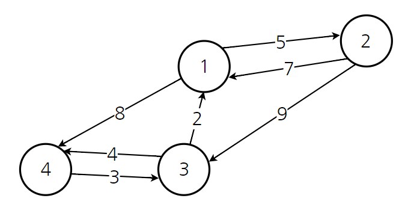

# 30장 최단 경로 알고리즘

## 벨만-포드(Bellman-Ford) 알고리즘

### 특징 요약

- 단일 시작점 알고리즘: 시작 정점 s에서부터 다른 정점들까지의 최단 거리를 계산
- 음수 간선이 있는 그래프에 대해서도 최단 경로를 탐색할 수 있음
- 음수 사이클의 유/무를 확인할 수 있음
- 최단 거리의 상한을 담은 `upper[]`를 유지
- 최단 거리의 상한을 예측한 뒤 예측 값과 실제 최단 거리 사이의 **오차를 줄여나가는 방식(relax)**으로 동작

### 벨만-포드 동작 과정

- `upper[s] = 0`, 나머지 정점은 INF로 초기화
- upper 값을 실제 최단 거리에 더 가깝게 갱신하기 위해 **최단 거리의 특성**을 이용: `dist[v] <= dist[u] + w(u,v)`

##### 최단 거리의 속성에 모순되는 그래프 예제


- 오차를 줄여나가는 방법(relax)
  - 만약 `upper[u] + w(u,v) < upper[v]`인 상황이라면 upper[v]를 upper[u] + w(u,v)로 줄일 수 있음

### Relax 과정과 종료 조건

### 음수 사이클 판정

### 구현

### 문제: 시간여행(문제 ID: TIMETRIP, 난이도: 중)

## 플로이드 와샬(Floyd Warshall) 알고리즘

## 플로이드(Floyd) 알고리즘

### 특징 요약

- 모든 쌍 최단 거리 알고리즘: 모든 정점 쌍에 대해 둘 사이의 최단 거리를 계산
  - 플로이드 알고리즘을 쓰지 않는다면? 다익스트라 + 벨만-포드 조합으로 해결 가능
- 모든 정점 쌍의 최단 거리를 저장하는 2차원 배열 `dist[][]`를 계산
- **경유점(거쳐가는 정점)**을 기준으로 알고리즘을 수행

### 플로이드 와샬 동작 과정

#### 어려운 설명

- 책의 설명은 아이디어, 증명, 프로토타이핑, 구현, 활용 순으로 설명하기 때문에 이해가 쉽지 않음
- 단순한 알고리즘이지만 이러한 알고리즘이 탄생하기 까지의 과정은 단순하지 않기때문에 필요에 따라 복습을 추천

#### 쉬운 설명



- 각각의 정정이 다른 정점으로 가는 비용(x->y)을 2차원 배열의 형태로 초기화

  |      |  1   |  2   |  3   |  4   |
  | :--: | :--: | :--: | :--: | :--: |
  |  1   |  0   |  5   | INF  |  8   |
  |  2   |  7   |  0   |  9   | INF  |
  |  3   |  2   | INF  |  0   |  4   |
  |  4   | INF  | INF  |  3   |  0   |

- 순회를 하며 모든 비용을 최소화 해야하는데, 반복의 기준을 **경유점**으로 함

- x->y로 가는 최소 비용과 x->z(경유점) + z->y 비용을 비교하여 더 적은 비용을 계산

  |      |  1   |  2   |  3   |  4   |
  | :--: | :--: | :--: | :--: | :--: |
  |  1   |  0   |  5   |  11  |  8   |
  |  2   |  7   |  0   |  9   |  13  |
  |  3   |  2   |  7   |  0   |  4   |
  |  4   |  5   |  10  |  3   |  0   |

### 구현

<details>
  <summary>코드 보기</summary>

```java
package me.seongwoon.ch20;

public class Floyd {

    int[][] adj;

    public int[][] floyd() {

        final int vertexCount = adj.length;

        for(int i = 0; i < vertexCount; i++) {
            adj[i][i] = 0;
        }

        for(int k = 0; k < vertexCount; k++) {
            for(int i = 0; i < vertexCount; i++) {
                for(int j = 0; j < vertexCount; j++) {
                    final int directCost = adj[i][j];
                    final int viaCost = adj[i][k] + adj[k][j];
                    adj[i][j] = Math.min(directCost, viaCost);
                }
            }
        }

        return adj;
    }

    public Floyd(int[][] adj) {
        this.adj = adj;
    }
}
```

```java
package me.seongwoon.ch20;

import org.junit.Test;

public class FloydTest {

    static final int INF = 100000;

    @Test
    public void test() {
        final int[][] adj = {
                { 0, 5, INF, 8 },
                { 7, 0, 9, INF },
                { 2, INF, 0, 4 },
                { INF, INF, 3, 0 }
        };

        final Floyd fl = new Floyd(adj);
        final int[][] result = fl.floyd();

        for (int i = 0; i < result.length; i++) {
            for (int j = 0; j < result.length; j++) {
                System.out.printf("%d ", result[i][j]);
            }
            System.out.print("\n");
        }
    }
}

// Test result
// 0 5 11 8 
// 7 0 9 13 
// 2 7 0 4 
// 5 10 3 0 
```
- 플로이드 와샬 알고리즘 시간 복잡도: O(|V|^3)

</details>

### 문제: 음주 운전 단속 (문제 ID: DRUNKEN, 난이도: 중)

https://www.algospot.com/judge/problem/read/DRUNKEN

<details>
  <summary>문제</summary>

> **문제**
>
> 송년회의 계절인 연말연시가 다가오면 시내 곳곳에서 음주운전 단속을 진행합니다. 단속은 교통안전을 위해 필수적이지만 불가피한 교통체증을 불러오기도 합니다.
>
> 
>
> 이 문제에서 서울의 지도는 위 그림처럼 여러 개의 장소들과 이들을 연결하는 도로로 구성됩니다. 모든 도로는 양방향 통행이 가능하며, 통항할 때마다 일정한 시간이 걸립니다. 경찰청은 날마다 한 장소를 골라 음주 운전 단속을 시행하며, 어디에서 음주 운전 단속을 하고 있는지 미리 알 방법은 없습니다. 음주 운전 단속을 하면 교통 체증이 심해져 해당 장소를 지나가는 경로들은 전부 일정 시간만큼 지연됩니다. 그림에서는 원 안에 적힌 숫자들이 해당 장소에서 음주 운전 단속을 할 경우 지연되는 시간을 나타냅니다. 단 경로의 출발 장소나 도착 장소에서 단속을 하는 것은 상관 없다고 합시다.
>
> 송년회를 가능한 빨리가기 위해 어디에서 최악의 경우에도 시간이 가장 적게 걸리는 경로를 찾는 프로그램을 작성하세요.
>
> 인류의 개념과 지성의 보고 안드로메다 은하의 과거와 미래 모습을 조사하려고 합니다. 조사단은 현재의 지구에서 출발해, 웜홀들을 거쳐 과거나 미래의 안드로메다 은하로 갑니다. **조사단이 얼마나 과거로 갈 수 있는지, 그리고 얼마나 미래로 갈 수 있는지를 계산하는 프로그램을 작성하세요.**
>
> 은하계들은 서로 너무 멀리 떨어져 있기 때문에, 웜홀을 통하지 않고 이동하는 것은 불가능합니다. 또한 조사단의 우주선에는 단거리 워프 기능이 있기 때문에, 같은 은하계 안에 있는 웜홀들 간을 이동하는 데는 시간이 걸리지 않습니다.
>
> **입력**
>
> 입력은 서울 지도 하나와 여러 개의 테스트 케이스로 이루어집니다. 첫 줄에는 서울 지도에 포함된 장소의 수 V(1<=V<=500)와 도로의 수 E(0<=E<=V(V-1)/2)가 주어집니다. 그 다음 줄에는 V개의 자연수로 각 정점에서 음주 운전 단속을 할 때 소요되는 시간 Ti가 분 단위로 주어집니다. 그 다음 E줄에는 가 세 개의 정수로 각 도로가 연결하는 두 개의 장소 Ai, Bi(1<=Ai, Bi<V)의 번호와 이 도로를 통행하는 데 걸리는 시간 Ci가 분 단위로 주어집니다. 모든 소요 시간은 100 이하의 자연수입니다.
>
> 서울 지도가 주어진 다음 줄에는 테스트 케이스 수 T(1<=T<=1000)가 주어집니다. 그 후 T줄에는 한 줄에 두 개의 정수 s, t(1<=s, t<=V)가 주어집니다. s는 출발지, t는 도착지 입니다. 모든 도로는 양방향 통행이 가능하고, 각 경우 통행 시간은 같습니다.
>
> **출력**
>
> 각 테스트 케이스마다 한 줄에 목표 장소까지 가기 위한 경로 중 가장 작은 최악의 예상 시간을 출력합니다.
>
> **예제 입력**
>
> ```
> 8 12 (정점의 수, 간선의 수)
> 8 6 5 8 3 5 8 4 (음주 단속으로 지체될 수 있는 시간)
> 1 6 9 (정점 A -> B 이동에 소요되는 시간)
> 1 2 3
> 2 8 3
> 6 8 5
> 6 7 3
> 8 7 3
> 6 5 5
> 4 5 7
> 3 4 4
> 3 5 2
> 2 3 6
> 7 5 1
> 2 (테스트 케이스 수)
> 1 5 (출발지, 도착지)
> 6 3
> ```
>
> **예제 출력**
>
> ```
> 17
> 10
> ```

</details>

<details>
  <summary>풀이</summary>

- 정점을 단속에 걸리는 시간 별로 정렬한 뒤, 단속에 시간이 적게 걸리는 정점부터 경유점으로 사용

```java
package me.seongwoon.ch20;

import java.util.ArrayList;
import java.util.Comparator;
import java.util.List;

public class Drunken {

    int[][] adj;
    int[] delay;

    public int[][] solve() {
        final int vertexCount = adj.length;
        final int[][] weight = new int[vertexCount][vertexCount];

        final List<int[]> orderedCost = new ArrayList<>();
        for(int i = 0; i < vertexCount; i++) {
            orderedCost.add(new int[] { delay[i], i });
        }
        orderedCost.sort(Comparator.comparingInt(o -> o[0]));

        for(int i = 0; i < vertexCount; i++) {
            for(int j = 0; j < vertexCount; j++) {
                if(i == j) {
                    weight[i][j] = 0;
                } else {
                    weight[i][j] = adj[i][j];
                }
            }
        }

        for(int k = 0; k < vertexCount; k++) {
            final int viaVertexNumber = orderedCost.get(k)[1];
            for(int i = 0; i < vertexCount; i++) {
                for(int j = 0; j < vertexCount; j++) {
                    final int directCost = adj[i][j];
                    final int viaCost = adj[i][viaVertexNumber] + adj[viaVertexNumber][j];
                    adj[i][j] = Math.min(directCost, viaCost);
                    weight[i][j] = Math.min(adj[i][viaVertexNumber] 
                                            + delay[viaVertexNumber] 
                                            + adj[viaVertexNumber][j],
                                            weight[i][j]);
                }
            }
        }

        return weight;
    }

    public Drunken(int[][] adj, int[] delay) {
        this.adj = adj;
        this.delay = delay;
    }
}
```

- 가장 작은 최악의 예상 시간 계산의 시간 복잡도: O(V^3)
- 테스트 케이스 검색의 시간 복잡도: O(1)

</details>

### 문제: 선거 공약 (문제 ID: PROMISES, 난이도: 중)

https://www.algospot.com/judge/problem/read/PROMISES

<details>
  <summary>문제</summary>

> **문제**
>
> 경제가 침체기에 빠졌을 때 정치인들이 흔히 내거는 공약으로 대규모 토목 공사를 통한 경기 부양책이 있습니다. 이번에 집권당에서는 향후 N 년간 1년에 하나씩 전국의 주요 도시들을 잇는 대형 고속도로를 건설하겠다는 공약을 내걸었습니다. 재야 경제 연구가인 의권이는 이들의 공약을 훑어보다가 이들이 아무 생각 없이 공약을 내걸었다는 결정적인 증거를 발견했습니다. 이들 중 일부 고속도로는 건설하는 의미가 거의 없다는 것입니다.
>
> 어떤 고속도로를 새로 건설할 당위성이 있기 위해서는 기존에 고속도로를 통해 오갈 수 없던 두 도시가 새로 연결되거나, 두 도시를 오가는 데 걸리는 시간이 단축되어야 합니다. 의권이는 공약 중 일부 고속도로는 이 두 조건중 아무 것도 만족하지 못한다는 사실을 알아냈습니다.
>
> 
>
> 위 그림과 같이 4개의 도시 a, b, c, d가 있는데, 이 중 a와 b, a와 d는 굵은 실선으로 표시된 고속도로들로 연결되어 있다고 합시다. 각 선에 표시된 숫자는 두 도시를 오가는 데 걸리는 시간을 나타냅니다. 이 때 a와 c사이에 새 고속도로를 건설한다고 합시다. c는 다른 도시와 고속도로를 통해서 왕복할 방법이 없었으므로, 이 고속도로는 의미가 있습니다. 그런데 그 다음 해에 b와 c를 잇는 고속도로를 건설한다고 합시다. 이 고속도로가 없더라도 a를 경유하면 b와 c 사이를 6시간만에 움직일 수 있으므로, 편도 6시간이 걸리는 이 고속도로는 아무런 의미가 없습니다.
>
> 기존에 존재하는 고속도로들의 정보와 앞으로 N 년간 건설하기로 예정된 고속도로들의 정보가 주어질 때, 새로 건설하기로 한 고속도로들 중 몇 개가 건설할 의미가 없는지 계산하는 프로그램을 작성하세요.
>
> **입력**
>
> 입력의 첫 줄에는 테스트 케이스의 수 C (1 <= C <= 50) 이 주어집니다. 각 테스트 케이스의 첫 줄에는 도시의 수 V (2 <= V <= 200) 와 현재 존재하는 고속도로의 수 M, 그리고 앞으로 건설될 고속도로의 수 N 이 주어집니다. (0 <= M+N <= 1000) 그 후 M 줄에는 각 줄에 3개의 정수 a, b, c (0 <= a,b <= V-1,1 <= c <= 100000) 로 이미 존재하는 고속도로의 정보가 주어집니다. a 와 b 는 이 고속도로가 연결하는 도시의 번호, 그리고 c 는 해당 고속도로를 통해 두 도시 간을 이동하는 데 걸리는 시간을 나타냅니다. 그 후 N 줄에 같은 형태로 앞으로 건설할 고속도로의 정보가 순서대로 주어집니다.
>
> 모든 도로는 양방향 통행이 가능하며, 각 경우의 통행 시간은 같습니다.
>
> **출력**
>
> 각 테스트 케이스마다 한 줄에 N 개의 고속도로를 순서대로 건설했을 때 건설할 의미가 없는 고속도로의 수를 출력합니다.
>
> **예제 입력**
>
> ```
> 2 (테스트 케이스)
> 4 2 2 (정점 수, 간선 수, 건설 예정의 고속도로 수)
> 0 1 4 (정점 A -> B 이동에 소요되는 시간)
> 0 3 1
> 0 2 2 (앞으로 추가 될 고속도로 정보)
> 1 2 6
> 4 2 2
> 0 1 4
> 0 3 1
> 1 2 6
> 0 2 2
> ```
>
> **예제 출력**
>
> ```
> 1
> 0
> ```

</details>

<details>
  <summary>풀이</summary>

- 정점 대신 간선을 기반으로한 알고리즘으로 계산을 수행
- 추가되는 고속도로(간선)를 추가하여 새롭게 계산을 수행

```java
package me.seongwoon.ch20;

public class Promises {

    int[][] adj = new int[200][200];

    public boolean update(int a, int b, int c) {

        final int vertexCount = adj.length;

        if(adj[a][b] <= c) {
            return false;
        }

        for (int x = 0; x < vertexCount; x++) {
            for (int y = 0; y < vertexCount; y++) {
                adj[x][y] = Math.min(adj[x][y],
                                     Math.min(adj[x][a] + c + adj[b][y],
                                              adj[x][b] + c + adj[a][y]));
            }
        }
        return true;
    }
}
```

- 정점을 이용하는 방식의 시간 복잡도: O(V^3*N)
- 간선을 이용하는 방식의 시간 복잡도: O(V^3+V^2N)

</details>