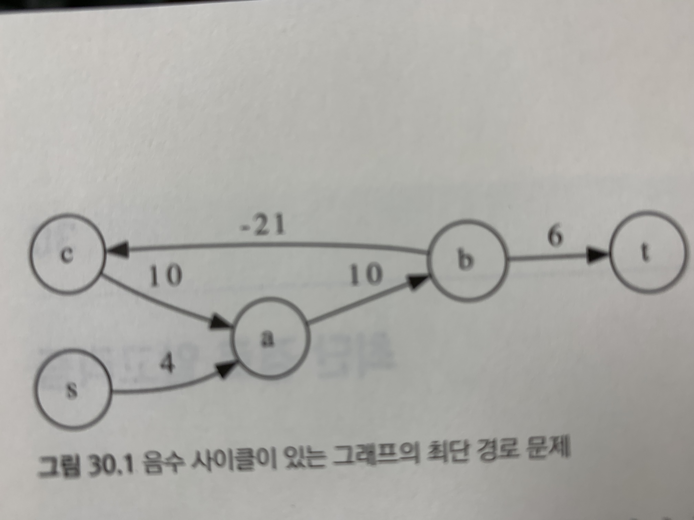

# 29장 그래프의 너비우선탐색

- BFS (Breadth First Search, 너비우선탐색) 복습
  - https://youtu.be/0u78hx-66Xk?t=127
  - 양방향 탐색
    <details>
    <summary>양방향 탐색의 동작 과정</summary>

    
    </details>

### 문제: 하노이의 탑 (HANOI4, 난이도: 중)

<details>
<summary>Click to expand</summary>

- 예제 입력

  ```
  3 (테스트 케이스의 수 C)
  
  5 (원반의 총 수 n)
  
  (1) 1
  (1) 3
  (2) 5 4
  (1) 2
  
  (0)
  (0)
  (0)
  (5) 5 4 3 2 1
  
  3 (원반의 총 수 n)
  
  (1) 2
  (0)
  (2) 3 1
  (0)
  
  (0)
  (0)
  (0)
  (3) 3 2 1
  
  10 (원반의 총 수 n)
  
  (2) 8 7
  (2) 5 4
  (3) 6 3 2
  (3) 10 9 1
  
  (0)
  (0)
  (0)
  (10) 10 9 8 7 6 5 4 3 2 1
  ```

- 원반이 꽂혀있는 상태 하나가 한개의 정점(vertex)이 됨

  - 그 상태에서 원반을 하나 옮겨서 만들 수 있는 상태가 그 정점에 연결된 정점이 됨

  - 원반이 꽂혀있는 상태를 4개의 정수배열로 표현해버리면 메모리소비가 크므로 비트마스크를 사용

  - 각 원반이 몇번 기둥이 꽂혀있는지가 결정되면 각 기둥에 원반이 어떻게 꽂힐지도 결정됨

    ```java
    class State {
        int diskState = 0; // 디스크가 어느 기둥에 꽂혀 있는지를 비트로 표현
    
        public void setDisk(int diskNum, int towerNum) {
          // 해당 diskNum 위치의 기존 towerNum 값 지우기
          this.diskState = this.diskState & ~(3 << (diskNum * 2));
    
          // 해당 diskNum 위치에 새로운 towerNum 값 넣기
          this.diskState = this.diskState | (towerNum << (diskNum * 2));
        }
    
        public int[] getTops() {
          int[] tops = new int[] {-1, -1, -1, -1};
          int currentDiskNum = 0;
          int currentDiskState = this.diskState;
          while (currentDiskState != 0) {
            int towerNum = currentDiskState & 3;
            if (tops[towerNum] == -1) {
              tops[towerNum] = currentDiskNum;
            } else {
              tops[towerNum] = Math.min(tops[towerNum], currentDiskNum);
            }
            currentDiskNum++;
            currentDiskState = currentDiskState >> 2;
          }
          return tops;
        }
    }
    ```

- 단방향 탐색

  ```java
  int solve(State initialState, State finalState) {
      var queue = new LinkedList<State>();
      queue.addLast(initialState);
      count[initialState.diskState] = 0;
  
      while (!queue.isEmpty()) {
        State state = queue.removeFirst();
        int[] tops = state.getTops();
  
        for (int towerNumFrom = 0; towerNumFrom < 4; towerNumFrom++) {
            int top = tops[towerNumFrom];
            if (top == -1) continue; // 원반이 없는 기둥은 패스
  
            for (int towerNumTo = 0; towerNumTo < 4; towerNumTo++) {
                if (towerNumFrom == towerNumTo) continue; // 같은 기둥으로는 옮길 수 없다
  
                // 옮기려는 기둥의 맨 위의 원반이 지금 옮기려는 원반보다 번호가 작다면 옮길 수 없다
                // 옮기려는 기둥이 비어있으면 가능
                if (tops[towerNumTo] != -1 && tops[towerNumTo] < top) continue;
  
                // 원반 옮겨서 새로운 state 생성
                State newState = state.newState(top, towerNumTo);
  
                // 이미 방문했던 state라면 스킵
                if (count[newState.diskState] != -1) continue;
  
                // 최종상태에 도달했다면
                if (newState.diskState == finalState.diskState) {
                  return count[state.diskState] + 1;
                }
  
                // 아직까지 발견되지 않은 state라면 지금까지의 count에 +1해서 기록
                count[newState.diskState] = count[state.diskState] + 1;
              
              	// 큐에 넣는다
                queue.addLast(newState);
            }
        }
      }
      return -1;
  }
  ```

  

- 양방향 탐색

  ```java
  int solve(State initialState, State finalState) {
      LinkedList<State> queue = new LinkedList<>();
    
      queue.addLast(initialState);
      count[initialState.diskState] = 1; // 1을 넣는다!
    
      queue.addLast(finalState);
      count[finalState.diskState] = -1; // -1을 넣는다!
  
      while (!queue.isEmpty()) {
          State state = queue.removeFirst();
          int[] tops = state.getTops();
  
          for (int towerNumFrom = 0; towerNumFrom < 4; towerNumFrom++) {
              int top = tops[towerNumFrom];
              if (top == -1) continue; // 원반이 없는 기둥은 패스
  
              for (int towerNumTo = 0; towerNumTo < 4; towerNumTo++) {
                if (towerNumFrom == towerNumTo) continue; // 같은 기둥으로는 옮길 수 없다
  
                // 옮기려는 기둥의 맨 위의 원반이 지금 옮기려는 원반보다 번호가 작다면 옮길 수 없다
                // 옮기려는 기둥이 비어있으면 가능
                if (tops[towerNumTo] != -1 && tops[towerNumTo] < top) continue;
  
                // 원반 옮겨서 새로운 state 생성
                State newState = state.newState(top, towerNumTo);
  
                // 이미 방문했던 state라면 스킵
                if (Integer.signum(count[state.diskState])
                    == Integer.signum(count[newState.diskState])) continue;
  
                // 중간에서 만났다면
                if (-Integer.signum(count[state.diskState])
                    == Integer.signum(count[newState.diskState])) {
                  return  Math.abs(count[state.diskState])
                    + Math.abs(count[newState.diskState]) - 1;
                }
  
                // 아직 방문하지 않은 state라면
                if (count[state.diskState] > 0) {
                  count[newState.diskState] = count[state.diskState] + 1;
                } else {
                  count[newState.diskState] = count[state.diskState] - 1;
                }
                queue.addLast(newState);
              }
          }
      }
      return -1;
  }
  ```

</details>  


# 30장 최단 경로 알고리즘

- 최단 경로 문제 (Shortest Path Problem): 그래프에서 주어진 두 정점을 연결하는 가장 짧은 경로의 "길이"를 찾는 문제

  - 가중치가 없는 그래프: BFS 사용하면 됨

  - 가중치가 있는 그래프: 단 하나의 가장 좋은 알고리즘이 존재하는 것이 아님. 그래프 종류와 특성에 따라 선택

    - 단일 시작점 알고리즘 (하나의 시작점에서 다른 모든 정점까지 가는 최단거리를 구하는 알고리즘)

      - **다익스트라 (Dijkstra) 알고리즘** 이 대표적임

    - 모든 쌍 알고리즘 (모든 정점의 쌍에 대해 최단 거리를 계산하는 알고리즘)

      - **플로이드의 최단 경로 알고리즘** 이 대표적임

    - 음수 사이클이 존재하는 그래프

      

      - 최단 경로를 구할 수 없음. 음수 사이클의 유무를 확인하는 알고리즘 (**벨만-포드 알고리즘**) 만 존재


- 다익스트라 (Dijkstra) 알고리즘

  - 단일 시작점 알고리즘: 시작 정점 s에서부터 다른 정점들까지의 최단 거리를 계산

  - 우선순위 큐 (Priority Queue) 를 사용하는 너비 우선 탐색

    - 가중치 있는 그래프에서 너비 우선 탐색으로 최단 거리를 계산하지 못하는 이유

      

    - Queue 대신 Priority Queue 를 사용하면 됨!

      - 우선순위 큐에 **정점의 번호**와 **지금까지 찾아낸 해당 점점까지의 최단 거리** 를 쌍으로 넣는다
      - 우선순위 큐에서 꺼낸 값을 배열 dist[]에 갱신 (루트에서 각 정점까지의 최단거리)
      - https://youtu.be/pSqmAO-m7Lk?t=230

  - 코드
    <details>
    <summary>Click to expand</summary>

    ```java
    class Pair {
        Pair(int vertexNum, int cost) {
          this.vertexNum = vertexNum;
          this.cost = cost;
        }
        int vertexNum;
        int cost;
    }
    
    int[] dijkstra(List<List<Pair>> adj) {
        int n = adj.size(); // 정점(vertex)의 개수
    
        int[] dist = new int[n];
        Arrays.fill(dist, Integer.MAX_VALUE);
        dist[0] = 0; // 시작점의 dist는 0
    
        var pq = new PriorityQueue<Pair>(Comparator.comparingInt(v -> v.cost));
        pq.add(new Pair(0, 0));
        while (!pq.isEmpty()) {
          Pair currentVertex = pq.poll();
    
          // 만약 지금 꺼낸 것보다 더 짧은 경로를 알고 있다면 지금 꺼낸 것을 무시한다
          if (dist[currentVertex.vertexNum] < currentVertex.cost) continue;
    
          // currentVertex와 인접한 정점들을 모두 검사한다
          for (Pair adjVertex : adj.get(currentVertex.vertexNum)) {
            int nextDist = currentVertex.cost + adjVertex.cost;
    
            // 더 짧은 경로를 발견하면 dist[]를 갱신하고 우선순위 큐에 넣는다
            if (dist[adjVertex.vertexNum] > nextDist) {
              dist[adjVertex.vertexNum] = nextDist;
              pq.add(new Pair(adjVertex.vertexNum, nextDist));
            }
          }
        }
    
        return dist;
    }
    ```
    </details>
    

  - 정당성의 증명
    - 생략
  - 시간 복잡도: O(*E* log*E*)
    - *E*: 간선(Edge)의 개수
    - 우선순위 큐에 추가/삭제하는데 O(log*E*)
    - 우선순위 큐에 추가되는 원소의 수는 최대 O(*E*)
    - E의 최대값은 $V^2$ 이기 때문에 O(*E* log*E*) = O(*E* log*V*) 로 계산해도 상관없음


### 문제: 신호 라우팅 (ROUTING, 난이도: 하)

<details>
<summary>Click to expand</summary>

- https://algospot.com/judge/problem/read/ROUTING

- 덧셈이 곱셈으로 바뀐 다익스트라일뿐

  ```java
  class Pair {
      Pair(int vertexNum, double cost) {
        this.vertexNum = vertexNum;
        this.cost = cost;
      }
      int vertexNum;
      double cost;
  }
  
  double dijkstra(List<List<Pair>> adj) {
    int n = adj.size(); // 정점(vertex)의 개수
  
    double[] dist = new double[n];
    Arrays.fill(dist, Double.MAX_VALUE);
    dist[0] = 0.0; // 시작점의 dist는 0.0
  
    var pq = new PriorityQueue<Pair>(Comparator.comparingDouble(v -> v.cost));
    pq.add(new Pair(0, 0.0));
    while (!pq.isEmpty()) {
      Pair currentVertex = pq.poll();
  
      // 만약 지금 꺼낸 것보다 더 짧은 경로를 알고 있다면 지금 꺼낸 것을 무시한다
      if (dist[currentVertex.vertexNum] < currentVertex.cost) continue;
  
      // currentVertex와 인접한 정점들을 모두 검사한다
      for (Pair adjVertex : adj.get(currentVertex.vertexNum)) {
        if (adjVertex.vertexNum == 0) continue;
  
        double nextDist;
        if (currentVertex.vertexNum == 0) {
          nextDist = adjVertex.cost;
        } else {
          nextDist = currentVertex.cost * adjVertex.cost;
        }
        if (dist[adjVertex.vertexNum] > nextDist) {
          dist[adjVertex.vertexNum] = nextDist;
          pq.add(new Pair(adjVertex.vertexNum, nextDist));
        }
      }
    }
  
    return dist[n - 1]; // 제일 마지막 정점까지의 최단 거리를 리턴
  }
  ```

</details>  


### 문제: 소방차 (FIRETRUCKS, 난이도: 중)
<details>
<summary>Click to expand</summary>

- https://algospot.com/judge/problem/read/FIRETRUCKS

- 가상의 정점 0을 추가하면 쉽게 풀림

  ```java
  class Pair {
      Pair(int vertexNum, int cost) {
        this.vertexNum = vertexNum;
        this.cost = cost;
      }
      int vertexNum;
      int cost;
  }
  
  public int dijkstra(List<List<Pair>> adj, int[] fireSpots) {
      int n = adj.size(); // 정점(vertex)의 개수
  
      int[] dist = new int[n];
      Arrays.fill(dist, Integer.MAX_VALUE);
      dist[0] = 0; // 시작점의 dist는 0
  
      var pq = new PriorityQueue<Pair>(Comparator.comparingInt(v -> v.cost));
      pq.add(new Pair(0, 0));
      while (!pq.isEmpty()) {
        Pair currentVertex = pq.poll();
  
        // 만약 지금 꺼낸 것보다 더 짧은 경로를 알고 있다면 지금 꺼낸 것을 무시한다
        if (dist[currentVertex.vertexNum] < currentVertex.cost) continue;
  
        // currentVertex와 인접한 정점들을 모두 검사한다
        for (Pair adjVertex : adj.get(currentVertex.vertexNum)) {
          if (adjVertex.vertexNum == 0) continue;
  
          int nextDist = currentVertex.cost + adjVertex.cost;
          if (dist[adjVertex.vertexNum] > nextDist) {
            dist[adjVertex.vertexNum] = nextDist;
            pq.add(new Pair(adjVertex.vertexNum, nextDist));
          }
        }
      }
  
      int answer = 0;
      for (int fireSpot : fireSpots) {
        answer += dist[fireSpot];
      }
      return answer;
  }
  ```

</details>


### 문제: 철인 N종 경기 (NTHLON, 난이도: 상)

<details>
<summary>Click to expand</summary>

- https://algospot.com/judge/problem/read/NTHLON

- 두 선수의 도착시간 차이를 정점으로 하고, 소요시간을 간선으로 하는 그래프를 그린다

  1. 두 선수가 완주했을 때 도착시간의 차이가 0이 되어야 하므로 종료정점은 0 이 된다

  2. 종목을 조합하면 무한한 크기의 그래프가 생겨버리므로, -200 ~ +200 범위를 벗어나는 정점은 그리지 않는다

  3. 시작정점은 1, 2 번에 해당하지 않는 값으로 대충 정하면 됨
  4. 그래프가 다 그려졌으면 그냥 다익스트라 돌리면 끝

  ```java
  class Pair {
      Pair(int vertexNum, int cost) {
        this.vertexNum = vertexNum;
        this.cost = cost;
      }
      int vertexNum;
      int cost;
  }
  
  int actualVertexNum(int delta) {
    return delta + 200; // delta 값은 범위는 -199 ~ +199
  }
  
  List<List<Pair>> makeGraph(int[] aTimes, int[] bTimes) {
      int sportsCount = aTimes.length; // 운동종목 수
      int vertexCount = 402; // -200 ~ 200 그리고 시작점
      int rootVertexNum = 401;
  
      List<List<Pair>> adj = new ArrayList<>();
      for (int i = 0; i < vertexCount; i++) adj.add(new ArrayList<Pair>());
  
      // 루트와 인접하는 정점 만들기
      for (int i = 0; i < sportsCount; i++) {
        int delta = aTimes[i] - bTimes[i];
        adj.get(rootVertexNum).add(new Pair(actualVertexNum(delta), aTimes[i]));
      }
  
      // 현재 차이
      for (int delta = -200; delta <= 200; delta++) {
        // i번 종목을 뒤에 붙인다면?
        for (int i = 0; i < aTimes.length; i++) {
          int next = delta + (aTimes[i] - bTimes[i]);
  
          // 시간 차이가 200을 넘는 정점은 만들 필요가 없다
          if (next < -200 || 200 < next) continue;
  
          adj.get(actualVertexNum(delta)).add(new Pair(actualVertexNum(next), aTimes[i]));
        }
      }
      return adj;
  }
  ```
</details>
  
