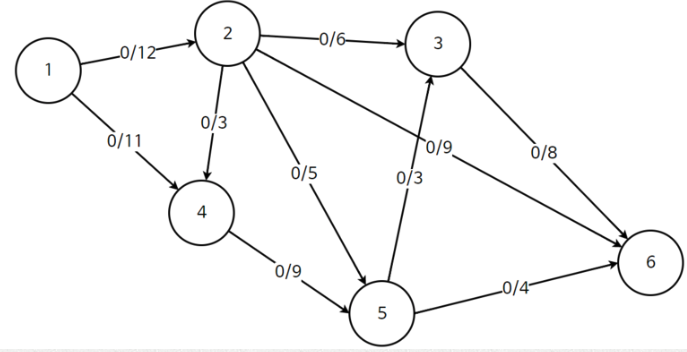

# 32장 네트워크 유량(Network Flow)

## 1) 배경

네트워크 유량은 특정한 지점에서 다른 지점으로 데이터가 얼마나 많이 흐르고 있는가를 측정하는 알고리즘입니다. 이러한 알고리즘은 교통 체증, 네트워크 데이터 전송 등의 다야안 분야에 활용되고 있습니다.

네트워크를 이용해 수백 GB에 달하는 아주 큰 파일을 다운로드 하는 중이라고 합시다. 이렇게 전송받을 자료의 양이 많을때 우리가 관심을 갖는 부분은 서버가 보낸 패킷이 내 컴퓨터에 몇미리초 만에 도착하는 것이 아니라, 1초에 몇 MB의 자료를 전송 받을 수 있느냐입니다. 네트워크 유량(Network Flow)는 이렇게 각 간선이 용량을 갖는 그래프에서 두 정점 사이에 얼마나 많은 흐름, 유량을 보낼 수 있는지를 계산하는 문제에서 시작되었습니다.

## 2) 용어 설명

용량(Capacity): 간선에 흘릴수 있는 최대 데이터 양
유량(Flow): 간선에 흐르는 데이터 양

### 예시 1)

각 도시를 지날때 1초가 걸리고 각 길의 폭은 8(서울->대전), 3(대전->부산)이라고 하자.
사람 1명당 1개의 폭을 차지 한다고 할때 서울에서 부산으로 1초당 몇명을 보내야 막힘이 없이 안정적으로 갈 수 있을까? 

- 서울 -> 대전 용량(Capacity) : 8,  대전 -> 부산  용량(Capacity) : 3

- 서울에서 부산으로 8명을 한번에 보냈을 경우

- 1초에 3명씩 서울에서 부산으로 보내야 막힘 없이 안정적으로 보낼 수 있다. (표현 방식: 유량/용량)

### 예시 2)

A에서 D로 최대한 많은 유량을 보내려고 할 때 가장 합리적인 양은 얼마일까?

- 6이상을 보내면 정체 현상이 발생할 수 있다. 여기서 6을 최대유량(Max Flow)라고 한다.

## 3) 포드-풀커슨 알고리즘

이제 한 번 여러개의 정점과 간선이 있는 경우를 확인해 봅시다.

참고) 네트워크 유량을 해결하는 가장 기초적인 방법으로 포드-풀커슨 알고리즘이 있습니다. 포드-풀커슨 알고리즘은 알고리즘 방법론으로 구현 방식은 다양하나 jongman book에서는 너비우선탐색으로 포드-풀커슨 알고리즘을 이용하여 구현한 에드몬드-카프 알고리즘에 대해 설명하고 있습니다.

- 가능한 모든 경우의 수를 탐색하기 위해 유량(Flow)를 0으로 초기화

- 정해진 용량(Capacity) 안에서 가능한 용량의 양을 반복적으로 더해준다.

https://blog.naver.com/ndb796/221237111220

