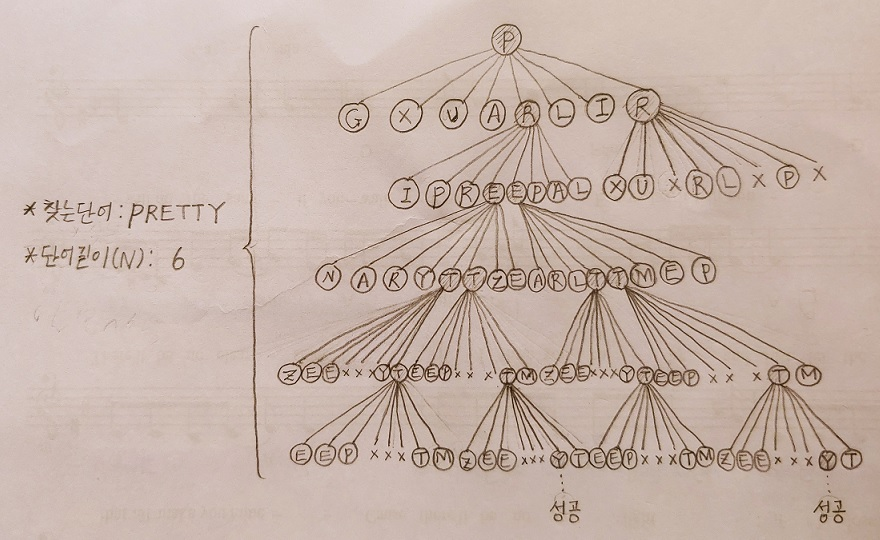
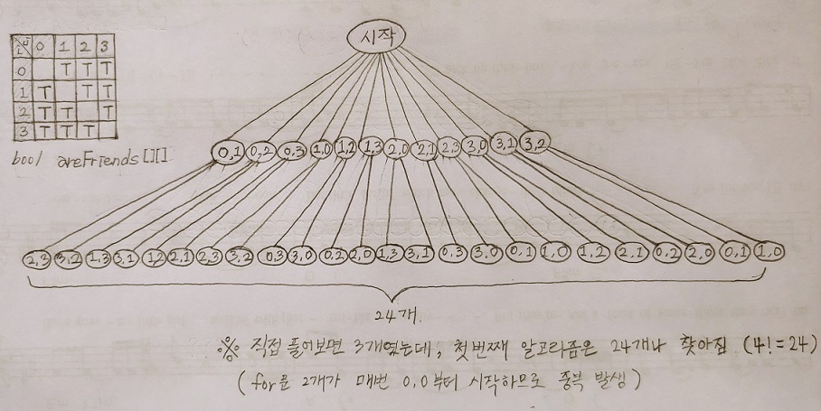
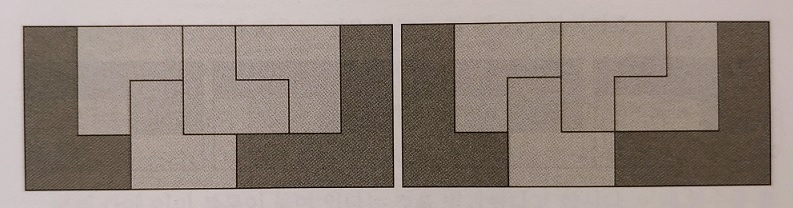
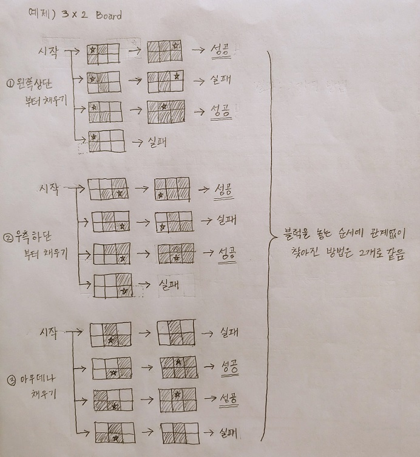
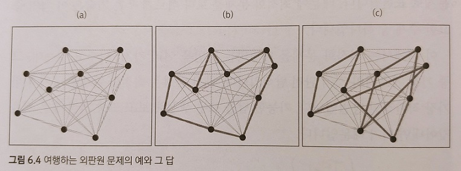
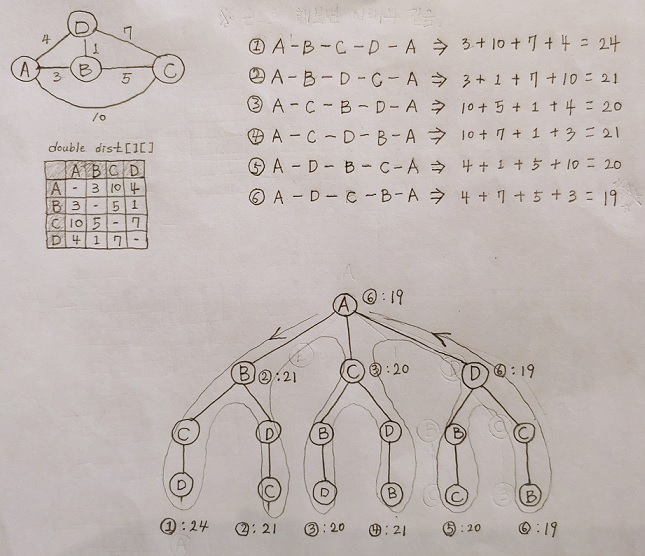
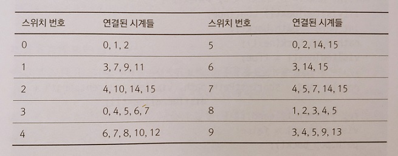

# 3부 알고리즘 설계 패러다임
### 개관

- 알고리즘을 고안하는 작업은 어려운 일입니다.
- 그러나 고수들도 한순간의 영감으로 문제를 해결하지 않으며, 여러가지의 전략적인 선택을 하게 됩니다.
- 알고리즘 설계 패러다임이란 알고리즘에 사용된 전략이나 관점을 의마합니다.
- 3부(6장~12장)에서 다양한 알고리즘 설계 패러다임을 익히면서 일종의 패턴을 확인할 수 있으며 이를 통해 알고리즘 설계 능력이 향상될 것입니다.
- 알고리즘 설계 패턴 : 6장-무식하게 풀기, 7장-분할정복, 8장,9장-동적 계획법, 10장-탐욕법, 11장-조합 탐색, 12장-최적화 문제

# 6장. 무식하게 풀기
## 6.1 도입

* 프로그래밍 대회에서 가장 많이 하는 실수는 문제를 어렵게 풀려고 하는 것입니다.
* 먼저, 스스로에게 물어봅시다. "무식하게 풀 수 있을까?"
* 그럼 무식하게 풀기(brute-force)란 무엇일까요?
  * 주어진 문제에서 가능한 **모든 경우의 수**를 무식하게 다 해보는 것입니다.  
    ※ 컴퓨터의 장점인 빠른 속도를 이용합시다!
  * 예1) A-B까지의 최단경로를 찾는 문제 --> 가능한 경로를 모두 찾아서 서로 비교
  * 예2) 자원을 몇명에게 분배하는 문제 --> 분배할 수 있는 모든 경우의 수를 찾아서 비교
* 이렇게 모든 경우의 수를 다 구하는 방법을 **완전탐색**(exhaustive search)이라고도 합니다.
* 예제
  * 10명의 학생을 한 줄로 세우려고 합니다.
  * 그런데 서로 사이가 안 좋은 학생들이 있어서 붙여놓면 싸웁니다.
  * 그래서 사이가 안 좋은 학생들은 떨어뜨리는 방법이 몇 개인지 찾고 싶습니다.
  * 해결방법
    * 마땅한 해결방법이 떠오르지 않습니다.
    * 네, 무식하게 풀기를 사용해 봅시다.
    * 10명을 한 줄로 세우는 모든 방법을 다 구합니다.  
      ※ 10! = 3,628,800
    * 그 후에 사이가 안 좋은 학생들이 붙어 있는지 검사해주는 함수를 사용합니다.
* 이런 방법이 의미가 있을까요?
  * 4장에서 배운 주먹구구 법칙에서 1초에 수행해야 할 연산이 1억개 미만이면 성공가능성이 있었습니다.
  * 따라서 360만이면 많게 보이지만 프로그램의 시간복잡도가 높지 않으면 충분히 해볼만한 개수입니다.
* 무식하게 풀기(완전탐색)의 구현방법은 어떻게 될까요? 반복문 또는 재귀호출을 사용하면 됩니다.

## 6.2 재귀호출과 완전 탐색 

### 재귀호출

* 반복문과 재귀함수의 목적은 **반복한다**라는 관점에서 동일합니다.
* 항상 그런것은 아니지만, 완전 탐색을 구현할 때는 재귀함수가 반복문보다 더 유용합니다.
* 먼저, 반복문을 재귀함수로 변경하는 방법에 대해서 알아보겠습니다.
* 예제
  * 입력 : 자연수 n
  * 출력 : 1~n 까지의 합을 반환
  * 해결방법 : 반복문과 재귀함수로 각각 구현  
    ```c++
    // 필수 조건 : n >=1
    // 결과 : 1부터 n까지의 합을 반환한다
    int sum(int n) {
        int ret = 0;
        for(int i=1; i<=n; ++i)
            ret += i;
        return ret;
    }
    
    // 필수 조건 : n >= 1
    // 결과 : 1부터 n까지의 합을 반환한다
    int recursiveSum(int n) {
        if(n == 1) 
            return 1;
        return n + recursiveSum(n-1);
    }
    ```
    
  * 위의 반복문과 재귀함수는 동일한 결과를 계산해줍니다.
  * 재귀함수를 구성하는 기본적인 구성요소는 아래 3가지입니다.
    * 조각 : 어떤 문제를 쪼개서 유사한 동작을 하는 단위를 찾기 (반복수행해야 할 대상)
    * 조각마다 반복하기 : 1개의 조각을 수행하고 남은 조각들은 다시 자기자신을 호출해서 수행
    * 기저사례(base case) : 제일 마지막 조각을 확인해서 무한히 호출되는 것을 막기
  * 위의 int recursiveSum(int n) 함수에서 재귀함수의 구성요소 3가지를 찾아보면 아래와 같습니다.
    * 조각 : 1, 2, 3, ...., n-1, n 과 같은 각각의 숫자입니다.
    * 조각마다 반복하기 : 조각 중 하나를 수행하고 나머지는 다시 자기자신에게 전달해서 수행하도록 합니다. 반복수행의 모습은 n + (n-1 + ... + 1) 형태가 되어야 합니다. 그래야 다음 호출에서도 처음과 똑같은 모습 n + (n-1 + ... +  1) 형태를 유지할 수 있습니다. 
    * 기저사례(base case) : n 부터 하나씩 빼가면서 자신을 호출했을 때, **1** 까지 도달하면 더 이상 진행할 필요가 없음을 알 수 있습니다. 따라서 **1**이 곧 기저사례입니다.
  * 그럼 완전탐색에서 반복문보다 재귀함수를 좋은 이유가 뭘까요? 아래 예제에서 확인할 수 있습니다.
* 예제: 중첩 반복문 대체하기
  * 0~n 중에서 4개를 고르는 모든 경우를 출력하기 입니다. (순서에 상관없이)
  * 만약, n=7 이라면 아래와 같이 출력돼야 합니다.
    * (0,1,2,3), (0,1,2,4), (0,1,2,5), ... , (3,4,5,6)
    * 7C4 = n! / r!(n-r)! = 7! / 4!3! = 35가지
  * 해결방법 : 반복문
    ```c++
    for (int i=0; i < n; ++i)
        for (int j=i+1; j < n; ++j)
            for (int k=j+1; k < n; ++k)
                for (int l=k+1; l < n; ++l)
                    cout << i << " " << j << " " << k << " " << l << endl;
    ```
    * 4개를 고를 땐 반복문 4개가 중첩됩니다.
    * 5개를 골라야 한다면? 반복문 5개가 중첩되야 하며 숫자가 늘어날수록 반복문의 중첩도 깊어질 것입니다.  
      : 코드의 복잡도 증가
    * 더 큰 단점은 골라야 할 개수가 코드상에서 정해져 있다는 것입니다. (개수에 따라 반복문을 추가해야 합니다.)  
      : 유연성 부족
    * 이처럼 완전탐색 알고리즘을 구현할 때, 반복문을 사용하면 코드의 복잡도가 올라가고 유연성이 떨어지는 문제가 있습니다.
  * 해결방법 : 재귀함수
    ```c++
    // n : 원소들의 총 개수
    // picked : 지금까지 고른 원소들의 번호
    // toPick : 더 골라야 할 원소들의 개수
    void pick(int n, vector<int>& picked, int toPick) {
        // 기저사례 : 더 고를 원소가 없을 때, 원소들을 출력한다
        if (toPick == 0) {
            printPicked(picked); 
            return;
        }
        
        // 고를 수 있는 가장 작은 번호를 계산한다
        int smallest = picked.empty() ? 0 : picked.back() + 1;
        
        // 이 단계에서 원소 하나를 고른다
        for(int next = smallest; next < n; ++next) {
            picked.push_back(next);
            pick(n, picked, toPick-1);
            picked.pop_back();
        }
    }
    ```
    * 조각
      * 골라야 할 숫자 N 개 중에서 1개 고르는 행위를 조각이라고 할 수 있습니다.
      * 재귀호출을 하면서 조각을 몇 개 골랐는지 확인할 수 있어야 합니다, 그것이 변수 toPick 입니다.
      * 반복문에서의 조각과 동일합니다.
    * 조각마다 반복하기
      * 조각 중에서 1개를 해결하고 나머지 과정을 다음으로 넘기면 됩니다.
      * picked.push_back(next); 와 picked.pop_back(); 이 왜 들어갔을까요?
        * 생각해보면 완전탐색을 재귀함수로 구현할 때, 왼쪽으로 쭈~욱 파고들어간 경우가 제일 처음 찾은 경우가 됨을 머릿속에 그려보면 좋을 것 같습니다. 
        * 그렇게 되면 그 호출이 끝나는 시점에 원상복구를 해줘야 다음 경우의 수를 또 찾을 수 있다는 느낌이 옵니다.
    * 기저사례(base case)
      * N개를 다 골랐다면 경우의 수 하나를 찾은 것입니다.
      * 즉, 골라야 할 조각의 개수를 가리키는 toPick이 0이 된 시점입니다.
    * 호출구조를 그림으로 보면 아래와 같습니다.  
      
      

### 예제: 보글 게임 (난이도 : 하)

* 문제
  * 보글 게임은 5x5 크기의 격자에서 원하는 단어를 찾아내는 게임입니다.
  * 시작점과 찾아야할 단어는 주어집니다.
  * 현 위치에서 **8개 방향**(상하좌우 및 대각선)으로 인전합 칸들을 검색할 수 있습니다.
  * 예를 들어 아래 그림 b, c, d 는 각각 PRETTY, GIRL, REPEAT 이라는 단어를 찾은 결과입니다.  
    
  * 그림 a, e 와 같은 격자와 단어가 주이지면, 해당 단어가 존재하는지 확인하는 기능을 구현하세요.
* 아이디어
  * 위 그림 e 는 YES 라는 단어를 찾는 것입니다.
  * 시작점이 정가운데 Y 라고 하면, 가능한 E가 모든 방향으로 8개나 됩니다.
  * 정답은 우측 상단 대각선으로 가야하는데 이것을 어떻게 하면 알 수 있을까요?
  * 알고리즘이 떠오르지 않습니다.
  * 네, 그럼 완전탐색을 통해 모든 경우의 수를 다 해보면 됩니다.

### 문제의 분할

* 일단, 알고리즘을 완전탐색으로 정했으니 재귀함수의 호출구조를 떠올려 보겠습니다.
* 맨 왼쪽으로 계속 파고 들어가는 것이 첫번째 경우의 수입니다.
* 예를 들어, 재귀함수가 왼쪽하단부터 찾는다면 그림 e에서 첫번째로 찾은 단어는 "YEN"일 것입니다.
* 조각
  * 주어진 단어에서 한 글자를 찾는 행위를 조각으로 볼 수 있습니다.
  * 시작점이 주어지기 첫번째 조각은 매우 간단하게 찾을 수 있습니다.
  * 그 다음부터는 8개 방향을 모두 찾아야 합니다.
* 조각마다 반복하기
  * 만약 "GIRL"이라는 단어가 주어졌다고 해보겠습니다.
  * 현재 위치에 "G"가 있는지 확인하고 다음에는 "IRL"이라는 단어를 찾으면 됩니다.
  * 즉, 현재 위치의 8개 방향에 "IRL" 있는지 처음 "G"를 찾았을 때와 동일하게 재귀함수를 반복할 수 있습니다.
* 기저 사례
  * 기본 기저사례
    1. 현재 위치 (y, x)에 전달된 단어의 첫 글자가 없으면 실패입니다.
    2. (1번이 아니고) 전달된 단어가 한 글자라면 성공입니다.
  * 예외처리 기저사례 (위의 내용과 더불어서 기저사례를 만들 때는 잘못된 입력에 대해서도 예외처리를 해주면 좋습니다.)
    * 보글 게임은 주어진 격자가 있기 때문에 범위를 벗어난 경우에는 실패입니다.
* 구현
  ```c++
  const int dx[8] = {-1, -1, -1,  1, 1, 1,  0, 0};
  const int dy[8] = {-1,  0,  1, -1, 0, 1, -1, 1};
  
  // 5x5의 보글게임판에서 주어진 단어가 있는지를 확인하는 함수
  bool hasWord(int y, int x, const string& word) {
  	// 기저사례 1: 시작 위치가 범위 밖이면 무조건 실패
  	if(!inRange(y, x)) return false;
  	// 기저사례 2: 첫 글자가 일치하지 않으면 실패
  	if(board[y][x] != word[0]) return false;
  	// 기저사례 3: 단어 길이가 1이면 성공
  	if(word.size() == 1) return true;
  	
      // 인접한 여덟 칸을 검사한다
  	for(int direction=0; direction <8; ++direction) {
  		int nextY = y + dy[direction], nextX = x + dx[direction];	
  		// 다음 칸이 범위 안에 있는지, 첫 글자는 일치하는지 확인할 필요가 없다
  		if(hasWord(nextY, nextX, word.substr(1)))
  			return true;
  	}
  	return false;
  }
  ```
* 재귀함수 호출구조
  * 보글게임은 격자에 단어가 있는지 여부를 묻는 것이기 때문에 return type은 boolean입니다.
  * 그래서 가능한 경우를 하나라도 찾으면 true가 연쇄적으로 반환되는 호출구조입니다.
  * 하나라도 찾으면 최종결과도 true가 될 것입니다.  
      
      
    

### 시간복잡도 분석

* 사실, 완전탐색의 경우 모든 경우의 수를 무식하게 푸는 것이므로 대개의 경우에 시간복잡도 계산도 단순합니다.
* 그렇긴 하지만, 보글 게임에서 사용한 알고리즘은 해답을 찾으면 바로 리턴하기 때문에 약간 까다롭긴 합니다.
* 최악의 경우를 구하면 좋을 것 같습니다.
  * 답을 못 찾은 경우가 최악의 경우입니다. 8x8 격자로 탐색가능한 모든 경우의 수가 곧 최악의 시간복잡도가 됩니다.
  * 단어의 길이수 마다 8개의 재귀함수를 호출합니다. (8개 방향)
  * 마지막 글자는 예외처리 기저사례에 의해 제외되므로, 시간복잡도는 8^n-1 입니다.
  * 따라서 점근적 시간복잡도는 O(8^n)이 되며, 4장에서 배운 것처럼 이것은 지수복잡도 알고리즘입니다.
  * 지금은 데이터량이 작지만, 지수복잡도는 데이터가 조금만 커져도 문제가 될 것입니다.
  * 이렇듯 무식하게 풀기는 데이터량(여기서는 단어길이)에 따라 실패할 수도 있음을 알 수 있습니다.
  * 8장에서는 배우는 동적계획법을 통해 이를 개선할 수 있습니다.

### 완전탐색 레시피

* 완전 탐색으로 문제를 해결하는 과정
  1. 완전 탐색은 존재하는 모든 답을 검사하므로 걸리는 시간은 측정이 용이한 측면이 있습니다. 해결방법이 떠오르지 않을 때, 시도해본 후에 주어진 시간에 해결할 수 있을지 빠르게 검토해보기 바랍니다. 만약, 불가능하다면 3부의 다른 장에서 소개하는 추가적인 설계 패러다임을 고려하기 바랍니다.
  2. 조각찾기
  3. 조각마다 반복하기
  4. 기저사례

### 이론적 배경: 재귀 호출과 부분 문제

* 재귀 호출을 공부할 때, 문제와 부분문제(problem & subproblem)라는 개념이 중요합니다.
* 위 개념은 3부에서 계속해서 배우게 되는 동적계획법이나 분할정복에서도 사용되므로 중요합니다.
* 직관적인 개념과는 약간의 차이가 있으므로 좀 더 설명해 보겠습니다.
* 먼저 문제란 무엇일까요?
  * 바로 **수행해야 할 작업 + 작업을 수행할 자료** 입니다. 
  * 아래에 2개의 문제가 있습니다.
    * 문제 #1 : 주어진 자연수 수열을 정렬
    * 문제 #2 : {16, 7, 9, 1, 31} 을 정렬
  * 위 두 문제는 얼핏 보면 비슷하지만, 큰 차이가 있습니다.
    * 위의 문제 2개는 엄밀히 다른 문제입니다. 수행해야 할 작업은 같지만, 작업을 수행할 자료가 다르기 때문입니다.
    * 게다가 문제 #1은 작업을 수행할 자료가 명확하지 않기 때문에 재귀호출 입장에서는 문제의 정의라고 보기 어렵습니다.
* 그럼 보글문제에서 문제와 부분문제는 어떻게 될까요?
  * 문제 : 게임판에서의 현재 위치 (y,x) 그리고 단어 word가 주어질 때, 해당 단어를 이 칸에서부터 시작해서 찾을 수 있는가?
  * 문제를 해결하기 위해서 9가지의 정보를 알아야 합니다.
    1. 현재 위치 (y, x) 에서 단어의 첫 글자가 있는가?
    2. 상단 (y-1, x) 에서 시작해서, 단어의 나머지 글자들을 찾을 수 있는가?
    3. 좌상단 (y-1, x-1) 에서 시작해서, 단어의 나머지 글자들을 찾을 수 있는가?
    4. ...
    5. ...
  * 위의 정보 중에서 2번부터는 1번 문제의 응용버전일 뿐, 푸는 방식은 동일합니다. 
  * 이처럼 원래 문제와 같은 형식을 가지는 것들을 부분문제라고 부릅니다.

## 6.3 문제: 소풍 (난이도: 하)

### 문제

* 유치원에서 소풍을 갈 때, 2명씩 짝을 지어주려 합니다.
* 그런데 친구가 아닌 아이들을 짝이 되면 싸우기 때문에 떨어트려야 합니다.
* 서로 친구인지 여부가 주어질 때, 짝지을 수 있는 방법의 수를 계산하는 프로그램을 구현하세요.
* 일부만 달라도 다른 방법입니다. 즉, 아래 2가지는 다른 방법으로 칩니다.
  * #1 - (태연, 제시카), (써니, 티파니), (효연, 유리)
  * #2 - (태연, 제시카), (써니, 유리), (효연, 티파니)
* 시간 & 메모리 제한
  * 1초 내 실행, 64MB 이하의 메모리
* 입력
  * 첫 줄에는 테스트 케이스의 수 C (C<=50)
  * 각 테스트 케이스
    * 첫번째 줄 : 학생의 수 n, 친구 쌍의 수 m  
      (범위 :  2 <= n <= 10, 0 <= m <= n(n-1) / 2)
    * 두번째 줄 : m개의 친구 쌍 정보
* 출력 
  * 각 테스트 케이스마다 모든 학생을 친구끼리만 짝지어줄 수 있는 방법의 수를 출력
* 예제 입력
  ```shell
  3
  2 1
  0 1
  4 6
  0 1 1 2 2 3 3 0 0 2 1 3
  6 10
  0 1 0 2 1 2 1 3 1 4 2 3 2 4 3 4 3 5 4 5
  ```
* 예제 출력
  ```shell
  1
  3
  4
  ```

### 예제 입출력 설명

* 첫 번째 테스트케이스
  * 입력의 의미
    * 2 1 : 학생이 2명이고 짝이 1개
    * 0 1 : 0번과 1번이 친구이므로 2명으르 짝지을 수 있음 
  * 알고리즘 수행결과는 "1" 이 나와야 함
    * 짝지을 수 있는 경우의 수 : 1개
    * (0, 1) 또는 (1, 0) - 동일함
* 두 번째 테스트케이스
  * 입력의 의미
    * 4 6 : 학생이 4명이고 짝이 6개
    * 0 1 1 2 2 3 3 0 0 2 1 3 : 사실상 모두 친구임 (4C2 = 총 6개)
  * 알고리즘 수행결과는 "3" 이 나와야 함
  * 4명을 보라돌이,뚜비,나나,뽀라고 할 때, 최종적으로 아래와 같은 3가지 방법이 가능함을 알 수 있습니다
    * (보라돌이, 뚜비) (나나, 뽀)
    * (뚜비, 뽀) (보라돌이, 나나)
    * (나나, 뚜비) (뽀, 보라돌이)
  * 왜 3가지 방법일까요?
    * 4명 중에 보라돌이가 짝을 고를 수 있는 방법은 3가지입니다.
    * 보라돌이가 짝을 고르면 2명이 남습니다.
    * 2명 중에 1명이 짝을 고를 수 있는 방법은 1가지 뿐입니다.
    * 따라서 4명이 모두 친구라면 짝이 될 수 있는 경우의 수는 3개(3 x 1)입니다. 

## 6.4 풀이: 소풍

### 완전 탐색

* 문제에 방법의 수를 구하라는 내용이 포함되어 있습니다.
* 방법의 수(경우의 수)를 구하는 문제는 1차적으로 완전탐색으로 풀어볼 수 있습니다. 그런 후에 실패할 확률이 크면 추가적인 개선을 합시다.
* 재귀함수 기본요소 찾기
  * 조각
    * 학생 1명에게 짝을 찾아주는 것을 조각으로 설정했습니다.
    * 그런데 1명이 짝을 찾으면 자연스럽게 학생 2명의 짝이 정해지게 됩니다.
    * 따라서 조각의 개수는 학생 n에 대해 n/2 개이 존재한다고 볼 수 있습니다.  
      ※ 이것은 코드상에서 taken[i] = taken[j] = true; 와 같은 구문으로 나타나게 됩니다.
  * 조각마다 반복하기
    * 재귀함수에서 2명의 짝을 작업을 수행하고, 똑같은 방법으로 자기자신을 호출해서 나머지 학생들의 짝을 찾아줍니다. 이를 반복합니다.
  * 기저사례
    * 모든 학생이 짝을 찾았다면 더 이상 진행할 필요가 없습니다.

### 중복으로 세는 문제

* 1차 코드
  ```c++
  int n;
  bool areFriends[10][10];
  
  // taken[i] = i번째 학생이 짝을 이미 찾았으면 true, 아니면 false
  int countParings(bool taken[10]) {
  	// 기저사례: 모든 학생이 짝을 찾았으면 한 가지 방법을 찾았으니 종료한다.
  	bool finished = true;
  	for(int i =0; i<n; ++i) if(!taken[i]) finished = false;
      if(finished) return 1;
  	int ret=0;
      // 서로 친구인 두 학생을 찾아 짝을 지어 준다
      for(int i=0; i<n; ++i) {
          for(int j=0; j<n; ++j) {
              if(!taken[i] && !taken[j] && areFriends[i][j]) { // i, j 가 친구가 없는데, 둘이 친구이면
                  taken[i] = taken[j] = true;
                  ret += countPairings(taken);
                  taken[i] = taken[j] = false;
              }
          }
      }
      return ret;
  }
  ```
  * 재귀함수 호출구조 
    
  * 근데 실행해보면, 답이 1 3 4 로 나오지 않습니다.
  * 위 코드의 문제점?
    * 중복으로 세는 것이 발생합니다.
    * 예를 들어 (0 1) 과 (1 0) 을 별개로 취급하고 있기 때문에 원하는 답이 나오지 않습니다.
  * 해결방법
    * 이처럼 중복이 발생하는 문제는 자주 마주치게 되므로 유의해야 합니다.
    * 흔히 사용하는 방법은 사전순으로 먼저 오는 것부터 답을 세는 것입니다.
  * 그럼 2가지가 보장됩니다.
    * (0, 1) 을 찾았다면 (1, 0) 은 찾지 않습니다.
    * (2, 3) (0, 1) 처럼 더 큰 숫자가 먼저 짝지어 질 수 없습니다.
* 2차 코드 (코드 6.5)
  ```c++
  int n;
  bool areFriends[10][10];
  
  // taken[i] = i번째 학생이 짝을 이미 찾았으면 true, 아니면 false
  int countParings(bool taken[10]) {
      // 남은 학생들 중 가장 번호가 빠른 학생을 찾는다
      int firstFree = -1;
      for(int i=0; i <n ++i) {
          if(!taken[i]) {
              firstFree = i;
              break;
          }
      }
      // 기저사례: 모든 학생이 짝을 찾았으면 한 가지 경우를 찾았으니 종료한다.
      if(firstFree == -1) return 1;
      int ret = 0;
      // 이 학생과 짝지을 학생을 결정한다
      for(int pairWith = firstFree+1; pairWith <n; ++pariWith) {
          if(!taken[pairWith] && areFriends[firstFree][pairWith]) {
              taken[firstFree] = taken[pairWith] = true;
              ret += countPairings(taken);
              taken[firstFree] = taken[pairWith] = false;
          }
      }
      return ret;
  }
  ```
  * 재귀함수   
  

### 답의 수의 상한

* 위의 그림에서 보이듯이 답을 찾아가는 재귀호출 알고리즘은 답의 수만큼 시간이 걸리게 됩니다.
* 따라서 답의 개수가 얼마인지를 미리 계산해야 그 수행시간도 예측할 수 있습니다.
* 그럼 위 코드에서 답으로 가능한 최대개수는 얼마일까요?
  * 최대 학생수는 10명입니다.
  * 서로가 모두 친구일 때, 답의 개수가 최대가 될 것이며 아래처럼 계산할 수 있습니다.
  * 9 x 7 x 5 x 3 x 1 = 945개
    * 첫번째 학생이 선택가능한 학생은 9명입니다.
    * 첫번째 학생이 선택을하면 자동으로 두 학생의 짝이 정해집니다.
    * 따라서 세번째 학생 순서입니다.
    * 세번째 학생이 선택가능한 학생은 7명입니다.
    * ... 반복

## 6.5 문제: 게임판 덮기 (난이도: 하)

* H x W 크기의 격자무늬 게임판이 있습니다.
* 칸은 검은색 or 흰색이며 모든칸을 검은색으로 채워야 합니다.
* L 모양의 세칸짜리 블럭으로 흰칸을 모두 채워야 합니다.
* 테트리스처럼 회전할 수는 있지만, 검은색을 덮거나 같은 곳에 두 번 덮을수는 없습니다.
* 흰칸의 최대개수가 50개일 때, L 모양 블럭으로 모든 흰칸을 채울 수 있는 방법은 몇 개일까요?
* 시간 & 메모리 제한
  * 2초안에 실행되어야 하고, 64MB 이하의 메모리만 사용  
* 예제  
  
* 입력
  * 첫 줄 : 테스트케이스 수 C (C <= 30)
  * 각 테스트케이스
    * 첫번째 줄 : H , W (1 <= H, W <= 20)
    * 두번째 줄 : 게임판 (# : 검은칸 / . : 흰칸)
* 출력
  * 한 줄에 하나씩 흰 칸을 모두 덮는 방법의 수를 출력합니다.
* 예제 입력  
  ```shell
  3
  3 7
  #.....#
  #.....#
  ##...##
  3 7
  #.....#
  #.....#
  ##..###
  8 10
  ##########
  #........#
  #........#
  #........#
  #........#
  #........#
  #........#
  ##########
  ```

* 예제 출력  
  ```shell
  0
  2
  1514
  ```

* 예제 설명
  * 첫번째 예제 : 빈칸이 13개 이므로 L (3칸짜리) 로 다 채울 수 없습니다.
  * 두번째 예제 : 아래와 같이 2가지 방법으로 덮을 수 있습니다.  
    

## 6.6 풀이: 게임판 덮기

* 문제가 방법의 수(경우의 수)를 모두 찾으라는 내용이으모 무식하게 풀기(완전탐색)로 해결할 수 있습니다.
* 아이디어
  * L모양 블럭이 3칸짜리이므로 흰칸의 개수가 3의 배수가 아니면 성공할 수 없습니다. 예외처리를 해야합니다.
  * 흰칸을 3으로 나누면 L모양 블럭의 개수를 구할 수 있습니다.
  * 재귀함수 구성요소를 생각해보면
    * 조각 : N개의 블럭(흰칸  / 3) 중 하나의 위치를 결정하는 일
    * 조각마다 반복하기 : 1개 블럭의 위치를 결정하고 나머지를 자기자신을 호출, N개를 다 찾을때까지 반복하므로 재귀함수의 최대깊이는 N이 됩니다.
    * 기저사례 : N개를 다 찾으면 return 합니다. 그 반대의 경우에도 (더 이상 진행할 수 없으면) return 합니다.

### 중복으로 세는 문제

* 위 그림을 보면 같은 결과라도 첫번째 블럭을 놓는 위치가 다른 것을 중복해서 찾게 될 것입니다.
* 이런 경우에는 시작위치를 강제화하는게 좋은 방법입니다.
* 2장 - 문제해결 전략을 10가지 중에 **9번 : 순서를 강제로 만들기** 전략입니다.
  1. 비슷한 유형 떠올려보기
  2. 단순하게 시작할 수 있을까?
  3. 손으로 해보기
  4. 단순화하기
  5. 그림 그려보기
  6. 수식화 해보기
  7. 분해해보기
  8. 뒤에서부터 생각하기
  9. **순서를 강제로 만들기**
  10. 정규화된 답을 찾기
* 먼저 블럭을 놓을 수 있는 방법은 4가지입니다.  
  
* 간단한 예제를 만들어보면 순서에 관계없이 동일한 결과가 나옴을 알 수 있습니다.  
  
* 이제 순서에 관계없음을 확인했으며 블럭을 놓을 수 있는 방법은 4가지 임을 확인했습니다.
* 직관적으로 왼쪽 위에서 부터 차례대로 블럭을 채운다고 해보겠습니다.

### 답의 수의 상한

* 주어진 시간제한 2초 안에 해결할 수 있을까요?
* 먼저, 흰칸은 최대 50개이므로 L모양 블럭은 최대 16개입니다.  
  ※ 50 / 3 = 16.xx
* 블럭 1개를 위치시키는 방법은 4개 이므로 완전탐색을 한다면 40억가지가 나옵니다.  
  ※ 4^16 = 4,294,967,296
* 주먹구구 법칙상 2초면 2억개 정도를 해결할 수 있기 때문에 실패할 가능성이 큽니다.
* 그러나 예제 3번은 흰칸이 48개나 있는데도 결과는 1514개 밖에 되지 않습니다.  
  ※ 보글게임 문제에서 확인했듯이 실패로 판단되는 경로의 재귀호출은 더 이상 진행하지 않는다면 완전탐색이라고 해도 모든 경우를 다 탐색하지는 않습니다.
* 아래 그림에서도, 흰 칸이 12개이므로 최대 256가지가 가능한데 실제 답은 2개 밖에 되지 않습니다.  
  ※12 / 3 = 4 , 4 ^ 4 = 256가지  
  
* 이런 상황이라면 정답인 곳으로만 재귀함수가 깊어지는 구조에서는 성공할 것이라는 예감이 듭니다.

### 구현

* 재귀함수로 구현할 때 구현을 시작하기 전에 먼저 재귀호출 시나리오를 그림으로 그려보는게 좋은 것 같습니다.  
  
* 코드  
  ```c++
  // 주어진 칸을 덮을 수 있는 4가지 방법
  // 블록을 구성하는 세 칸의 상대적 위치 (dy, dx)의 목록 (그림 6.3 참조)
  const int coverType[4][3][2] = {
      { {0, 0}, {1, 0}, {0, 1} },  // 그림에서 블럭 b
      { {0, 0}, {0, 1}, {1, 1} },  // 그림에서 블럭 c
      { {0, 0}, {1, 0}, {1, 1} },	 // 그림에서 블럭 d
      { {0, 0}, {1, 0}, {1,-1} }   // 그림에서 블럭 e
  };
  
  // board의 (y, x)를 type번 방법으로 덮거나, 덮었던 블록을 없앤다
  // delta = 1 이면 덮고, delta = -1 이면 덮었던 블록을 없앤다
  // 만약 블록이 게임판 밖으로 나가거나, 서로 곂치거나, 검은 칸을 덮을 때는 false를 반환한다.
  bool set(vector<vector<int>>& board, int y, int x, int type, int delta) {   
      bool ok = true;
      for(int i=0; i<3; ++i) {
          const int ny = y + coverType[type][i][0];
          const int nx = x + coverType[type][i][1];        
  
          if(ny < 0 || ny >= board.size() || nx < 0 || nx >= board[0].size())
              ok = false;
          else if((board[ny][nx] += delta) > 1)
              ok = false;
      }
      return ok;
  }
  
  // board의 모든 빈 칸을 덮을 수 있는 방법의 수를 반환한다.
  // board[i][j] = 1 이면, 이미 덮인 칸 혹은 검은 칸
  // board[i][j] = 0 이면, 아직 덮이지 않은 흰 칸
  int cover(vector<vector<int>>& board) {
      // 아직 채우지 못한 칸 중 가장 윗줄 왼쪽에 있는 칸을 찾는다
      int y = -1, x = -1;
      for(int i = 0; i < board.size(); ++i) {
          for(int j = 0; j < board[i].size(); ++j) {
              if(board[i][j] == 0) {
                  y = i;
                  x = j;
                  break;
              }
          }
          if(y != -1) break;
      }
      
      // 기저사례 : 모든 칸을 채웠으면 1을 반환한다.
      if(y == -1)
          return 1;
      
      int ret = 0;
      for(int type = 0; type < 4; ++type) {
          // 만약 board[y][x]를 type 형태로 덮을 수 있으면 재귀 호출한다
          if(set(board, y, x, type, 1))
              ret += cover(board);
         	// 덮었던 블록을 치운다
          set(board, y, x type, -1);
      }
      return ret;
  }
  ```

## 6.7 최적화 문제

* 지금까지는 가능한 경우의 수를 모두 찾거나, 가능한지 알아보는 문제를 풀었습니다.
* 최적화 문제(Optimization Problem)는 여러개의 답 중에 가장 좋은 답을 찾아내는 문제를 의미합니다.
* 예를 들어
  * "n개의 원소 중에서 r개를 순서 없이 골라내는 방법의 수를 구하라" 는 최적화 문제가 아닙니다.
  * "n개의 사과 중에서 r개를 골랐을 때, 무게의 합을 최대인 것을 구하라" 는 최적화 문제입니다.
* 최적화 문제를 푸는 방법은 여러가지가 있지만, 가장 기초적인 것은 역시 **완전탐색**을 이용하는 것입니다.
* 왜냐하면 가능한 방법을 다 찾아보면 그 중에서 제일 좋은 답을 찾아내는 것도 가능하기 때문입니다.

### 예제: 여행하는 외판원 문제 (TSP)

* TSP(Traveling Salesman Probelm)은 매우 유명한 문제입니다.
* n 개의 도시가 있다고 가정합시다. (2<=n<=10)
* 한 영업사원이 한 도시에서 출발해 모든 도시들을 한 번씩 방문한 뒤 처음 도시로 돌아오려 합니다.
* 각 도시간의 거리가 주어질 때, 가장 짧은 거리로 이동하는 방법을 구하세요.

### 무식하게 풀 수 있을까요?

* 완전탐색을 적용할때는 시간내에 풀 수 있을지 검토가 필요합니다.  
  ※ 완전탐색은 기본이 되는 알고리즘이지만 빠른 알고리즘은 아닙니다.
* 먼저, n 개의 도시가 있고 각각의 도시가 다른 도시로 모두 연결되어 있다면 시간 복잡도는 (n-1)! 입니다. O(N!)  
  ※ 첫번째 도시는 9개 도시중에 선택할 수 있고, 두번째 도시는 8가지 도시 중에 선택할 수 있습니다. 반복  
  
* 문제에서 최대 10개 도시라고 했기 때문에 가능한 경우의 수는 36만개입니다.  
  ※ 9! = 362,880
* 36만개면 주먹구구 법칙을 통해 해결가능하다고 판단할 수 있습니다.
* 주의할 점은 TSP문제는 방문해야할 도시가 조금만 많아져도 완전탐색으로는 해결할 수 없습니다.  
  ※ 도시가 14개라면 , 13! = 6,227,020,800 (60억개)

### 재귀호출을 통한 답안 생성 (코드 6.7)

* 구현을 시작하기 전에 먼저 재귀호출 시나리오를 그림으로 그려보는게 좋은 것 같습니다.  
  
* 코드  
  ```c++
  int n;  // 도시의 수
  double dist[MAX][MIN];  // 두 도시 간의 거리를 저장하는 배열
  
  // path : 지금까지 만든 경로
  // visited : 각 도시의 방문 여부
  // currentLength: 지금까지 만든 경로의 길이
  // 나머지 도시들을 모두 방문하는 경로들 중 가장 짧은 것의 길이를 반환한다
  double shortestPath(vector<int>& path, vector<bool>& visited, double currentLength) {
      // 기저사례: 모든 도시를 다 방문했을 떄는 시작 도시로 돌아가고 종료한다
      if(path.size == n)
          return currentLength + dist[path[0]][path.back()];
      
      double ret = INF;	// 매우 큰 값으로 초기화 (확인안된 경로는 거리가 무한대라는 의미)
      // 다음 방문할 도시를 전부 시도해 본다.
      for(int next = 0; next < n; ++next) {
          if(visited[next])
              continue;
          
          int here = path.back();
          path.push_back(next);
          visited[next] = true;
          
          // 나머지 경로를 재귀 호출을 통해 완성하고 가장 짧은 경로의 길이를 얻는다.
          double cand = shortestPath(path, visited, currentLength + dist[here][next]);
          ret = min(ret, cand);
          visited[next] = flase;
          path.pop_back();
      }
      return ret;
  }
  ```

## 6.8 문제: 시계 맞추기 (난이도: 중)

* 아래 그림처럼 16개의 시계가 있습니다.  
  
* 각각은 12시 / 3시 / 6시 / 9시 중 하나를 가리키고 있습니다.
* 시간을 바꾸는 방법은 스위치를 누르는 것입니다.
  * 스위치는 각 시계를 3시간씩 앞으로 움직이게 합니다. (12시는 3시로 , 3시는 6시로 등)
  * 각 스위치는 3~5개의 시계와 연결되어 있습니다.
  * 위의 시계와 연결된 스위치는 아래와 같습니다. (시계 번호는 상단왼쪽이 0이고, 오른쪽으로 가면서 1씩 증가)  
    
* 이 때, 모든 시계가 12시를 가리키도록 하기 위해, 최소로 스위치를 누르는 횟수를 구하세요.
* 시간 및 메모리 제한
  * 10초 이내, 64MB 이하 메모리만 사용
* 입력
  * 첫 줄 : 테스트 케이스 개수 C (C<= 30)
  * 각 테스트 케이스 : 16개 시계가 현재 가리키는 시간
* 출력
  * 각 테스트 케이스당 정수 하나를 한 줄에 출력한다
  * 이 정수들은 모든 시계를 12시로 바꾸는데 필요한 최소한의 스위치 누름횟수이다
  * 불가능한 경우 -1 을 출력한다 (**실패할 수도 있다는 사실이 중요한 것 같습니다.**)
* 예제입력  
  ```shell
  2
  12 6 6  6 6 6 12 12 12 12 12 12 12 12 12 12 
  12 9 3 12 6 6  9  3 12  9 12  9 12 12  6  6 
  ```
* 예제출력  
  ```shell
  2
  9
  ```
* 예제 입출력 설명
  * 첫번째 테스트케이스 : 8번 스위치를 2번 누르면 해결됩니다.
  * 두번째 테스트케이스 : 여러가지 방법이 있습니다. 한가지 방법은 아래와 같이 9번 누르는 것입니다.
    * 스위치 누르는 순서 : 0, 1, 5, 6, 6, 6, 6, 3, 7

## 6.9 풀이: 시계 맞추기

### 문제 변형하기

* 있는 그대로 풀려면 매우 복잡한 문제입니다.
* 조금의 단순화 과정이 필요합니다. 그러면 완전탐색으로 풀 수 있게 됩니다.
* 아이디어
  * 스위치를 누르는 순서는 결과에 영향을 주지 않습니다.
  * 위의 내용을 기반으로 예제를 만들어보면 각각의 스위치가 독립임을 알 수 있습니다.  
    ※ 각 스위치의 누름 횟수만 계산하는 것을 재귀함수의 조각으로 만들어 볼 수 있습니다.  
    
  * 각 시계는 12시간이 지나면 제 자리로 돌아옵니다. 따라서 4번 이상 누르는 것은 의미가 없습니다.  
* **그 결과** 10개의 스위치 각각을 4번 누르는 유한한 문제로 변경에 성공했습니다.
* 완전탐색으로 찾을 수 있는 경우의 수는 100만 가지입니다. 주먹구구법칙으로 해결가능할 것입니다!  
  ※ 4^10  = 1,048,576

### 완전 탐색 구현하기 (코드 6.8)

* 구현을 시작하기 전에 먼저 재귀호출 시나리오를 그림으로 그려보는게 좋은 것 같습니다.  
  
* 코드  
  ```c++
  const int INF = 9999, SWITCHES = 10, CLOCKS = 16;
  
  // linked[i][j] = 'x' : i 번 스위치와 j 번 시계가 연결되어 있다
  // linked[i][j] = '.' : i 번 스위치와 j 번 시계가 연결되어 있지 않다
  // CLOCKS+1 은 char 형태이기 때문에 NULL 추가한 것 같아요;;(?)
  const char linked[SWITCHES][CLOCKS+1] = {
  	"xxx.............",
      "...x...x.x.x....",
      "....x.....x...xx",
      "x...xxxx........",
      "......xxx.x.x...",
      "x.x...........xx",
      "...x..........xx",
      "....xx.x......xx",
      ".xxxxx..........",
      "...xxx...x...x.."
  };
  
  // 모든 시계가 12시를 카리키고 있는지 확인하는 함수 (구현 생략)
  bool areAligned(const vector<int>& clocks);
  
  // swtch번 스위치를 누르는 함수
  void push(vector<int>& clocks, int swtch) {
      for(int clock = 0; clock < CLOCKS; ++clock) {
          if(linked[swtch][clock] == 'x') {
              clocks[clock] += 3;
              if(clocks[clock] == 15)
                  clocks[clock] = 3;
          }
      }
  }
  
  // clocks: 현재 시계들의 상태
  // swtch : 이번에 누를 스위치의 번호
  // 가 주어질 때, 남은 스위치들을 눌러서 clocks를 12시로 맞출 수 있는 최소 횟수를 반환한다.
  // 만약 불가능하다면 INF 이상의 큰 수를 반환한다.
  int solve(vector<int>& clocks, int swtch) {
      if(swtch == SWITCHES)
          return areAligned(clocks) ? 0 : INF;
      
      // 이 스위치를 0번 누르는 경우부터 3번 누르는 경우까지를 모두 시도한다.
      int ret = INF;
      for(int cnt = 0; cnt <4; ++cnt) {
          ret = min(ret, cnt + solve(clocks, swtch + 1));
          push(clocks, swtch);
      }
      
      // push(clocks, swtch)가 4번 호출되었으니 clocks는 원래와 같은 상태가 된다.
      return ret;
  }
  ```

## 6.10 많이 등장하는 완전탐색 유형
### 모든 순열 만들기

* n개 중에서 r개를 뽑는 순열 완전탐색 문제를 재귀함수로 구현하는 연습이 필요합니다.  
  ※ nPr = n! / (n-r)!
* 단, n이 10을 넘어가는 경우는 주먹구구 법칙을 기반으로 실패 할 확률이 크므로 다른 방법을 고려해봐야 합니다.
* C++의 경우에 순열을 생성해주는 next_permuation() 이라는 함수를 제공하기 때문에 조금 유리합니다.  
  ```c++
  #include <string>
  #include <iostream>
  #include <algorithm>
  
  using namespace std; 
  
  int main()
  { 
  	string s = "abaac";
  	sort(s.begin(), s.end());
  	
  	cout << s << endl;
  	int cnt = 0; 
  	
  	do { 
  		cnt++;
  		cout << s << endl;
  	} while(next_permutation(s.begin(), s.end()));
  	
  	cout << "result: " << cnt << endl;
  }
  ```

### 모든 조합 만들기

* 순서없이 봅는 조합문제도 재귀함수로 구현하는 연습이 필요합니다.
*  nCr = n! / r!(n-r)!

### 2^n 가지 경우의 수 만들기

* n개의 질문을 "예"/"아니오" 로 대답할 수 있는 경우의 수를 구하는 문제가 그 예입니다.
* 2^n 문제는 재귀함수를 쓰지 않아도 모든 경우를 확인할 수 있습니다.  
  ※ n비트 정수를 이용하면 모든 경우의 수를 for 문 하나로 구현할 할 수 있습니다.  
  ```c++
  #include <iostream>
  #include <bitset>
  
  using namespace std; 
  
  int main()
  { 
      int a = 0;
      string data;
      
      for (int i = 0; i < 10 ; ++i) {
          data = std::bitset<8>(a).to_string();
          cout << data << endl;
          a += 1;
      }
  }
  ```
 
