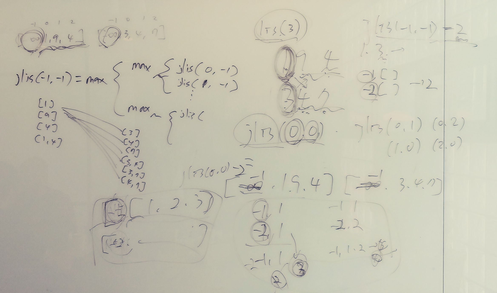

- 예제: 삼각형 위의 최대 경로 (문제 ID: TRIANGLEPATH, 난이도: 하)

  - 완전 탐색으로 시작하기

    ```java
    static Integer n; // 삼각형의 크기
    static Integer[][] triangle = new Integer[100][100]; // 삼각형
    // (y,x) 위치까지 내려오기 전에 만난 숫자들의 합이 sum 일 때
    // 맨 아래줄까지 내려가면서 얻을 수 있는 최대 경로를 반환한다.
    static Integer path(Integer y, Integer x, Integer sum) {
        // 기저 사례: 맨 아래 줄까지 도달했을 경우
        if(y == n-1) return sum + triangle[y][x];
    
        sum += triangle[y][x];
        return Math.max(path(y+1, x, sum), path(y+1, x+1, sum));
    }
    ```

    

  - 무식하게 메모이제이션 적용하기

    ```java
    // MAX_NUMBER: 한 칸에 들어갈 숫자의 최대치
    static Integer n; // 삼각형의 크기
    static Integer[][] triangle = new Integer[100][100]; // 삼각형
    static Integer[][][] cache = new Integer[100][100][MAX_NUMBER*100+1];
    // (y,x) 위치까지 내려오기 전에 만난 숫자들의 합이 sum 일 때
    // 맨 아래줄까지 내려가면서 얻을 수 있는 최대 경로를 반환한다.
    static int path1(Integer y, Integer x, Integer sum) {
        // 기저 사례: 맨 아래 줄까지 도달했을 경우
        if(y == n-1) return sum + triangle[y][x];
        // 메모이제이션
        if(cache[y][x][sum] != -1) return cache[y][x][sum];
        sum += triangle[y][x];
        cache[y][x][sum] = Math.max(path1(y+1, x, sum), path1(y+1, x+1, sum));
        return cache[y][x][sum];
    }
    ```

    

  - 입력 걸러내기

    ```java
    static Integer n; // 삼각형의 크기
    static Integer[][] triangle = new Integer[100][100]; // 삼각형
    static Integer[][] cache2 = new Integer[100][100];
    // (y,x) 위치부터 맨 아래줄까지 내려가면서 얻을 수 있는 최대 경로의 합을 반환한다.
    static int path2(Integer y, Integer x) {
        // 기저 사례
        if(y == n-1) return triangle[y][x];
        // 메모이제이션
        if(cache2[y][x] != -1) return cache2[y][x];
        cache2[y][x] = Math.max(path2(y+1, x), path2(y+1, x+1)) + triangle[y][x];
        return cache2[y][x];
    }
    ```

    

- 이론적 배경: 최적 부분 구조

  - 각 부분 문제의 최적해만 있으면 전체 문제의 최적해를 쉽게 얻어낼 수 있을 경우

  - 예: 서울에서 부산까지 가는 최단 경로

    

- 예제: 최대 증가 부분 수열 (문제 ID: LIS, 난이도: 하)

  Longest Increasing Subsequence

  - 완전 탐색에서 시작하기

    ```java
    static Integer lis(List<Integer> A) {
        // 기저 사례: A가 텅 비어 있을 때
        if(A.isEmpty()) return 0;
        int ret = 0;
        for(int i = 0; i < A.size(); ++i) {
            List<Integer> B = new ArrayList<>();
            for(int j = i+1; j < A.size(); ++j) {
                if(A.get(i) < A.get(j)) {
                    B.add(A.get(j));
                }
            }
            ret = Math.max(ret, 1 + lis(B));
        }
        return ret;
    }
    ```

    

  - 입력 손보기

    입력이 정수가 아니라 배열이라서 메모이제이션이 까다로움. 입력을 인덱스로 받도록 수정.

    ```java
    static Integer n;
    static Integer[] cache = new Integer[100];
    static Integer[] S = new Integer[100];
    static { Arrays.fill(cache, -1); }
    // S[start]에서 시작하는 증가 부분 수열 중 최대 길이를 반환한다.
    static Integer lis2(Integer start) {
        Integer ret = cache[start];
        if(ret != -1) return ret;
        // 항상 S[start]는 있기 때문에 길이는 최하 1
        cache[start] = 1;
        for(int next = start+1; next < n; ++next) {
            if(S[start] < S[next]) {
                cache[start] = Math.max(cache[start], lis2(next) + 1);
            }
        }
        return cache[start];
    }
    
    static Integer roundsAllPositions() {
        Integer maxLen = 0;
        for(int begin = 0; begin < n; ++begin) {
            maxLen = Math.max(maxLen, lis2(begin));
        }
        return maxLen;
    }
    ```

    

  - 시작 위치 고정하기

    시작위치를 -1로 고정시키면 roundsAllPositions() 를 호출하지 않아도 된다.

    ```java
    static Integer n;
    static Integer[] cache = new Integer[101];
    static Integer[] S = new Integer[100];
    // S[start]에서 시작하는 증가 부분 수열 중 최대 길이를 반환한다.
    static int lis3(Integer start) {
        Integer ret = cache[start+1];
        if(ret != -1) return ret;
        // 항상 S[start]는 있기 때문에 길이는 최하 1
        cache[start+1] = 1;
        for(int next = start+1; next < n; ++next) {
            if(start == -1 || S[start] < S[next]) {
                cache[start+1] = Math.max(cache[start+1], lis3(next) + 1);
            }
        }
        return cache[start+1];
    }
    ```

    주의: 최종 결과 값에서 -1을 해줘야 한다.

  

  - 더 빠른 해법

    O(nk) 시간 해법

    O(nlogn) 시간 해법
    
    부연설명 (발표 중, 칠판필기 내용)  
    
      
    

- 최적화 문제 동적 계획법 레시피

  1. 모든 답을 만들어 보고 그 중 최적해의 점수를 반환하는 완전 탐색 알고리즘을 설계한다.

  2. 전체 답의 점수를 반환하는 것이 아니라, 앞으로 나은 선택들에 해당하는 점수만을 반환하도록 부분 문제 정의를 바꾼다.

  3. 재귀 호출의 입력에 이전의 선택에 관련된 정보가 있다면 꼭 필요한 것만 남기고 줄인다.

  4. 입력이 배열이거나 문자열인 경우 가능하다면 적절한 변환을 통해 메모이제이션 할 수 있도록 한다.

  5. 메모이제이션을 적용한다.

     

- 문제: 합친 LIS (문제 ID: JLIS, 난이도: 하)

  Joined Longest Increasing Subsequence

  - 탐욕법으로는 안 된다

    두 수열의 LIS를 각가 찾은 뒤 이들을 합치는 방법으로는 안된다.

  - 비슷한 문제를 풀어 본 적이 있군요

    ```java
    // 입력이 32비트 부호 있는 정수의 모든 값을 가질 수 있으므로
    // 인위적인 최소치는 64비트여야 한다.
    static Long NEGINF = Long.MIN_VALUE;
    static Integer n, m;
    static Integer[] A = new Integer[100];
    static Integer[] B = new Integer[100];
    static Integer[][] cache = new Integer[101][101];
    // min(A[indexA], B[indexB]), max(A[indexA], B[indexB])로 시작하는
    // 합친 증가 부분 수열의 최대 길이를 반환한다.
    // 단 indexA == indexB == -1 혹은 A[indexA] != B[indexB]라고 가정한다.
    static int jlis(Integer indexA, Integer indexB) {
        // 메모이제이션
        if(cache[indexA+1][indexB+1] != -1) return cache[indexA+1][indexB+1];
        // A[indexA], B[indexB]가 이미 존재하므로 2개는 항상 있다.
        cache[indexA+1][indexB+1] = 2;
        Long a = (indexA == -1 ? NEGINF : A[indexA]);
        Long b = (indexB == -1 ? NEGINF : B[indexB]);
        Long maxElement = Math.max(a, b);
        // 다음 원소를 찾는다.
        for(int nextA = indexA + 1; nextA < n; ++nextA) {
            if (maxElement < A[nextA]) {
                cache[indexA+1][indexB+1] =
                    Math.max(cache[indexA+1][indexB+1], jlis(nextA, indexB) + 1);
            }
        }
        for(int nextB = indexB + 1; nextB < m; ++nextB) {
            if(maxElement < B[nextB]) {
                cache[indexA+1][indexB+1] =
                    Math.max(cache[indexA+1][indexB+1], jlis(indexA, nextB) + 1);
            }
        }
        return cache[indexA+1][indexB+1];
    }
    ```

    주의: 최종 결과 값에서 -2를 해줘야 한다.

  - 부연설명 (발표 중, 칠판필기 내용)  
    
    
