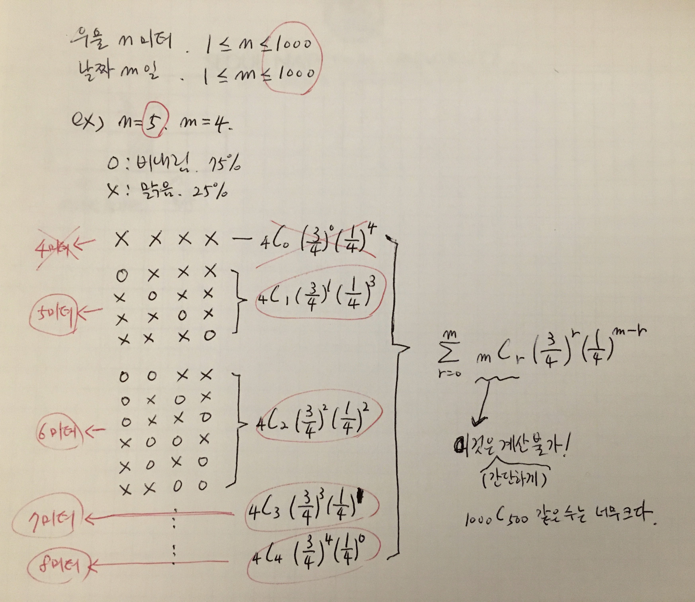
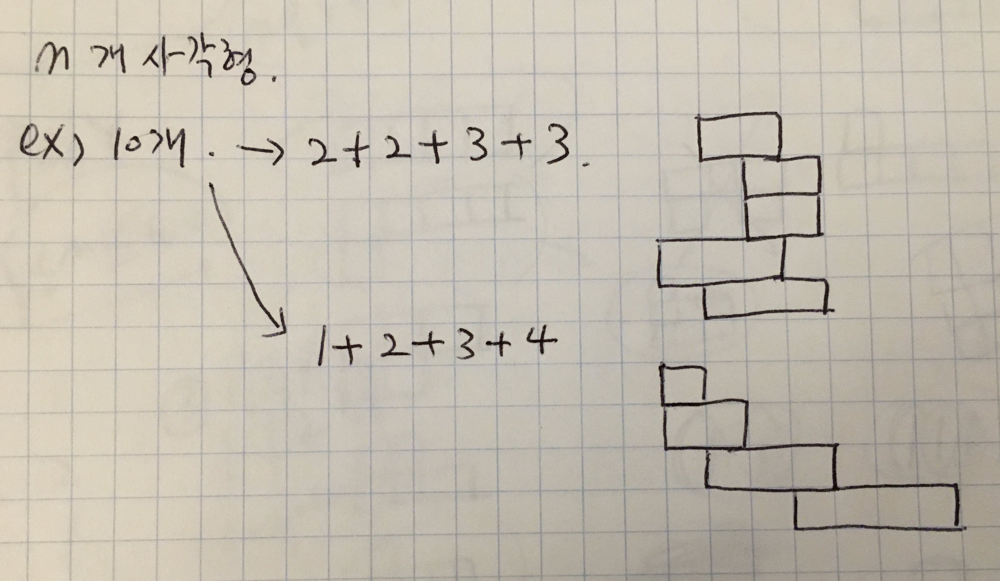
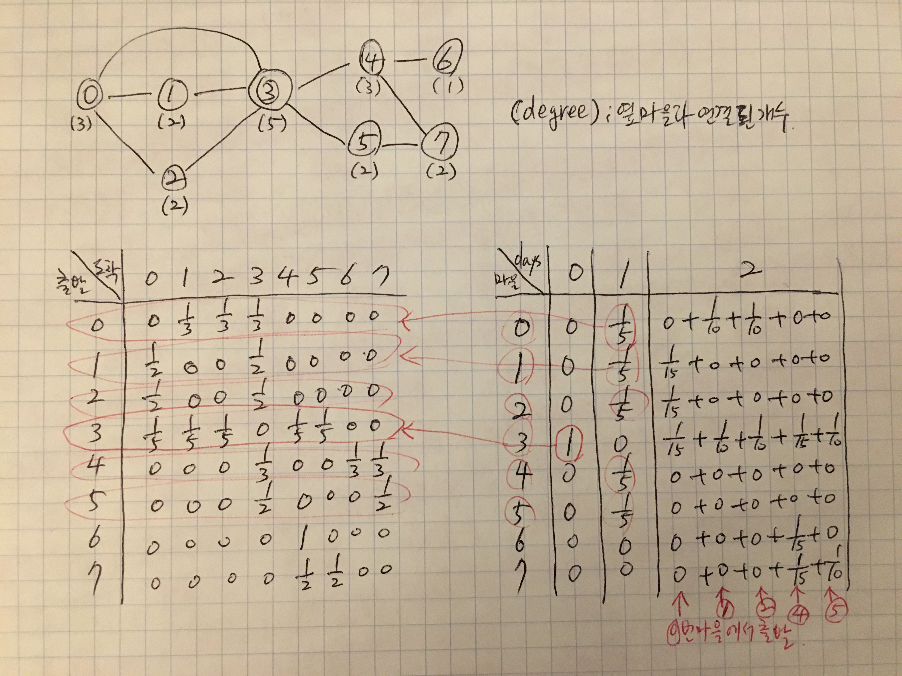

### 예제 : 장마가 찾아왔다 (문제 ID: SNAIL, 난이도 : 하)

- 문제 (AlgoSpot 사이트 SNAIL 문제 기준. 책의 문제와는 약간 다르다.)
  - 깊이 : n 미터
  - 비오는 날 : 2미터 이동
  - 맑은 날 : 1미터 이동
  - m일 동안 비올 확률이 75%일 때 탈출할 확률?

  
  
- 확률 문제로 직접 계산 시도.

  

  

- 책의 풀이
  
  - double snail_book(int days, int climbed);
  - 책의 설명에 나온 함수 정의 : **days동안  climbed만큼 올라왔을 때, m일 전까지 n미터 이상 올라갈 확률.**
  
  
  
- 다른 방법 1
  
  - double snail_exact(int n, int m);
  - **m일 후에 <u>정확히 n미터</u>에 있을 확률.**
  
  
  
- 다른 방법 2
  
  - double snail(int n, int m);
  - **m일 후에 <u>n미터 이상</u> 올라갈 확률.**


```c++
#define REDIRECTION

#include <iostream>
using namespace std;

//책의 풀이 : 116 msec
//days동안 climbed만큼 올라왔을 때 m일 동안 올라가서 n미터를 넘을 확률을 리턴하는 함수.
static double cache_snail_book[1001][2001];//days, climbed
double snail_book(int n, int m, int days, int climbed) {
    if(days==m) {
        if(climbed>=n) return 1;
        else return 0;
    }
    
    double& ret = cache_snail_book[days][climbed];
    if(ret >= 0) return ret;
    
    return ret = snail_book(n, m, days+1, climbed+1) * 0.25 + snail_book(n, m, days+1, climbed+2) * 0.75;
}

//m일 후에 정확히 n미터에 있을 확률을 리턴 : 108 msec
static double cache_snail_exact[2001][1001];//[거리][남은날짜]
double snail_exact(int n, int m) {
    if (n<1*m) return 0.0;
    if (n>2*m) return 0.0;

    if (m==1) {
        if(n==1) return 0.25;
        if(n==2) return 0.75;
    }

    double& ret = cache_snail_exact[n][m];
    if(ret >= 0) return ret;

    return ret = (snail_exact(n-2, m-1) * 0.75 + snail_exact(n-1, m-1) * 0.25);
}

//m일 후에 n미터 이상 올라가서 탈출할 확룰을 리턴 : 12 msec
static double cache_snail[2001][1001];//[남은거리][남은날짜]
double snail(int n, int m) {
    if (n<=1*m) return 1.0;
    if (n>2*m) return 0.0;

    if (m==1) {
        //if(n==1) return 0.25;
	      if(n==1) return 1.0;//사실 첫 라인의 코드에서 걸려서 여기로 올 수가 없다. 개념적으로는 1.0이 맞다.
        if(n==2) return 0.75;
    }

    double& ret = cache_snail[n][m];
    if(ret >= 0) return ret;

    return ret = (snail(n-2, m-1) * 0.75 + snail(n-1, m-1) * 0.25);
}


int main(int argc, const char * argv[]) {
#ifdef REDIRECTION
    FILE *fp = freopen("input.txt", "r", stdin);
    if(fp==0) return -1;
#endif

    int c; scanf("%d", &c);

    //reset cache
    for (int i=0; i<2001; ++i) {
        for (int j=0; j<1001; ++j) {
            cache_snail_exact[i][j] = -1;
            cache_snail[i][j] = -1;
        }
    }

    while (c--) {
        int n, m;
        scanf("%d %d", &n, &m);
#ifdef REDIRECTION
        printf("%d %d : ", n, m);
#endif
        
        //책의 풀이 : 116 msec
        //days동안 climbed만큼 올라왔을 때 m일 동안 올라가서 n미터를 넘을 확률을 리턴하는 함수.
        if(0) {
            for (int i=0; i<1001; ++i) {
                for (int j=0; j<2001; ++j) {
                    cache_snail_book[i][j] = -1;
                }
            }
            printf("%0.10f\n", snail_book(n, m, 0, 0));
        }
        
        //m일 후에 정확히 n미터에 있을 확률을 리턴 : 108 msec
        if(0) {
            double sum = 0;
            for (int i=n; i<=2*m; ++i) {
                sum += snail_exact(i, m);
            }
            printf("%0.10f\n", sum);
        }

        //m일 후에 n미터 이상 올라가서 탈출할 확룰을 리턴 : 12 msec
        if(01) {
            printf("%0.10f\n", snail(n, m));
        }
    }

#ifdef REDIRECTION
    fclose(stdin);
#endif
    return 0;
}
```


### 8.12 비대칭 타일링 (ASYMTILING, 난이도 : 하)

- 타일링 방법의 수를 모두 구한 후 대칭인 경우를 제외하면 된다.

  


```c++

#define REDIRECT

#include <iostream>
#include "cstring"
using namespace std;

int mod = 1000000007;
int cache[1001];
int tiling(int n) {
//    if (n == 0) return 0;
    if (n == 1) return 1;
    if (n == 2) return 2;

    int& ret = cache[n];
    if (ret != -1) return ret;

    return ret = ( tiling(n - 1) + tiling(n - 2) ) % mod;
}

int asymtiling(int n) {
    if (n == 1) return 0;
    if (n == 2) return 0;
    int ret;
    if (n % 2 == 0) {
        ret = tiling(n) - tiling(n / 2) - tiling((n - 2) / 2);
    }
    else {
        ret = tiling(n) - tiling((n - 1) / 2);
    }
    while (ret < 0) ret += mod;
    ret = ret % mod;
    return ret;
}

int main(int argc, const char * argv[]) {
#ifdef REDIRECT
    FILE *fp = freopen("input.txt", "r", stdin);
    if (fp == 0) return -1;
#endif

    int c; cin >> c;
    while (c--) {
        int n; cin >> n;

        memset(cache, -1, sizeof(int) * 1001);
        //cout << tiling(n) << endl;
        cout << asymtiling(n) << endl;
    }

#ifdef REDIRECT
    fclose(stdin);
#endif
    return 0;
}

```


### 8.14 폴리오미노 (POLY, 난이도 : 중)

- 세로 단조 폴리오미노

  

  

- 위의 그림을 보고 n을 1개의 숫로 표시, 2개의 수로 표시, n-1개의 수로 표시... 로 나누어서 풀어보려고 시도.

  - 만약 n=4이라면, 아래와 같이 8가지가 나오고 각 경우에 가능한 조합은 총 19개이다.
    - 1개 수로 표시 : 4->(1가지)
    - 2개로 : 1+3->(3가지),  2+2->(3),  3+1->(3)
    - 3개로 : 1+1+2->(1x2가지),  1+2+1->(2x2),  2+1+1->(2x1)
    - 4개로 : 1+1+1+1->(1x1x1가지)
  - 위의 (괄호) 안의 부분은 아래와 같이 생각하면 됨.

  


- 아래에서 위로 쌓는다고 생각하고 다음과 같이 함수를 정의한다.

  - **이전 층의 사각형 개수가 p개 이고, 남은 사각형 개수가 r개일 때 폴리오미노 개수를 리턴하는 함수.**
  - 이전 층 p개의 사각형을 포함하여 개수를 계산한다.

  

- 책은 다음과 같이 함수를 정의하였다.

  - **첫 라인의 사각형 개수가 first개 이고, n개의 사각형을 가진 폴리오미노 개수를 리턴하는 함수.**


- ##### 아래는 위의 두 함수를 구현한 코드

```c++
#define REDIRECT

#include <iostream>
#include "cstring"
using namespace std;

int mod = 10000000;

int cache[101][101];

//mine
int poly_mine(int p, int r) {//p=previous, r=remain
    if (r == 0) return 1;

    int& ret = cache[p][r];
    if (ret != -1) return ret;
    
    int sum = 0;
    for (int i = 1; i <= r; i++) {
        sum = ( sum + (p + i - 1) * poly_mine(i, r - i) ) % mod;
    }
    
    return ret = sum;
}

//book
int poly_book(int n, int first) {
    if(first==n) return 1;

    int& ret = cache[first][n];
    if (ret != -1) return ret;
    
    int sum = 0;
    for (int i = 1; i <= n-first; i++) {
        sum = ( sum + (first + i - 1) * poly_book(n-first, i) ) % mod;
    }
    
    return ret = sum;
}

int main(int argc, const char * argv[]) {
#ifdef REDIRECT
    FILE *fp = freopen("input.txt", "r", stdin);
    if (fp == 0) return -1;
#endif

    memset(cache, -1, sizeof(int) * 101 * 101);
    
    int c; cin >> c;
    while (c--) {
        int n; cin >> n;
    
        int sum = 0;
        for (int i = 1; i <= n; i++) {
            sum = (sum + poly_mine(i, n - i)) % mod;
            //sum = (sum + poly_book(n, i)) % mod;
        }
        cout << sum << endl;
    }

#ifdef REDIRECT
    fclose(stdin);
#endif
    return 0;
}
```


### 8.16 두니발 박사의 탈옥 (NUMB3RS, 난이도 : 중)

- 첫 번째 시도는 일단 마을사이에 확률 테이블을 만드는 것.

- 그리고, d일 후에 각 마을에 도달할 확률을 계산.

- 단순히 순차적으로 계산하는 것으로, 마을 수가 50개 이하라서 생각보다 빠르다!

  


- Floyd-Warshall 알고리즘 찾아보자!

- Markov Chain도 ......

  

- 재귀적으로 함수를 정의해보자!
  - **d일 후에 q마을에 있을 확률를 리턴하는 함수를 정의!**
  - 그러면, 아래 코드에서 prob_book함수처럼 작성할 수 있다.
  - 기본생각은 하루 전날에 있을 수 있는 마을을 조사하고, 거기서 현재 위치로 올 확률을 계산하는 것이다.


```c++

#define REDIRECT

#include <iostream>
#include "vector"
using namespace std;

//내 첫 번째 풀이 : 그냥 모든 확률을 순차적으로 구했다. -> 12msec
double prob_town[50][50];//마을수 50개 이하. [from][to]
double prob_dunibal[100+1][50];//날짜 0~100일, 마을수 50. [day][town]

void calc_prob_town(int n, int A[][50]) {
    for (int i=0; i<n; i++) {
        int sum=0;
        for(int j=0; j<n; j++) {
            if(A[i][j]==1) sum++;
        }
        double p = 1.0 / (double)sum;
        for(int j=0; j<n; j++) {
            if(A[i][j]==1) prob_town[i][j] = p;
            else prob_town[i][j] = 0;
        }
    }
}

//calc_prob_dunibal(prob_town, n, d, p);
void calc_prob_dunibal(double prob_town[][50], int n, int d, int p) {
    //reset all 0
    for (int i=0; i<=d; i++) {//day
        for (int j=0; j<n; j++) {//town
            prob_dunibal[i][j] = 0;//[day][town]
        }
    }
    
    prob_dunibal[0][p] = 1;//0일에 p = 교도소가 있는 곳. 즉, 출발점.
    
    for(int i=0; i<d; i++) {// i day
        for(int j=0; j<n; j++) {// j town
            if(prob_dunibal[i][j]!=0) {//j마을에서 시작.
                for(int k=0; k<n; k++) {//k마을에 도착.
                    prob_dunibal[i+1][k] += prob_dunibal[i][j] * prob_town[j][k];
                }
            }
        }
    }
}

//책을 읽고나서 재귀적으로 풀어본 것. -> 20msec
int deg[50];
void calc_deg(int n, int A[][50]) {
    for (int i=0; i<n; i++) {
        int sum=0;
        for(int j=0; j<n; j++) {
            if(A[i][j]==1) sum++;
        }
        deg[i] = sum;
    }
}
double cache[101][51];
//d일 후에 q마을에 있을 확률.
double prob_book(int n, int A[][50], int p, int d, int q) {
    if(d==0) {//현재
        if (q==p) return 1.0;//p마을에 있다.
        else return 0.0;
    }
    
    double& ret = cache[d][q];
    if(ret>-0.5) return ret;
    
    double sum = 0;
    for (int i=0; i<n; i++) {
        if (A[q][i]) {//마을이 연결되어있으면...
            sum += prob_book(n, A, p, d-1, i) / deg[i];//하루 전에 i 마을에서 현재 q마을로 올 확률.
        }
    }
    return ret = sum;
}

//0.20000000 0.06666667 0.06666667 0.43333333 0.00000000 0.00000000 0.06666667 0.16666667
//0.83333333 0.00000000 0.16666667
//0.43333333 0.06666667 0.06666667 0.06666667

int main(int argc, const char * argv[]) {
#ifdef REDIRECT
    FILE *fp = freopen("input.txt", "r", stdin);
    if(fp==0) return -1;
#endif
    int c; cin >> c;
    while (c--) {
        //마을의 수 n (2 <= n <= 50)
        //탈출 후 지금까지 지난 일수 d (1 <= d <= 100)
        //그리고 교도소가 있는 마을의 번호 p (0 <= p < n)
        int n, d, p; cin >> n >> d >> p;
        
        //A[i][j] 가 1인 경우 i 번 마을에서 j 번 마을을 잇는 산길이 있다는 것을 의미
        int A[50][50];
        for(int i=0; i<n; i++) {
            for(int j=0; j<n; j++) {
                cin >> A[i][j];
            }
        }
        
        //확률을 계산할 마을의 수 t (1 <= t <= n)
        //t 개의 정수로 확률을 계산할 마을의 번호 q (0 <= q < n)
        int t; cin >> t;
        int q[50];
        for(int i=0; i<t; i++) {
            cin >> q[i];
        }
        
//        //입력확인!
//        cout << n << " " << d << " " << p << endl;
//        for(int i=0; i<n; i++) {
//            for(int j=0; j<n; j++) {
//                cout << A[i][j] << " ";
//            }
//            cout << endl;
//        }
//        cout << t << endl;
//        for(int i=0; i<t; i++) {
//            cout << q[i] << " ";
//        }
//        cout << endl;
        
        cout.precision(8);
        
        //내 첫 번째 풀이 : 그냥 d일 까지 모든 마을의 확률을 순차적으로 구했다.
        {
            calc_prob_town(n, A);
            calc_prob_dunibal(prob_town, n, d, p);
            for(int i=0; i<t; i++) {
                cout << fixed << prob_dunibal[d][q[i]] << " "; // d일 후에 q[i]번 마을에 있을 확률
            }
            cout << endl;
        }
        
        //책보고 재귀함수로 구해보기.
        {
//            for(int i=0; i<101; i++) {
//                for(int j=0; j<51; j++) {
//                    cache[i][j] = -1;
//                }
//            }
//            for(int i=0; i<t; i++) {
//                calc_deg(n, A);
//                cout << fixed << prob_book(n, A, p, d, q[i]) << " "; // d일 후에 q[i]번 마을에 있을 확률
//            }
//            cout << endl;
        }
    }
    
#ifdef REDIRECT
    fclose(fp);
#endif
    return 0;
}

```

