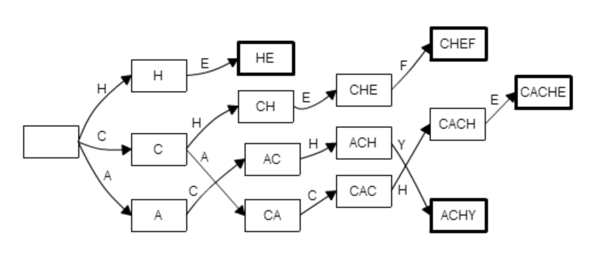

## 트라이(Trie)의 탄생 배경

이진 검색 트리는 정수나 실수의 검색 효율이 좋지만 문자열 검색 시 효율이 좋지 않다.
트라이는 문자열의 검색 효율을 더 개선하기 위해 고안된 자료 구조이다.

> N: 문자열 갯수
> M: 최대 문자열 길이

- 일반적인 문자열 검색: *O(NM)*
- 정수/실수의 이진 검색 트리: *O(logN)*
- 문자열 이진 검색 트리: *O(MlogN)*


## 트라이

일반 트리 자료구조 중 하나로, Digital Tree, Prefix Tree라고 불린다.
텍스트 자동 완성 기능과 같이 문자열을 저장하고 탐색하는데 유용한 자료 구조로 문자열 자동 완성에 주로 활용된다.

> M: 최대 문자열 길이

- 장점: *O(M)*의 시간복잡도 (입력/검색)
- 단점: 공간 효율

트라이는 대게 Child 노드를 가르키는 포인터 목록을 가지고 있고, 이 목록은 입력에 등장할 수 있는 모든 문자에 각각 대응되는 원소를 갖는 고정 길이 배열로 구현된다. 따라서 알파벳 대문자만을 사용할 때, 트라이의 각 노드는 8byte * 26 알파벳 갯수 가 필요하다. 예를 들어 트라이에 입력되는 문자열 길이의 합이 1백만이라고 하면 최악의 경우 200MB의 메모리를 사용해야 한다.

### 트라이의 구현

```java
package me.seongwoon.trie;

public class Trie {
    public static class TrieNode {
        private static final int ALPHABETS = 26;
        private static int charToIndex(char c) {
            // ascii table: http://www.asciitable.com/
            return c - 'A';
        }

        TrieNode[] children = new TrieNode[ALPHABETS];
        boolean terminal;
    }

    private final TrieNode root = new TrieNode();

    public void insert(String key) {
        TrieNode node = root;
        for (char c : key.toCharArray()) {
            final int i = TrieNode.charToIndex(c);
            // 자식 노가 없을 경우 새로운 TrieNode를 생성하고 배열[i]에 담는다.
            if (node.children[i] == null) {
                node.children[i] = new TrieNode();
            }
            // 자식 노드가 있을 경우 현재 노드를 자식 노드로 변경한다.
            node = node.children[i];
        }
        // 모든 문자열 등록이 끝나면 Terminal을 True로 변경한다.
        node.terminal = true;
    }

    public TrieNode find(String key) {
        TrieNode node = root;
        for (char c : key.toCharArray()) {
            final int i = TrieNode.charToIndex(c);
            // 찾으려는 문자열이 없는 경우 null을 리턴한다.
            if (node.children[i] == null) {
                return null;
            }
            // 자식 노드가 있을 경우 현재 노드를 자식 노드로 변경한다.
            node = node.children[i];
        }
        // 탐색 대상 문자열 순회가 끝났을 때의 현재 노드를 리턴한다.
        return node;
    }
}
```

```java
package me.seongwoon.trie;

import static org.junit.Assert.assertFalse;
import static org.junit.Assert.assertTrue;

import org.junit.Test;

import me.seongwoon.trie.Trie.TrieNode;

public class TrieTest {

    @Test
    public void test() {
        final Trie trie = new Trie();
        trie.insert("BUS");
        trie.insert("BE");
        trie.insert("BET");
        trie.insert("TEA");
        trie.insert("TEN");
        
        assertTrue(isTerminal(trie.find("BUS")));
        assertTrue(isTerminal(trie.find("TEN")));
        assertTrue(isTerminal(trie.find("BE")));
        assertTrue(isTerminal(trie.find("TEA")));
        assertTrue(isTerminal(trie.find("BET")));
        assertFalse(isTerminal(trie.find("TE")));
        assertFalse(isTerminal(trie.find("BU")));
        assertFalse(isTerminal(trie.find("HI")));
        assertFalse(isTerminal(trie.find("")));
    }

    private static boolean isTerminal (TrieNode trieNode) {
        // TrieNode가 null이 아닌 경우 Terminal 값을 리턴, 그렇지 않은 경우 false.
        return trieNode != null ? trieNode.terminal : false;
    }
}
```

### 추가 내용

- 사전(Dictionary) 자료 구조로 활용 가능
- 접미사 트리로 활용 가능
  - 하지만.. 접미사 배열을 쓰자


## 문제: 안녕히, 그리고 물고기는 고마웠어요! (SOLONG)

### 문제 요약

지느러미로 문자를 입력해야하는 돌고래를 위해 자동 완성이 지원되는 툴을 개발하였다. 
돌고래가 특정 문장을 입력하는데 총 몇 번의 타이핑이 필요한가?

- 자동 완성 알고리즘은 미리 저장된 N개의 단어만을 사용
- 타이핑을 했을때 저장된 단어만을 추천
- 추천 우선순위는 단어의 출현 빈도 > 알파벳 순으로 결정
- 탭(tab)을 누르면 추천된 단어가 자동으로 입력됨
- 이미 입력한 단어를 편집하는 기능은 없음

### 제한

- 메모리: 64MB 이하
- 시간: 3초 이내

### 입력

- 첫 줄에는 테스트 케이스 수 C(1 <= C <= 10)이 주어짐
- 각 테스트 케이스의 첫 줄에는 사전에 포함된 단어의 수 N(1 <= N <= 10000)과 입력할 단어의 수 M(1 <= M <= 20000)이 주어짐
- 그 후 N 줄에는 한 줄에 하나의 문자열과 정수로 사전에 포함된 단어와 해당 단어의 출현 빈도를 사전 순서와 무관하게 줌
- 같은 단어는 주어지지 않고, 출현 빈도는 1~10만 사이의 정수
- 그 다음 줄에는 M개의 단어로 입력할 문자열이 주어짐
- 모든 단어는 알파벳 대문자, 최대 길이는 10

```java
package me.seongwoon.trie.problem;

public class SoLong {
    public static class TrieNode {
        private static final int ALPHABETS = 26;
        private static int charToIndex(char c) {
            return c - 'A';
        }

        TrieNode[] children = new TrieNode[ALPHABETS];
        int terminal = -1;
        int recommend = -1;
    }

    private final TrieNode root = new TrieNode();

    public void insert(String key, int id) {
        TrieNode currentNode = root;
        for (char c : key.toCharArray()) {
            final int i = TrieNode.charToIndex(c);
            if (currentNode.children[i] == null) {
                currentNode.children[i] = new TrieNode();
            }
            currentNode = currentNode.children[i];
            if (currentNode.recommend == -1) {
                currentNode.recommend = id;
            }
        }
        currentNode.terminal = id;
    }

    public TrieNode find(String key) {
        TrieNode currentNode = root;
        for(char c : key.toCharArray()) {
            final int i = TrieNode.charToIndex(c);
            if (currentNode.children[i] == null) {
                return null;
            } else {
                currentNode = currentNode.children[i];
            }
        }
        return currentNode;
    }

    public int type(String key, int id) {
        TrieNode currentNode = root;
        int typingCount = 0;
        for(char c : key.toCharArray()) {
            final int i = TrieNode.charToIndex(c);
            if (currentNode.recommend == id) {
                typingCount += 1; // Tab Press Count
                break;
            }
            currentNode = currentNode.children[i];
            typingCount += 1; // Key Press Count
        }
        return typingCount;
    }
}
```

```java
package me.seongwoon.trie.problem;

import java.io.BufferedReader;
import java.io.IOException;
import java.io.InputStreamReader;
import java.util.PriorityQueue;
import java.util.stream.IntStream;

import me.seongwoon.trie.problem.SoLong.TrieNode;

public final class SoLongTest {

    public static void main(String[] args) throws IOException {
        final BufferedReader br = new BufferedReader(new InputStreamReader(System.in));
        // 테스트 케이스 수 C(1 <= C <= 10)
        int caseCount = Integer.parseInt(br.readLine());
        while (caseCount > 0) {
            // 사전에 포함된 단어의 수 & 입력할 단어의 수
            final String[] wordCounts = br.readLine().split(" ");
            // 사전에 포함된 단어의 수 N(1 <= N <= 10000)
            final int dicCounts = Integer.parseInt(wordCounts[0]);
            // 입력할 단어의 수 M(1 <= M <= 20000)
            final int inputCounts = Integer.parseInt(wordCounts[1]);

            final PriorityQueue<DicWord> dicWords = new PriorityQueue<>(dicCounts);

            IntStream.range(0, dicCounts)
                     .forEach(ignored -> {
                         try {
                             dicWords.add(new DicWord(br.readLine()));
                         } catch (IOException e) {
                             throw new RuntimeException();
                         }
                     });

            final String inputWords = br.readLine();

            final SoLong soLong = new SoLong();
            IntStream.range(0, dicCounts)
                     .forEach(i -> soLong.insert(dicWords.poll().word, i));

            int count = inputCounts - 1;
            for (String word : inputWords.split(" ")) {
                count += countKeys(soLong, word);
            }

            System.out.println(count);
            caseCount -= 1;
        }
    }

    private static int countKeys(SoLong soLong, String word) {
        final TrieNode trieNode = soLong.find(word);
        if (trieNode == null || trieNode.terminal == -1) {
            return word.length();
        }
        return soLong.type(word, trieNode.terminal);
    }

    private static class DicWord implements Comparable<DicWord> {
        String word;
        int frequency;

        DicWord(String readLine) {
            final String[] wordAndFrequency = readLine.split(" ");
            word = wordAndFrequency[0];
            frequency = Integer.parseInt(wordAndFrequency[1]);
        }

        @Override
        public int compareTo(DicWord target) {
            return frequency <= target.frequency ? 1 : -1;
        }
    }
}
```

```
2
7 8
ALL 4
AND 3
FISH 8
FOR 6
SO 4
THANKS 9
THE 9
SO LONG AND THANKS FOR ALL THE FISH
7 8
ALL 4
AND 5
FISH 3
FOR 6
SO 8
THANKS 1
THE 2
SO LONG AND THANKS FOR ALL THE FISH
=====
28
29
```

### 시간 복잡도 분석

> N: 문자열 갯수
> K: 최대 문자열 길이
> L: 타이핑할 문자열의 전체 길이 

- 입력 단계
  
  - 문자열 정렬: *O(NlogN)*
  - 최대 길이 K의 문자열 정렬: *O(KNlogN)*
  
- 트라이 생성
  
  - insert: *O(KN)*
  
- 타이핑 수 확인
  - find: *O(M)*
  - type: *O(M)*
  
- 전체 시간 복잡도
  
  - 최대 길이 K의 문자열을 입력: *O(KNlogN+L)*
  
  

## 트라이를 이용한 다중 문자열 검색

### KMP 문자열 검색 알고리즘(단일 패턴 매칭)

대표적인 단일 문자열 매칭 최적화 알고리즘이다. 문자열 검색 시 부분 문자열 테이블을 활용하여 모든 경우를 다 비교하지 않아도 탐색 대상 텍스트로 부터 검색하고자 하는 문자열(패턴)을 빠르게 찾아낼 수 있다.

> N: 텍스트의 길이
> M: 문자열 패턴의 길이

- 단순 매칭: *O(NM)*
- KMP 알고리즘: O(N+M)

하지만 검색하고자 하는 문자열(패턴)의 개수가 늘어나면 문자열의 갯수만큼 탐색 대상의 텍스트를 재탐색 해야한다.

> N: 텍스트의 길이
> K: 문자열 패턴 갯수
> L: 문자열 패턴 길이의 합

- k개의 문자열 검색: *O(NK+L)*
  - *O(N+m1+N+m2+...N+mk)*

#### 실패 함수

네 개의 바늘 문자열("CACHE", "HE", "CHEF", "ACHY")에 대한 KMP 알고리즘의 전처리(실패 함수) 결과이다.

<left></left>

트라이를 이용해 겹치는 접두사를 정리하면 다음과 같은 모양이 된다.

<left></left>

실패 함수를 아래의 조건으로 재정의 한다.

> *failure(s)* = *s*의 접미사이면서 트라이에 포함된 문자열 중 자기 자신 보다는 짧고 문자열 중에는 가장 긴 곳으로 연결

<left></left>

### 아호-코라식 문자열 검색 알고리즘(다중 패턴 매칭)

트라이에 실패 링크(Failure link), 출력 링크(Output link)를 더하여 다중 문자열 검색을 선형 시간 내에 탐색할 수 있도록 해준다.

길이 N의 탐색 대상, 길이 M의 문자열 k개을 기준으로,

> N: 텍스트의 길이
> L: 문자열 패턴 길이의 합
> P: 문자열 패턴의 출현 횟수

- 시간 복잡도: *O(N+L+P)*
  - *O(N+m1+m2+...+mk+P)*

#### 아호-코라식 알고리즘 문자열 매칭 영상

https://figshare.com/articles/Aho_Corasick_String_Matching_Video/771968

#### 실패 함수의 계산

단순한 방법: 해당 노드 문자열의 모든 접미사 중 트라이에 포함되어 있는 첫번째 문자열을 찾는다.

**더 빠른 방법**: 부모 노드의 실패 연결을 이용하면 자식 노드의 실패 연결을 쉽게 알 수 있다.

<left></left>

1. **부모 노드의 실패 연결은 자식 노드의 실패 연결과 이어진다.**
   문자열 A(CAC)와 그 뒤에 글자 H를 붙인 문자열 Ax(CACH)가 트라이 상에서 부모 자식 관계라고 하자. Ax의 실패 연결이 루트가 아니라면 실패 연결을 따라가 만나는 문자열의 마지막 문자는 항상 x(H)이다. 따라서 실패 연결을 따라가 만난 문자열을 Bx(ACH)라고 할 수 있다. 여기서 x(H)를 떼어낸 B(AC)를 생각해보면, B는 항상 A의 접미사가 된다. 따라서 부모 노드 A의 실패 연결 B에 x를 붙인 자손 Bx가 있는지를 확인해 Bx가 Ax의 실패 연결로 지정할 수 있다.
2. **실패 연결의 실패 연결을 찾아가라.**
   1번의 방법으로 모든 실패 연결을 찾을 수는 없다. 노드 "CACH"와 "CACHE"를 보자. "CACH"의 실패 연결인 "ACH"에는 E로 표시된 간선이 없기 때문에 1번의 규칙으로는 실패 연결을 제대로 지정할 수 없다. 이럴때는 실패 연결인 "ACH"의 실패 연결을 한 번 더 따라가야한다. 

이러한 규칙을 이용하면 모든 노드의 실패 연결을 계산할 수 있지만, 자식 노드의 실패 연결을 알기 위해서는 부모 노드의 실패 연결이 필요하다. 따라서 실패 연결을 계산할 순서가 중요하다.

실패 연결을 따라갔을 때 만나는 문자열은 원래 노드의 문자열보다 항상 짧다라는 것에 주목해서 루트에서부터 시작해서 깊이가 낮은 노드들 부터 순서대로 실패 연결을 계산하면 위의 문제를 해결 할 수 있다.

- 루트에서 가까운 노드부터 탐색하기 위해 큐를 이용한 너비 우선 탐색(BFS)을 이용

### 아호-코라식 문자열 검색 알고리즘의 구현

```java
package me.seongwoon.trie;

import java.util.ArrayList;
import java.util.LinkedList;
import java.util.List;
import java.util.Queue;

public class AhoCorasick {
    public static class TrieNode {
        private static final int ALPHABETS = 26;
        private static int charToIndex(char c) {
            return c - 'A';
        }

        TrieNode[] children = new TrieNode[ALPHABETS];
        TrieNode failureLink;
        int terminal = -1;
        List<Integer> output = new ArrayList<>();
    }

    private final TrieNode root = new TrieNode();

    public void insert(String key, int id) {
        TrieNode node = root;
        for (char c : key.toCharArray()) {
            final int i = TrieNode.charToIndex(c);
            if (node.children[i] == null) {
                node.children[i] = new TrieNode();
            }
            node = node.children[i];
        }
        node.terminal = id;
    }

    public void match(String text) {
        TrieNode node = root;
        for (char c : text.toCharArray()) {
            final int i = TrieNode.charToIndex(c);
            while (node != root && node.children[i] == null) {
                node = node.failureLink;
            }
            if (node.children[i] != null) {
                node = node.children[i];
            }
            node.output.forEach(System.out::println);
        }
    }

    public void computeFailureFunction() {
        // 루트에서 가까운 노드부터 탐색하기 위해 큐를 이용한 너비 우선 탐색
        final Queue<TrieNode> searchQueue = new LinkedList<>();
        // 루트의 실패 함수는 루트
        root.failureLink = root;
        searchQueue.add(root);
        while (!searchQueue.isEmpty()) {
            final TrieNode node = searchQueue.remove();
            // 부모 노드의 모든 자식 노드에 대하여 실패 연결을 계산하고 큐에 집어넣음
            for (int i = 0; i < TrieNode.ALPHABETS; i++) {
                final TrieNode childNode = node.children[i];
                if (childNode == null) {
                    continue;
                }
                // 현재 노드가 1레벨 노드라면 실패 연결을 루트로 지정
                if (node == root) {
                    childNode.failureLink = root;
                } else {
                    // 아닌 경우, 부모 노드의 실패 연결을 따라가며 실패 연결을 탐색
                    TrieNode parentFailure = node.failureLink;
                    // 실패 연결 노드가 루트가 아닌데 찾는 자식 노드가 없을 경우 실패 연결!
                    while (parentFailure != root && parentFailure.children[i] == null) {
                        parentFailure = parentFailure.failureLink;
                    }
                    // 실패 연결 노드에 찾고있는 자식 노드가 있을 경우
                    if (parentFailure.children[i] != null) {
                        parentFailure = parentFailure.children[i];
                    }
                    childNode.failureLink = parentFailure;
                }
                childNode.output.addAll(childNode.failureLink.output);
                if (childNode.terminal != -1) {
                    childNode.output.add(childNode.terminal);
                }
                searchQueue.add(childNode);
            }
        }
    }
}

```

```java
package me.seongwoon.trie;

import org.junit.Test;

public class AhoCorasickTest {

    @Test
    public void test() {
        final AhoCorasick ahoCorasick = new AhoCorasick();
        ahoCorasick.insert("HE", 1);
        ahoCorasick.insert("SHE", 2);
        ahoCorasick.insert("HIS", 3);
        ahoCorasick.insert("HERS", 4);

        ahoCorasick.computeFailureFunction();

        ahoCorasick.match("SHERS");
    }
}
```

```
1
2
4
```


## 문제: 문자열 집합 판별 (BJ9250)

### 문제

https://www.acmicpc.net/problem/9250

집합 S는 크기가 N이고, 원소가 문자열인 집합이다. Q개의 문자열이 주어졌을 때, 각 문자열의 부분 문자열이 집합 S에 있는지 판별하는 프로그램을 작성하라. 예를 들어, S = {"www","woo","jun"} 일 때, "myungwoo"의 부분 문자열인 "woo"가 집합 S에 있으므로 'YES'이다. 하지만 "dooho"는 집합 S의 부분문자열이 아니므로 'NO'가 출력되어야 한다.

### 제한

- 메모리: 256MB 이하
- 시간: 2초 이내

### 입력

- 첫 줄에는 집합 S의 크기 N(1 <= N <= 1000)이 주어짐
- 다음 N개의 줄에는 집합 S의 원소들이 주어진다. 문자열의 길이는 100을 넘지 않음
- 다음 줄에는 판별해야 하는 문자열의 개수 Q(1 <= Q <= 1000)가 주어짐
- 다음 Q개의 줄에는 답을 판별해야 하는 문자열이 주어진다. 문자열의 길이는 10,000을 넘지 않음
- 입력 문자열은 모두 알파벳 소문자


## 문제: 보안종결자 (NH)

### 문제 요약

해커가 은행의 전산망을 해킹하려고 한다. 하지만 그 은행에는 네트워크 침입 감지 시스템(IDS)이 존재한다. 이 시스템은 네트워크 트래픽을 감시해서 특정 문자열이 포함되었는지 탐지한다. 
은행의 전산망 비밀번호가 알파벳 소문자로 구성된 길이 n의 문자열이고, IDS의 인식 패턴을 모두 알고있다고 가정할 때, IDS에 탐지되지 않는 문자열의 개수를 구해보자.

- 주어지는 패턴의 길이는 10이하
- 출력시 문자열의 수가 클 경우 10007로 나눔

### 제한

- 메모리: 64MB 이하
- 시간: 1초 이내
