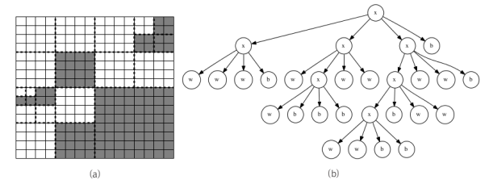
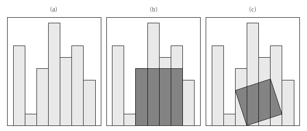
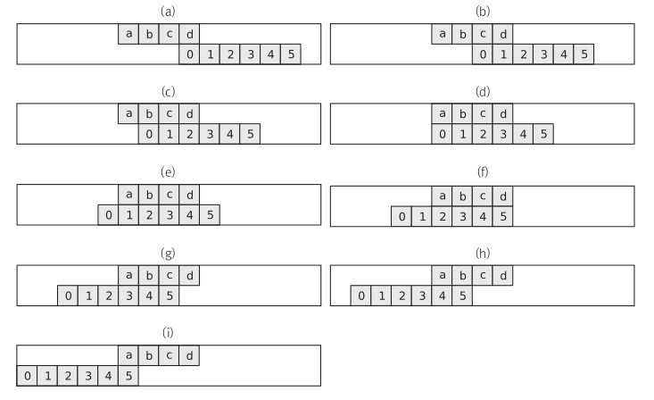

## 쿼드 트리 뒤집기 (QUADTREE)

난이도: 하 / 체감 난이도: 중

#### **문제**



대량의 좌표 데이터를 메모리 안에 압축해 저장하기 위해 사용하는 여러 기법 중 쿼드 트리(quad tree)란 것이 있습니다. 주어진 공간을 항상 4개로 분할해 재귀적으로 표현하기 때문에 쿼드 트리라는 이름이 붙었는데, 이의 유명한 사용처 중 하나는 검은 색과 흰 색밖에 없는 흑백 그림을 압축해 표현하는 것입니다. 쿼드 트리는 2^N × 2^N 크기의 흑백 그림을 다음과 같은 과정을 거쳐 문자열로 압축합니다.

이 그림의 모든 픽셀이 검은 색일 경우 이 그림의 쿼드 트리 압축 결과는 그림의 크기에 관계없이 b가 됩니다.
이 그림의 모든 픽셀이 흰 색일 경우 이 그림의 쿼드 트리 압축 결과는 그림의 크기에 관계없이 w가 됩니다.
모든 픽셀이 같은 색이 아니라면, 쿼드 트리는 이 그림을 가로 세로로 각각 2등분해 4개의 조각으로 쪼갠 뒤 각각을 쿼드 트리 압축합니다. 이때 전체 그림의 압축 결과는 x(왼쪽 위 부분의 압축 결과)(오른쪽 위 부분의 압축 결과)(왼쪽 아래 부분의 압축 결과)(오른쪽 아래 부분의 압축 결과)가 됩니다. 예를 들어 그림 (a)의 왼쪽 위 4분면은 xwwwb로 압축됩니다.
그림 (a)와 그림 (b)는 16×16 크기의 예제 그림을 쿼드 트리가 어떻게 분할해 압축하는지를 보여줍니다. 이때 전체 그림의 압축 결과는 xxwww bxwxw bbbww xxxww bbbww wwbb가 됩니다.

쿼드 트리로 압축된 흑백 그림이 주어졌을 때, 이 그림을 상하로 뒤집은 그림 을 쿼드 트리 압축해서 출력하는 프로그램을 작성하세요.

#### **입력**

첫 줄에 테스트 케이스의 개수 C (C≤50)가 주어집니다. 그 후 C줄에 하나씩 쿼드 트리로 압축한 그림이 주어집니다. 모든 문자열의 길이는 1,000 이하이며, 원본 그림의 크기는 220 × 220 을 넘지 않습니다.

#### **출력**

각 테스트 케이스당 한 줄에 주어진 그림을 상하로 뒤집은 결과를 쿼드 트리 압축해서 출력합니다.

#### **예제 입력**

```
4
w
xbwwb
xbwxwbbwb
xxwwwbxwxwbbbwwxxxwwbbbwwwwbb
```

#### **예제 출력**

```
w
xwbbw
xxbwwbbbw
xxwbxwwxbbwwbwbxwbwwxwwwxbbwb
```

#### **코드**

```java
public class Quadtree {

    private static int pointer;

    private final char[][] decompressed;

    public char[][] decompress(String s, int y, int x, int size) {
        final char currentChar = s.charAt(pointer);
        pointer++;

        // base case
        if (currentChar == 'b' || currentChar == 'w') {
            for (int dy = 0; dy < size; ++dy) {
                for (int dx = 0; dx < size; ++dx) {
                    decompressed[y + dy][x + dx] = currentChar;
                }
            }
        } else {
            final int half = size / 2;
            decompress(s, y, x, half);
            decompress(s, y, x + half, half);
            decompress(s, y + half, x, half);
            decompress(s, y + half, x + half, half);
        }

        return decompressed;
    }

    public String reverse(String s, int p) {
        final char head = s.charAt(p);

        // base case
        if (head != 'x') {
            return String.valueOf(head);
        } else {
            final String upperLeft = reverse(s, 1 + p);
            final String upperRight = reverse(s, 1 + p + upperLeft.length());
            final String lowerLeft = reverse(s, 1 + p + upperLeft.length() + upperRight.length());
            final String lowerRight = reverse(s, 1 + p + upperLeft.length() + upperRight.length() + lowerLeft.length());

            return 'x' + lowerLeft + lowerRight + upperLeft + upperRight;
        }
    }

    public Quadtree(int maxSize) {
        decompressed = new char[maxSize][maxSize];
    }
}
```

```java
import java.util.Arrays;

import org.junit.Test;

public class QuadtreeTest {

    @Test
    public void decompressTest() {
        final String testCase = "xwwxwbwwb";
        final Quadtree quadtree = new Quadtree(4);
        final char[][] decompress = quadtree.decompress(testCase, 0, 0, 4);
        Arrays.stream(decompress).forEach(System.out::println);
      	/* 	wwww
						wwww
						wbbb
						wwbb  */
    }

    @Test
    public void reverseTest() {
        final String testCase = "xwwxwbwwb";
        final Quadtree quadtree = new Quadtree(4);
        final String decompress = quadtree.reverse(testCase, 0);
        System.out.println(decompress);
      	/* xxwwwbbww */
    }
}
```

#### **시간복잡도**

함수가 호출되는 횟수는 문자열 길이에 비례 

Devide: O(n) / Merge: O(n)


## 울타리 잘라내기 (FENCE)

난이도: 중 / 체감 난이도: 중

#### **문제**



너비가 같은 N개의 나무 판자를 붙여 세운 울타리가 있습니다. 시간이 지남에 따라 판자들이 부러지거나 망가져 높이가 다 달라진 관계로 울타리를 통째로 교체하기로 했습니다. 이 때 버리는 울타리의 일부를 직사각형으로 잘라내 재활용하고 싶습니다. 그림 (b)는 (a)의 울타리에서 잘라낼 수 있는 많은 직사각형 중 가장 넓은 직사각형을 보여줍니다. 울타리를 구성하는 각 판자의 높이가 주어질 때, 잘라낼 수 있는 직사각형의 최대 크기를 계산하는 프로그램을 작성하세요. 단 (c)처럼 직사각형을 비스듬히 잘라낼 수는 없습니다.

판자의 너비는 모두 1이라고 가정합니다.

#### **입력**

첫 줄에 테스트 케이스의 개수 C (C≤50)가 주어집니다. 각 테스트 케이스의 첫 줄에는 판자의 수 N (1≤N≤20000)이 주어집니다. 그 다음 줄에는 N개의 정수로 왼쪽부터 각 판자의 높이가 순서대로 주어집니다. 높이는 모두 10,000 이하의 음이 아닌 정수입니다.

#### **출력**

각 테스트 케이스당 정수 하나를 한 줄에 출력합니다. 이 정수는 주어진 울타리에서 잘라낼 수 있는 최대 직사각형의 크기를 나타내야 합니다.

#### **예제 입력**

```
3
7
7 1 5 9 6 7 3
7
1 4 4 4 4 1 1
4
1 8 2 2
```

#### **예제 출력**

```
20
16
8
```

#### **코드**

```java
public class Fence {

    final int[] fenceHeights;

    public int bruteForce() {
        int maxArea = 0;
        for (int left = 0; left < fenceHeights.length; ++left) {
            int minHeight = fenceHeights[left];
            for (int right = left; right < fenceHeights.length; ++right) {
                minHeight = Math.min(minHeight, fenceHeights[right]);
                maxArea = Math.max(maxArea, (right - left + 1) * minHeight);
            }
        }
        return maxArea;
    }

    public int solve(int left, int right) {
        // base case
        if (left == right) {
            return fenceHeights[left];
        }

        final int mid = (left + right) / 2;
        int maxArea = Math.max(solve(left, mid), solve(mid + 1, right));

        int low = mid;
        int high = mid + 1;
        int height = Math.min(fenceHeights[low], fenceHeights[high]);

        maxArea = Math.max(maxArea, 2 * height);

        while (low > left || high < right) {
            if (high < right && (low == left || fenceHeights[high + 1] > fenceHeights[low - 1])) {
                high += 1;
                height = Math.min(height, fenceHeights[high]);
            } else {
                low -= 1;
                height = Math.min(height, fenceHeights[low]);
            }
            maxArea = Math.max(maxArea, (high - low + 1) * height);
        }

        return maxArea;
    }

    public Fence(int[] fenceHeights) {
        this.fenceHeights = fenceHeights;
    }
}
```

```java
import org.junit.Test;

public class FenceTest {

    @Test
    public void bruteForceTest() {
        final int[] fenceHeights = {7, 1, 5, 9, 6, 7, 3};
        final Fence fence = new Fence(fenceHeights);
        final int maxArea = fence.bruteForce();
        System.out.println(maxArea);
      	/* 20 */
    }

    @Test
    public void solveTest() {
        final int[] fenceHeights = {7, 1, 5, 9, 6, 7, 3};
        final Fence fence = new Fence(fenceHeights);
        final int maxArea = fence.solve(0, 6);
        System.out.println(maxArea);
      	/* 20 */
    }
}
```

#### **시간복잡도**

O(nlogn)


## 팬미팅 (FANMEETING)

난이도: 상 / 체감 난이도: 상

#### **문제**

가장 멤버가 많은 아이돌 그룹으로 기네스 북에 올라 있는 혼성 팝 그룹 하이퍼시니어가 데뷔 10주년 기념 팬 미팅을 개최했습니다. 팬 미팅의 한 순서로, 멤버들과 참가한 팬들이 포옹을 하는 행사를 갖기로 했습니다. 하이퍼시니어의 멤버들은 우선 무대에 일렬로 섭니다. 팬 미팅에 참가한 M명의 팬들은 줄을 서서 맨 오른쪽 멤버에서부터 시작해 한 명씩 왼쪽으로 움직이며 멤버들과 하나씩 포옹을 합니다. 모든 팬들은 동시에 한 명씩 움직입니다. 아래 그림은 행사 과정의 일부를 보여줍니다. a~d는 네 명의 하이퍼시니어 멤버들이고, 0~5는 여섯 명의 팬들입니다.



하지만 하이퍼시니어의 남성 멤버들이 남성 팬과 포옹하기가 민망하다고 여겨서, 남성 팬과는 포옹 대신 악수를 하기로 했습니다. 줄을 선 멤버들과 팬들의 성별이 각각 주어질 때 팬 미팅이 진행되는 과정에서 하이퍼시니어의 모든 멤버가 동시에 포옹을 하는 일이 몇 번이나 있는지 계산하는 프로그램을 작성하세요.

#### **입력**

첫 줄에 테스트 케이스의 개수 C (C≤20)가 주어집니다. 각 테스트 케이스는 멤버들의 성별과 팬들의 성별을 각각 나타내는 두 줄의 문자열로 구성되어 있습니다. 각 문자열은 왼쪽부터 오른쪽 순서대로 각 사람들의 성별을 나타냅니다.

M은 해당하는 사람이 남자, F는 해당하는 사람이 여자임을 나타냅니다. 멤버의 수와 팬의 수는 모두 1 이상 200,000 이하의 정수이며, 멤버의 수는 항상 팬의 수 이하입니다.

#### **출력**

각 테스트 케이스마다 한 줄에 모든 멤버들이 포옹을 하는 일이 몇 번이나 있는지 출력합니다.

#### **예제 입력**

```
4
FFFMMM
MMMFFF
FFFFF
FFFFFFFFFF
FFFFM
FFFFFMMMMF
MFMFMFFFMMMFMF
MMFFFFFMFFFMFFFFFFMFFFMFFFFMFMMFFFFFFF
```

#### **예제 출력**

```
1
6
2
2
```

#### **코드**

```java
import java.util.stream.Stream;

public class FanMeeting {
    public int hugs(String members, String fans) {

        final String reversed = new StringBuilder(members).reverse().toString();
        final int[] memberGenders = Stream.of(reversed.split(""))
                                          .mapToInt(c -> "M".equals(c) ? 1 : 0)
                                          .toArray();

        final int[] fanGenders = Stream.of(fans.split(""))
                                       .mapToInt(c -> "M".equals(c) ? 1 : 0)
                                       .toArray();

        final BigIntegerMultiplication bigIntegerMultiplication = new BigIntegerMultiplication();

        final int[] c = bigIntegerMultiplication.multiply(memberGenders, fanGenders);

        int hugs = 0;
        for (int i = memberGenders.length - 1; i < fanGenders.length; ++i) {
            if (c[i] == 0) {
                hugs += 1;
            }
        }

        return hugs;
    }
}
```

```java
import java.util.Arrays;
import java.util.List;
import java.util.stream.Collectors;

public class BigIntegerMultiplication {

    // 카라츠바 곱셈
    public int[] karatsuba(int[] a, int[] b) {
        int an = a.length;
        int bn = b.length;

        // a가 b보다 짧을 경우 둘을 바꾼다
        if (an < bn) { return karatsuba(b, a); }

        // base case 1 : a 나 b 가 비어있는 경우
        if (an == 0 || bn == 0) { return new int[0]; }

        // base case 2 : a가 비교적 짧은 경우 O(n^2) 곱셈으로 변경한다
        if (an <= 2) { return multiply(a, b); }

        int half = an / 2;
        // a 와 b 를 밑에서 half 자리와 나머지로 분리한다
        // 복잡하니까 a 와 b 의 자릿수가 동일하다고 가정하자 (책에 나온 코드는 자릿수가 다른 경우도 계산가능)
        int[] a0 = Arrays.copyOfRange(a, 0, half);
        int[] a1 = Arrays.copyOfRange(a, half, an);
        int[] b0 = Arrays.copyOfRange(b, 0, Math.min(half, bn));
        int[] b1 = Arrays.copyOfRange(b, Math.min(half, bn), bn);

        // z2 = a1 * b1
        int[] z2 = karatsuba(a1, b1);

        // z0 = a0 * b0
        int[] z0 = karatsuba(a0, b0);

        // z1 = (a0 + a1) * (b0 + b1) - z0 - z2
        int[] z1 = sub(sub(karatsuba(add(a0, a1), add(b0, b1)), z0), z2);

        // ret = z0 + (z1 * 10^half) + (z2 * 10^(half*2))
        int[] ret = add(add(z0, powerOf10(z1, half)), powerOf10(z2, half * 2));
        return ret;
    }

    // return a + b
    private int[] add(int[] a, int[] b) {
        int[] result = new int[Math.max(a.length, b.length) + 1];
        for (int i = 0; i < Math.max(a.length, b.length) + 1; i++) {
            int ai = i < a.length ? a[i] : 0;
            int bi = i < b.length ? b[i] : 0;
            result[i] = ai + bi;
        }
        return normalize(result);
    }

    // return a - b
    private int[] sub(int[] a, int[] b) {
        int[] result = new int[Math.max(a.length, b.length)];
        for (int i = 0; i < Math.max(a.length, b.length); i++) {
            int ai = i < a.length ? a[i] : 0;
            int bi = i < b.length ? b[i] : 0;
            result[i] = ai - bi;
        }
        return normalize(result);
    }

    // return a * 10^exp
    private int[] powerOf10(int[] a, int exp) {
        int[] result = new int[a.length + exp];
        for (int i = 0; i < a.length; i++) {
            result[exp + i] = a[i];
        }
        return result;
    }

    // O(n^2) 곱셈
    public int[] multiply(int[] a, int[] b) {
        int an = a.length;
        int bn = b.length;
        int[] c = new int[an + bn + 1];
        for (int i = 0; i < an; i++) {
            for (int j = 0; j < bn; j++) {
                c[i + j] += a[i] * b[j];
            }
        }
        return normalize(c);
    }

    private int[] normalize(int[] c) {
        for (int i = 0; i + 1 < c.length; i++) {
            if (c[i] >= 0) {
								// c[i + 1] += c[i] / 10;
                // c[i] = c[i] % 10;
            } else {
                int borrow = (Math.abs(c[i]) + 9) / 10;
                c[i + 1] -= borrow;
                c[i] += borrow * 10;
            }
        }
        // 앞에 붙은 0 지우기
        List<Integer> list = Arrays.stream(c).boxed().collect(Collectors.toList());
				// while (list.size() > 0 && list.get(list.size() - 1) == 0) { list.remove(list.size() - 1); }
        return list.stream().mapToInt(i -> i).toArray();
    }
}
```

```java
import org.junit.Test;

public class FanMeetingTest {
    @Test
    public void hugsTest() {
        final String members = "MFMFMFFFMMMFMF";
        final String fans = "MMFFFFFMFFFMFFFFFFMFFFMFFFFMFMMFFFFFFF";

        final FanMeeting fanMeeting = new FanMeeting();
        final int hugs = fanMeeting.hugs(members, fans);
        System.out.println(hugs);
      	/* 2 */
    }
}
```

#### **시간 복잡도**

단순 곱 연산: O(n^2)

카라츠바 곱 연산: O(n^log3)