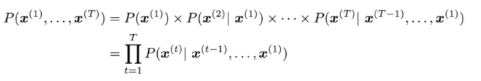
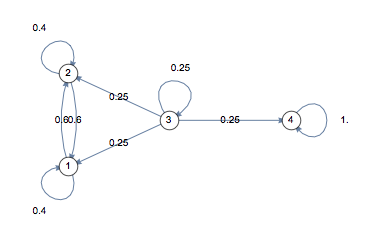
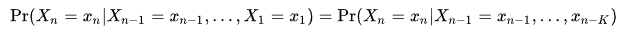

# 9장. 동적 계획법 테크닉

동적 계획법으로 풀 수 있는 여러 문제들과 다양한 기법들에 대해 다룹니다.

## 9.1 최적화 문제의 실제 답 계산하기
문제의식: 최적화 문제를 풀기위해 최적해의 점수만을 계산하였는데 최적해를 직접 계산해야한다면..?


### 최적화 문제 답 계산하기 레시피
1. 재귀 호출의 각 단계에서 최적해를 만들었던 선택을 별도의 배열에 저장해 둔다.
2. 별도의 재귀 함수를 이용해 이 선택을 따라가며 각 선택지를 저장하거나 출력 한다.


## 9.2 문제: 여행 짐 싸기 (문제 ID: PACKING, 난이도: 중)) 
[algospot](https://algospot.com/judge/problem/read/PACKING)

**문제**

여행을 떠나기 전날까지 절대 짐을 싸지 않는 버릇이 있는 재훈이는 오늘도 비행기 타기 전날에야 가방을 싸기 위해 자리에 앉았습니다. 비행기 규정상 재훈이는 캐리어를 하나만 가지고 갈 수 있는데, 아무래도 가져가고 싶은 물건들이 캐리어 안에 다 들어가지 않을 것 같습니다. 재훈이는 가져가고 싶은 각 물건들의 부피와 얼마나 필요한지를 나타내는 절박도를 조사해 다음과 같은 목록을 만들었습니다.

| 물건    | 노트북 컴퓨터 | 카메라 | XBOX365 | 커피그라인더 | 아령 | 백과사전 |
|--------|---------------|--------|---------|--------------|------|----------|
| 부피   | 4             | 2      | 6       | 4            | 2    | 10       |
| 절박도 | 7             | 10     | 6       | 7            | 5    | 4        |

캐리어의 용량이 정해져 있기 때문에 가져갈 수 있는 물건들의 부피 합은 캐리어의 용량 w 이하여야 합니다. 이때 절박도를 최대화할 수 있는 물건들의 목록을 계산하는 프로그램을 작성하세요.

**입력**

입력의 첫 줄에는 테스트 케이스의 수 C (1≤C≤50)가 주어집니다. 각 테스트 케이스의 첫 줄에는 가져가고 싶은 물건의 수 N (1≤N≤100)과 캐리어의 용량 W (1≤W≤1000)가 주어집니다. 그 이후 N줄에 순서대로 각 물건의 정보가 주어집니다. 한 물건에 대한 정보는 물건의 이름, 부피, 절박도 순서대로 주어지며, 이름은 공백 없는 알파벳 대소문자 1글자 이상 20글자 이하의 문자열, 부피와 절박도는 1000 이하의 자연수입니다.

**출력**

각 테스트 케이스별 출력의 첫 줄에는 가져갈 수 있는 물건들의 최대 절박도 합과 가져갈 물건들의 개수를 출력합니다. 이후 한 줄에 하나씩 각 물건들의 이름을 출력합니다. 만약 절박도를 최대화하는 물건들의 조합이 여럿일 경우 아무 것이나 출력해도 좋습니다.

**예제 입력**
```
2
6 10
laptop 4 7
camera 2 10
xbox 6 6
grinder 4 7
dumbell 2 5
encyclopedia 10 4
6 17
laptop 4 7
camera 2 10
xbox 6 6
grinder 4 7
dumbell 2 5
encyclopedia 10 4
```

**예제 출력**
```
24 3
laptop
camera
grinder
30 4
laptop
camera
xbox
grinder
```

## 9.3 풀이: 여행 짐 싸기

모든 조합에 대해 검사하고 최적의 조합을 찾아내는 완전 탐색 알고리즘 구현

### 동적 계획법 알고리즘
물건 n개에 대해, 각 물건을 가져가져나 말거나 선택할 수 있으므로 2<sup>n</sup>개의 조합이 존재

```cpp
// 지금까지 고른 물건들의 몰록이 `items`에 주어질 떄, 남은 용량을 채워 얻을 수 있는 최대의 절박도 합
pack(items)
```

--(남은 용량에 담을 수 있는 물건들의 절박도 합만 반환하도록)-->
- 재귀함수를 이용한 완전 탐색과 메모이제이션 사용
- 확률 고려 (물건을 "담을때"와 "안 담을때" 두 상황만을 고려)

```cpp
// capacity: 캐리어에 남은 용량
// item: 현재 아이템
pack(capacity, item)
```

`pack` 함수에서 물건을 "가져간다"/"가져가지 않는다"를 선택시의 최대 절박도를 계산

- 가져가는 경우: `pack(capacity-volume[item], item+1) + need[item]`
- 가져가지 않는 경우: `pack(capacity, item+1)`

```cpp
#include <string>
using namespace std;

int n, capacity;
// volume 물건의 부피
// need 물건의 절박도
int volume[100], need[1000];
// 재귀 호출의 각 단계에서 최적해를 만든 선택을 저장하기 위헤
int cache[1001][100];
string name[100];

int pack(int capacity, int item) {
    // 기저 사례: 더 담을 물건이 없음 (모든 물건을 담음)
    if(item == n) return 0;
    int& ret = cache[capacity][item];
    if(ret != -1) return ret;
    // 이 물건을 가져가지 않는 경우
    ret = pack(capacity, item + 1);
    // 이 물건을 가져가는 경우
    if(capacity >= volume[item])
        ret = max(ret, pack(capacity - volume[item], item + 1) + need[item]);
    return ret;
}
```

### 시간 복잡도 분석
`pack()`의 인수 값 범위
- capacity: [0, w]
- item: [0, n)

--> 부분 문제수 *O(nw)*

### 답 추적하기
부분 문제의 선택지는 물건을 "가져간다"/"가져가지 않는다" 두개만 있으므로 선택 히스토리를 저장하지 않고 답을 역추적 할 수 있음

How? 부분 문제 `pack(capacity, item)` 에서 item을 선택 했는지는 `pack(capacity, item+1)`과 `pack(capacity, item)`이 같은지 비교

- if `pack(capacity, item+1) = pack(capacity, item)`, item 무시
- otherwise, 목록에 item 추가

(설명: 값이 같다면 item을 선택하지 않아도 최대 절박도를 얻을 수 있음을 의미. 그렇기 때문에 `ret = pack(...)` 을 우선 수행)


## 9.4 문제: 광학 문자 인식 (문제 ID: OCR, 난이도: 상)
[algospot](https://algospot.com/judge/problem/read/OCR)

**문제**
광학 문자 인식(Optical Character Recognition)은 사람이 쓰거나 기계로 인쇄한 글자를 스캔한 이미지를 다시 기계가 읽을 수 있는 문자로 변환하는 과정을 말합니다. OCR 알고리즘들은 대개 수많은 필기 샘플을 통계적으로 분석하고 패턴을 찾아내어 각 단어들을 인식하곤 합니다. 하지만 단순히 각 단어들을 개별적으로 인식하기보다, 단어의 분포나 문법 등을 고려하면 더 나은 결과를 얻을 수 있는 경우가 많습니다. 이 문제에서는 과거 자료로부터 추출한 정보를 이용해 문자 인식의 정확도를 높여 봅시다.

과거에 인식했던 수많은 문장들을 분석해 원본 문장의 형태를 파악하려고 합니다. 이 작업을 위해 우선 과거 자료에 출현하는 모든 단어의 목록을 만든 뒤, 각 단어가 문장의 첫 단어로 사용된 비율을 계산했습니다. 그리고 각 단어 쌍에 대해, 한 단어가 다른 단어 다음에 출현할 확률을 계산했습니다. 이때 우리가 인식해야 할 원본 문장은 과거 자료와 똑같은 분포를 가진다고 가정합시다. 달리 말해 이 확률 테이블만 있으면 어떤 원본 문장이 출현할 확률을 정확히 계산할 수 있다고 가정한다는 얘깁니다.

우리의 문자 인식 알고리즘은 원문 그림을 여러 조각으로 쪼갠 후 각 조각을 비슷해 보이는 단어로 분류합니다. 이 분류하는 알고리즘을 분류기(classifier)라고 부릅니다. 이 분류기는 완벽하지 않기 때문에 특정 단어를 다른 단어로 잘 인식할 수도 있습니다. 예를 들어 boy라는 단어를 buy나 bay로 인식할 수 있다는 이야기입니다. 수많은 예제 입력에 대해 분류기를 시험하여, 각 단어가 적힌 조각을 분류기에 입력했을 때 어떤 출력을 얻을 수 있는지, 그리고 각각의 확률은 얼마였는지를 계산했습니다. 예를 들어 분류기에 실제 boy라고 씌어 있는 조각을 입력했을 때, 정확하게 boy로 인식할 확률은 0.7, bay일 확률은 0.25, buy일 확률은 0.04, bye일 확률은 0.01이었다는 식입니다.

이와 같은 정보들을 이용하면 좀더 나은 문자 인식을 할 수 있습니다. 각 조각을 앞에서 예로 든 분류기를 이용해 인식한 결과 "I am a bay."라는 문장을 결과로 얻었다고 합시다. 그런데 자료를 살펴보니 a 후에 bay가 올 확률은 얼마 없는 반면, a 후에 boy가 올 확률은 매우 컸다고 합시다. 우리의 분류기가 bay라고 인식한 조각이 사실은 boy일 확률이 0.25나 되기 때문에, 이 문장의 인식 결과를 "I am a boy."로 고치는 편이 더 올바른 분류일 것입니다.

어떤 문장을 단어별로 인식한 결과가 주어졌을 때, 원본일 조건부 확률이 가장 높은 문장을 찾아내는 프로그램을 작성하세요제

**입력**

입력은 분석이 끝난 과거 자료의 통계치와, 분류기가 인식한 문장으로 구성됩니다.

- 입력의 첫 줄에는 원문에 출현할 수 있는 단어의 수 m (1≤m≤500)과 처리해야 할 문장의 수 q (1≤q≤20)가 주어집니다.
- 두 번째 줄에는 원문에 출현할 수 있는 m개의 단어가 공백으로 구분되어 주어집니다. 각 단어는 알파벳 대소문자로만 구성되어 있습니다. 모든 단어의 길이는 10 이하입니다.
- 세 번째 줄에는 각 단어가 문장의 처음에 출현할 확률 B[i]가 m개의 실수로 주어집니다. B[i]는 i번 단어가 첫 단어로 출현할 확률입니다. 모든 B[i]의 합은 1입니다.
- 그 후 m줄에 m×m 크기의 실수 행렬 T가 주어집니다. 이 행렬에서 i행 j열의 숫자 T[i, j]는 i번 단어의 다음 단어가 j번 단어일 확률을 나타냅니다. 각 행에 있는 확률의 합은 항상 1입니다.
- 그 후 m줄에 m×m 크기의 실수 행렬 M이 주어집니다. 이 행렬에서 i행 j열의 숫자 M[i, j]는 i번 단어가 적힌 조각을 j번 단어로 분류할 확률을 나타냅니다. 각 행에 있는 확률의 합은 항상 1입니다.
- 그 후 q줄에 한 줄에 하나씩 분류기로 인식한 문장이 주어집니다. 각 줄의 처음에 단어의 수 n (1≤n≤100)이 주어지고, 그 후 n개의 단어로 분류기의 인식 결과가 주어집니다. 모든 단어는 처음에 주어진 m개의 단어 중 하나입니다.

입력의 크기가 크므로 빠른 입력 방식을 사용하기를 권장합니다.

**출력**
한 문장마다 한 줄에 주어진 인식 결과에 대해 **조건부 출현 확률**이 가장 높은 문장을 출력합니다. 주어지는 입력에서 가장 확률이 높은 문장이 여러 개인 경우 어느 것을 출력해도 좋습니다.

**예제 입력**
```
5 3
I am a boy buy
1.0 0.0 0.0 0.0 0.0  // 문장의 처음에 "I"가 출현할 확률이 1.0 이다
0.1 0.6 0.1 0.1 0.1  // "am"은 "I" 다음일 확률 0.6
0.1 0.1 0.6 0.1 0.1
0.1 0.1 0.1 0.6 0.1
0.2 0.2 0.2 0.2 0.2
0.2 0.2 0.2 0.2 0.2 
0.8 0.1 0.0 0.1 0.0  // "I"가 0번째 단어로 분류될 확률 0.8
0.1 0.7 0.0 0.2 0.0
0.0 0.1 0.8 0.0 0.1
0.0 0.0 0.0 0.5 0.5
0.0 0.0 0.0 0.5 0.5
4 I am a buy
4 I I a boy
4 I am am boy
```

**예제 출력**
```
I am a boy
I am a boy
I am a boy
```

## 9.5 풀이: 광학 문자 인식
마르코프 연쇄(Markov chain)을 활용

*Note. 마르코프 연쇄는 완벽한 풀이 방식은 아니다. 하지만 마르코프 연쇄를 이용하면 본 답에 근접한 답을 구할 수 있는 동시에 계산을 단순화 할 수 있다. (정확도 <--> 시간 복잡도)*

### 확률 계산하기

분류기의 목적은 "문장 `R`이 주어질 때 조건부확률 `P(Q|R)`을 최대화하는 원문 Q를 찾는 것" 이다.
(의미적으로: 조건부 확률을 최대화 한다 = 귀납적으로 봤을때 문장 R을 포함한 문장 Q가 가장 많이 존재했다)

**베이즈 정리**
```
P(Q|R) = P(R|Q) x P(Q) / P(R)
```

`P(R)`은 상수값이므로, 분류기의 목적(최대화 값보다는 최대화하는 케이스만 찾으면 된다)을 위해선 `P(R|Q) x P(Q)` 를 최대화하는 `Q`를 찾으면 된다.


- `P(R|Q)`
    단어별로 독립이므로 아래와 같이 쓸 수 있다.
    ```
    // M(a, b): a를 b로 분류할 확률
    P(R|Q) = ∏ M(Q[i], R[i])    // i=[0,n-1]
    ```
- `P(Q)`
    ```
    // P(Q): 원문이 출현할 확룰
    // B[Q[0]]: Q[0]이 문장 처음에 출현할 확률

    P(Q) = B(Q[0]) x ∏ T(Q[i-1], Q[i])  // i=[1,n-1]
    ```

    Q[-1]이 항상 시작 단어라는 가정을 추가 ( `B[Q[0]] = T(Q[-1], Q[0])` )
    ```
    P(Q) = ∏ T(Q[i-1], Q[i])  // i=[0, n-1]
    ```

    *Note: Language Model*
    

따라서 목적은 함수 `f(Q)`를 최대화 하는 것이며, `f(Q)`는 아래와 같이 정리할 수 있다.

```
f(Q)    =   P(R|Q) x P(Q)
        =   ∏ M(Q[i], R[i]) x  ∏ T(Q[j-1], Q[j])    // i=[0,n-1], j=[0,n-1]
        =   ∏ [ M(Q[i], R[i]) x T(Q[i-1], Q[i]) ]   // i=[0,n-1]
```

### 동적 계획법 알고리즘

`f(Q)` 함수에서 부분 문제는 "원문 Q를 만드는 과정을 n 조각으로 잘라 각 재귀 호출마다 Q의 단어 하나를 정하는 것"

```
Q[0]                // 1st recursion
Q[0], Q[1]          // 2nc recursion
Q[0], Q[1], Q[2]    // 3rd recursion
...
```

**부분 문제로의 정의**

> `recognize(s, p) = Q[s-1]`이 `p`일 때 `Q[s...]`를 적절히 채워서 만들 수 있는  `∏ g(Q[i]), i=[s,n-1]` 의 최대치

점화식으로..
> `recognize(s, p) = max(recognize(s+1, t) x g(t))` 


**주의점**
확률 매우 작기 때문에 확률 값을 수백 번씩 곱하면 확률 값이 너무져 언더플로가 발생 할 수 있다.
따라서 최대 확률 `f(Q)` 대신 로그 값을 활용한다.

```cpp
int n, m;
// 분류기가 반환한 문장. 단어 번호로 변환되어 있음
int R[100];
// T[i][k]=i 단어 이후에 j단어가 나올 확률의 로그값
double T[501][501];
// M[i][j] = i 단어가 j 단어로 분류될 확률의 로그값
double M[501][501];
int choice[102][102];
double cache[102][502]; // 1로 초기화한다.

// Q[segment] 이후를 채워서 얻을 수 잇는 최대 g() 곲의 로그 값을 반환한다.
// Q[segment-1] == previousMatch라고 가정한다.
double recognize(int segment, int previousMatch) {
    if(segment == n) return 0;
    double& ret = cache[segment][previousMatch];
    if(ret != 1.0) return ret;
    ret = -1e200; // log(0)=음의 무한대에 해당하는 값
    int& choose = choice[segment][previousMatch];
    // R[segment]에 대응되는 단어를 찾는다.
    for(int thisMatch = 0; thisMatch < m; ++thisMatch) {
        // g(thisMatch) = T(previousMatch, thisMatch) *
        //                M(thisMatch, R[segment])
        double cand = T[previousMatch][thisMatch] 
                        + M[thisMatch][R[segment]]
                        + recognize(segment + 1, thisMatch);
        if(ret < cand) {
            ret = cand;
            choose = thisMatch;
        }
    }
    return ret;
}
```

### 원문 역산해 내기
부분 문제에서 택한 결과를 `choice[]`에 저장하고 있고, 이를 이용하여 원문을 계산해 낼 수 있다.

```cpp
#include <string>
using namespace std;

// 입력받은 단어들의 목록
string corpus[501];
string reconstruct(int segment, int previousMatch) {
    int choose = choice[segmnet][previousMatch];
    string ret = corpus[choose];
    if(segment < m-1)
        ret = ret + " " + reconstruct(setmant+1, choose);
    return ret;
}
```


---------------------------------------------------------------

#### 참고: 마르코프 모델 (마르코프 연쇄)


마르코프 체인은 어느 한 상태에서 다른 상태로 이동/전이하는 수학적 시스템/모델을 말한다.
마르코프 체인은 아래와 같은 특성을 가진다.
- 다음 상태는 이전 상태에만 의존한다. (2단계, 3단계 이전이 어떠했는지 고려하지 않음)
    
- 다음 상태는 전이확률(transition probabilities)에 따라 결정된다.

앞선 OCR문제를 생각해보면... 문제는 생성/출현 가능성이 가장 높은 문장을 찾는 것이었다.
이는 텍스트 생성문제와 같으며, 텍스트 생성을 위해 (이전단어, 다음단어) pair의 출현 가능성을 계산하고 이를 전이 확률로 활용하여 풀 수 있다. 
